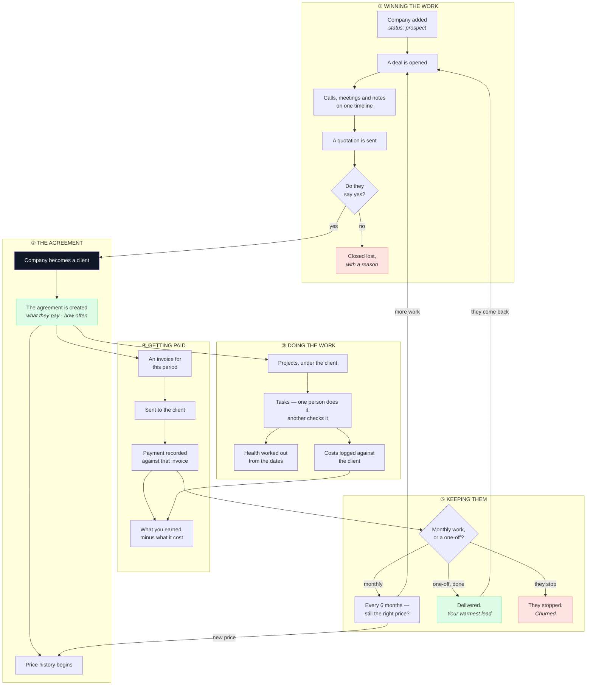
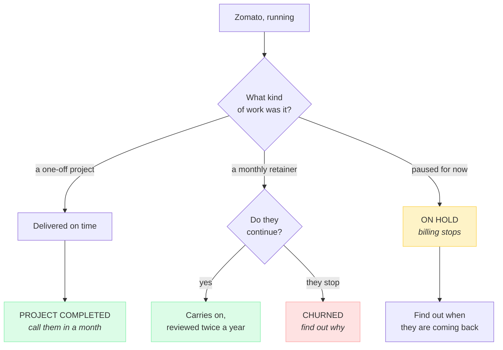
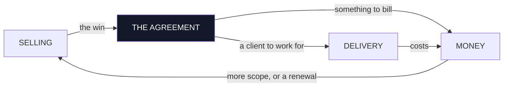

# Flowzen — The Journey

**One company, from a name nobody has heard of to a client you have been billing for a year.**

Told as a single story, in order, with no technical language. Every module appears where it naturally
comes up rather than in a chapter of its own — because that is how the system is actually used.

| | |
|---|---|
| **This document** | The story — what happens, in what order, and why it makes sense |
| **`FLOWZEN-WORKFLOW.md`** | The reference — every screen, every field |
| **`FLOWZEN-MASTER-PLAN.md`** | The decisions — why it is built this way, and the database behind it |

---

## The idea underneath everything

> **There is one record for a company. Everything else attaches to it.**

Not a "lead" that later becomes a "client". **The same record**, gaining layers as the relationship
deepens:

```
        Zomato                          ← a company. Day one.
          + a deal                      ← you are trying to win them
          + a quotation                 ← you have named a price
          ─────────── they say yes ───────────
          + an agreement                ← what they pay, and how often
          + projects and tasks          ← the work
          + invoices and payments       ← the money
          + a price review every 6 months
```

Nothing is ever copied. Nothing is re-typed. When they become a client, **the record does not move
anywhere** — it changes status, and new things attach to it.

**This is why the system can never contradict itself.** There is no second copy to fall out of date.

---

# The single flow



**Notice it is a loop, not a line.** Two arrows go back to the start:

- A client whose scope grows becomes **a new deal**, not an edit to the old one
- A finished project client who returns becomes **a new deal** on the same company

That is the whole system in one picture. The rest of this document walks it slowly.

---

# Act 1 · A name

**Day 0.** Someone mentions Zomato might need social media work.

You add them. At this point Zomato is a **prospect** — a company you are interested in, paying you
nothing.

Two things are set immediately, and the system asks for both:

| | Why it will not let you skip it |
|---|---|
| **Who owns them** | Every reminder Flowzen ever sends about Zomato goes to this person. With nobody named, every reminder goes nowhere and the company silently goes cold |
| **When to follow up** | The same. A prospect with no next date is one you will remember for about a week |

> **Why this makes sense:** most companies do not lose deals to competitors. They lose them to
> forgetting. Both of these fields exist to make forgetting harder.

**If Zomato is already in the system**, adding them again is blocked — you are shown the existing
record instead. A second Zomato is how two people end up working the same company without knowing.

---

# Act 2 · A conversation

**Days 1–20.** You open a **deal** on Zomato: *"Social media retainer, roughly ₹40,000 a month."*

The company and the deal are **separate things**, and that matters more than it sounds:

> Zomato is a company you have a relationship with. The deal is one specific thing you are trying to
> sell them. **Next year you might be selling them a website at the same time.** Two deals, one
> company, no confusion about which is which.

## Everything lands on one timeline

Every call, meeting, email and note goes on **the deal's timeline**. Not in someone's inbox, not in a
WhatsApp thread.

**When you log a call, it asks when the call happened** — not when you are typing. If you spoke on
Tuesday and write it up on Friday, it belongs on Tuesday. Otherwise every *"when did we last talk to
them?"* answer is wrong by however long people take to write things up.

**The timeline can only be added to.** Nothing on it can be edited or removed later. A history you
can rewrite is not a history.

## The deal moves along the board

```
New Lead → Outreach → Meeting → Proposal → Negotiation → Contract → Won
```

**You can skip stages and drag deals backwards.** Real deals go sideways, stall, and come back. A
system that forces a straight line just teaches people to move cards dishonestly so the board looks
tidy.

**One thing is required to reach Negotiation: a value and a close date.** Not to be bureaucratic — a
deal without an amount and a date cannot be counted in any forecast, so it is invisible to planning
while feeling like progress.

## The board tells you what is going stale

Each stage has its own patience. Sitting three days in Meeting is normal; three weeks is not. When a
deal exceeds its stage's patience, the card says so — and the owner hears about it in the morning.

> **Why this makes sense:** the deals that die are rarely the ones you rejected. They are the ones
> nobody touched for five weeks.

---

# Act 3 · A price

**Day 21.** You build a quotation: line items, quantities, rates, tax.

**Flowzen works out every total.** Nothing you type into a box becomes the amount billed — the
figures on the document are calculated, so the document and the record can never disagree.

## The quote says what kind of work it is

This is the most important field on it, and the least obvious.

```
₹4,80,000
```

Is that ₹40,000 a month for a year? Or a one-off ₹4.8 lakh build?

**The document cannot say without being told.** And because the deal's value follows the quote total,
getting it wrong makes the deal look **twelve times** its real monthly fee — which then flows into
every forecast you look at.

So the quote states: **retainer or project**, and **how often it bills**.

## Sending it

Two ways, and both are supported:

| | |
|---|---|
| **Send from Flowzen** | It makes the PDF and emails it **from your own address** — so it lands in your Sent folder and the reply comes back to your inbox |
| **Send it yourself** | Download the PDF, send it however you like, then tell Flowzen you sent it — when, and how |

**If the email fails, the quote does not get marked as sent.** A quote you believe went out and never
arrived is worse than one still sitting in draft.

---

# Act 4 · Yes — the hinge

**Day 30.** Zomato's marketing head replies: *"Looks good, let's start on the 1st."*

## First, the answer is recorded

Someone marks the quote accepted, and Flowzen asks **when they said yes** and **how** — email, call,
WhatsApp, in a meeting.

> **Why "when" and not just "yes":** if they agreed on the 30th and you record it on the 3rd, then
> every "how long do our deals take to close?" number is wrong. Over a year, that is the difference
> between knowing your sales cycle and guessing it.

**Only one quote per deal can be accepted.** If you sent three versions, accepting the third
automatically declines the first two — so there is never any question about which price was agreed.

## Then the deal is won

Marking it Won asks two things, already filled in from the accepted quote:

- **Retainer or project?**
- **What date does it start?**

For a retainer, an end date is **optional** — and leaving it blank is meaningful. It means *this just
runs until somebody stops it*, which is what most retainers actually do. Inventing an end date
invents a deadline nobody agreed to.

## And in that one moment, four things happen together

```
Zomato's status              prospect  →  ACTIVE CLIENT
An agreement is created      ₹40,000 · monthly · starting 1 April
Its price history begins     first entry: ₹40,000 from 1 April
The deal closes              and leaves the board
```

**All four, or none.** One click cannot half-win a deal and leave you with a client who is not being
billed.

**Nothing is copied.** Zomato's record is the same one created on Day 0 — same contacts, same
timeline, same history of every call it took to get here. It has simply changed status and gained an
agreement.

> **This is the seam between selling and everything else**, and it is the single most important
> moment in the system. Before it, Zomato costs you effort. After it, Zomato pays you money. One
> action moves them across that line, and it is impossible to do halfway.

## Why won deals leave the board

They stop at Won. They do not travel onwards into "delivering" or "active".

> **Why this makes sense:** a pipeline answers exactly one question — *what might we win, and when?*
> Once you have won, that question is answered. Keeping the client on the board forever means the
> board slowly becomes a client list, and stops answering the question it exists for.

**And a lost deal never reopens.** If Zomato comes back in six months, that is a **new deal** on the
same company. Otherwise "how long do deals take" and "what do we win" both become meaningless,
because a deal could be reopened and re-closed indefinitely.

---

# Act 5 · The work begins

**Day 31.** Now two things start in parallel, both hanging off Zomato.

## Projects

You create a project — *"Zomato — Social Media, April"* — under the client.

**A project belongs to the client, not to the agreement.** The project page *shows* what Zomato is on
— *retainer, ₹40,000/month* — but it is not tied to it.

> **Why this makes sense:** when the retainer renews next April, it becomes a new agreement. If
> projects were tied to agreements, every running project would have to be re-pointed at the new one,
> and the one somebody forgot would be counted against money that had already ended. Attaching to the
> client means nothing needs maintaining, ever.

## Tasks

Under the project. Each has **someone who does it** and, separately, **someone who checks it**.

> **Why two people:** agency work gets reviewed before a client sees it. If a task only has an
> assignee, the review either does not happen or happens invisibly in a chat. "In review" is a real
> status, because work sitting with a reviewer is neither finished nor in progress.

**Retainer work repeats**, so tasks can recur monthly — the same social calendar, the same reporting,
without anyone re-creating them.

## The system decides whether it is on track

Nobody sets a status light by hand:

```
a task is overdue, or the deadline is within a week with work still open   →  at risk
the deadline has passed and it is not finished                             →  off track
otherwise                                                                  →  on track
```

> **Why not let people set it:** a health flag someone sets by hand is green everywhere, forever.
> Nobody remembers to go back and turn their own project amber.

---

# Act 6 · The first invoice

**Day 31 also.** The agreement knows three things: **₹40,000**, **monthly**, **starting 1 April**. So
it knows an invoice is due on 1 April.

On that date, Flowzen tells you. **A person raises the invoice** — it does not appear on its own.

The invoice carries a number that has never been used before and never will be again, the line items,
and the tax — worked out automatically from your state and Zomato's:

```
same state       →  CGST + SGST
different state  →  IGST
```

> **Why calculated and not chosen:** the system knows where both parties are. Asking a person to pick
> is asking them to work out something already known, and to get it wrong occasionally.

## Then the date moves — but only because you raised it

```
1 Apr   invoice raised   →   next invoice due: 1 May
1 May   invoice raised   →   next invoice due: 1 Jun
```

**The date advances when an invoice is actually created — never on a timer.**

> **Why this matters more than it looks:** if the date rolled forward by itself, a month nobody billed
> would slide silently into the past. By only moving when you raise one, an unbilled month **stays
> showing as due** and keeps appearing on your morning list until somebody deals with it.

## An issued invoice never changes

Once it has gone to the client, that document is frozen. If it is wrong, you cancel it and issue a
correction.

> **Why:** an invoice is a legal record of what you asked for. If last month's invoice can be quietly
> edited today, your books are a work of fiction.

---

# Act 7 · Money arrives

**Day 45.** ₹20,000 lands. Then, ten days later, the other ₹20,000.

Each payment is recorded **against that specific invoice** — amount, date, method, reference.

```
₹0 received       →  sent
₹20,000 of ₹40,000  →  partly paid
₹40,000 of ₹40,000  →  paid
```

**The invoice works its own status out from its payments.** Nobody marks anything paid by hand, and
only one piece of code decides it — which is what stops a list and a dashboard showing different
answers about the same money.

**"Overdue" is not a status either.** It means *sent, unpaid, and past its due date* — worked out the
moment you look.

> **Why not store it:** storing it needs a nightly job to go through and mark things. The night that
> job fails, your receivables are wrong and nothing tells you.

## Three numbers that are not the same thing

This is where most agencies confuse themselves:

| | |
|---|---|
| **What you earn** | Every active agreement, as a monthly figure. Zomato contributes ₹40,000 |
| **What you billed** | What you actually raised invoices for. If nobody raised May's, this is lower |
| **What you collected** | What actually arrived in the bank |

**A month can look excellent on the first and be empty on the third.** Flowzen shows all three
separately and never calculates one from another.

## And what it cost

Costs — ad spend, vendors, tools — get logged against Zomato or against the project.

```
invoiced  −  costs  =  gross margin
```

**Gross margin, not profit.** Flowzen does not know what your own team's hours cost, so it will not
pretend to give you a profit figure. A number that looks precise and is not is worse than no number.

---

# Act 8 · Six months in

**October.** Zomato has been running since April. Nothing has expired, because a rolling retainer
never does.

**That is exactly the risk.**

> The danger with a monthly client is not that they leave. It is that you agreed ₹40,000 in April for
> four posts a week, it is now October and you are doing eight, and nobody has ever raised it.

So every six months Flowzen asks one question: **should this still be this price?**

Three outcomes:

| | What happens |
|---|---|
| **Still right** | Note it, ask again in six months |
| **Should go up** | The new price takes effect from a date. **The old price is kept** |
| **They want more work** | That is a **new deal**, back at the top of the board |

**Why the old price is kept:** if raising Zomato from ₹40,000 to ₹55,000 simply overwrote the number,
then *"what were we earning last March?"* becomes permanently unanswerable — and you find out on the
day you need it. Keeping every change means any month's revenue can be reconstructed exactly.

**Notice the third row.** More scope is a **deal** — it goes on the board, gets a quote, gets won, and
adjusts the agreement. It is not somebody quietly editing a number in the client record. That way it
appears in your pipeline, your win rate, and your forecast, like any other sale.

---

# Act 9 · How it ends — three different endings



## A finished project is not a lost client

This distinction is deliberate and it matters:

> An agency delivering **twenty websites a year** would, if finished projects counted as churn, appear
> to lose twenty clients during its best year on record. The churn figure becomes a number nobody can
> trust or use.

**Churn measures lost recurring revenue — not endings.** A project ending loses nothing recurring,
because there was nothing recurring.

**And they are your warmest lead.** Somebody who just had a good experience is the easiest sale in
your pipeline. Filed under *"churned"*, nobody ever calls them. Filed under *"delivered"*, they show
up on a list of people worth ringing.

## Pausing a client is not the same as parking a deal

| | What it stops |
|---|---|
| **Parking a deal** | Nothing. There is no billing yet. It keeps its exact place on the board |
| **Pausing a client** | Real money. Invoices stop |

**One gesture must never do both**, or billing stops as a side effect of somebody dragging a card.

## Nothing is ever deleted

Lost deals stay lost, with their reason. Clients who leave stay in the history with everything that
ever happened.

> **Why:** people come back. When Zomato calls in two years, you want the two years of context — who
> you dealt with, what you charged, why it ended. Delete it and you meet them as strangers.

---

# The four seams

Where one part of the system hands over to the next. **These are the joints — everything else is
just detail.**



| | Seam | What crosses it |
|---|---|---|
| **1** | Selling → The agreement | Winning a deal creates exactly one agreement, in the same instant the company becomes a client |
| **2** | The agreement → Delivery | The client now has work to do. Projects attach to **the client**, so they survive the agreement renewing |
| **3** | The agreement → Money | The agreement knows the amount, the frequency and the next date. Every invoice comes from it |
| **4** | Money → Selling | Costs join invoices to make margin. And when scope grows or a term ends, it goes **back to the board as a new deal** |

**The fourth is what makes it a loop.** A client is not the end of the story — it is the start of the
next one, and the system routes it back through the same pipeline as any new business, so it shows up
in your forecast honestly.

---

# What runs while nobody is watching

Every morning, in your own timezone, to **the person who owns the record** — never to everybody:

- Follow-ups due today
- Deals that have gone quiet, judged against each stage's own patience
- **Quotations sent over a week ago with no reply** — the outcome nobody ever writes down
- Price reviews and renewals coming up
- Invoices that have not been paid

**A repeat updates rather than piling up.** An overdue invoice that generated a fresh alert every
morning would produce thirty identical ones in a month — and the day that starts is the day everybody
stops reading them.

---

# Who sees which parts of this

| | Sees |
|---|---|
| **Member** | Their own tasks |
| **Sales** | The pipeline, quotes and clients |
| **Manager** | All of that, plus projects and who is working on what |
| **Admin** | All of that, plus **the money** — invoices, payments, revenue |
| **Super Admin** | Everything, plus who gets which role |

**Money is the only real dividing line.** In an agency, deals, clients, projects and who is busy are
all more useful shared than hidden. Revenue is the exception.

**Being an owner is not the same as being allowed.** Whoever owns Zomato gets the reminders and is
accountable for the relationship. That is different from who is permitted to open an invoice.

---

# Why the whole thing hangs together

Five ideas, and every rule above is one of them applied somewhere:

**① One record per company, forever.** Prospect or client, first day or fifth year. Two records for
one company always drift apart, and then two screens tell you different things.

**② A company becomes a client only by winning a deal.** There is exactly one door. So the client
list and the sales board can never disagree about who is a customer.

**③ Anything that can be worked out is not stored.** Overdue, behind schedule, paid, at risk — all
calculated when you look. A value somebody stored is right on the day they stored it and drifts from
then on.

**④ Nothing is deleted and nothing is overwritten.** Prices keep their history, timelines only grow,
lost deals stay lost. So any question about the past has an answer.

**⑤ Money is the one thing worth hiding; everything else is worth sharing.** A team that can see the
pipeline, the projects and the workload makes better decisions than one that cannot.

---

## The one-paragraph version

> A company arrives and someone owns it. You work the deal, logging everything on one timeline, and
> send a quotation that says whether it is monthly work or a one-off. When they say yes, that single
> action turns them into a client, creates the agreement that bills them, and closes the deal — all
> at once, or not at all. From the agreement come the invoices; against the client sit the projects
> and their costs; between them you get margin. Every six months the price is questioned, and if the
> work grows, that goes back to the board as a new deal. Nothing is ever copied, overwritten, or
> deleted — so the system cannot contradict itself, and any question about last March has an answer.
