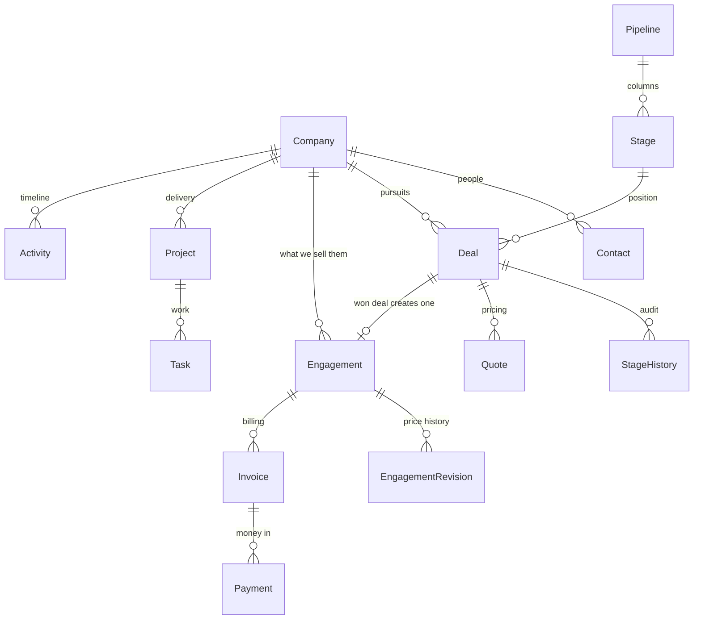
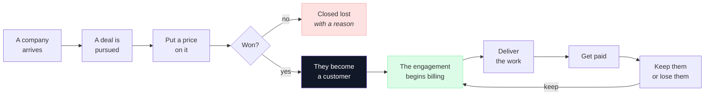
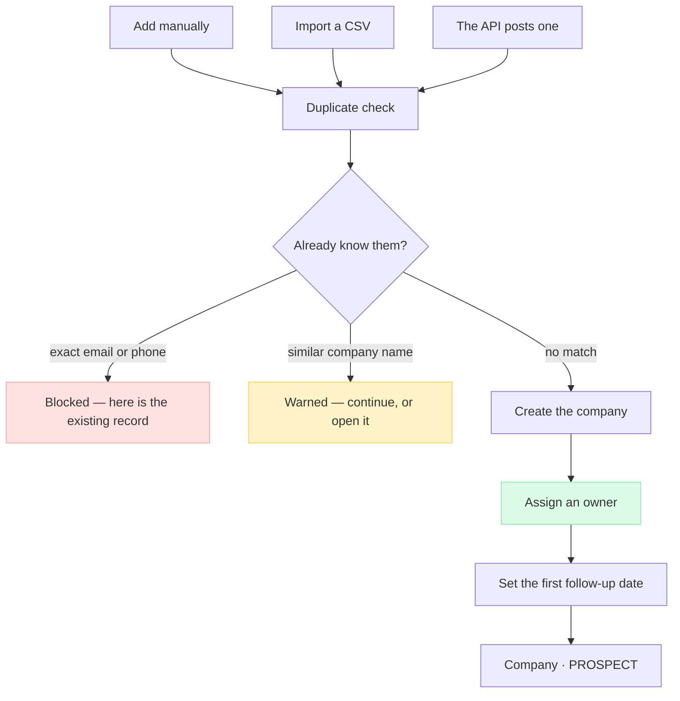
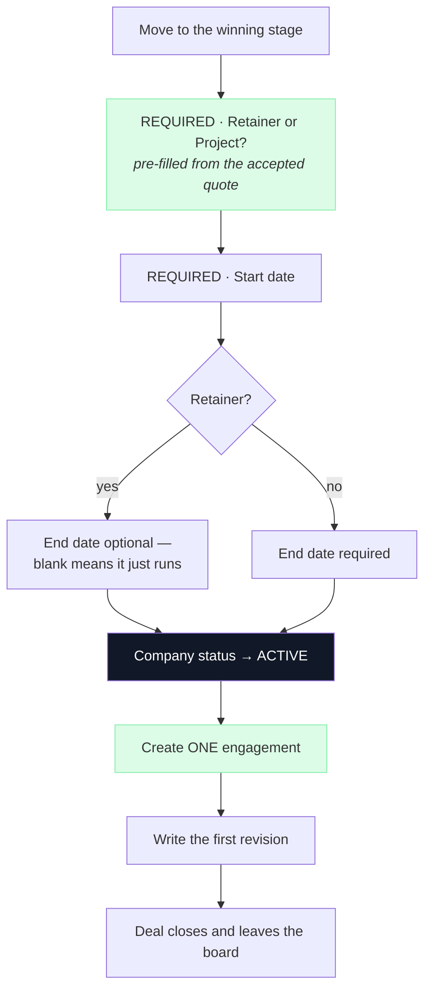
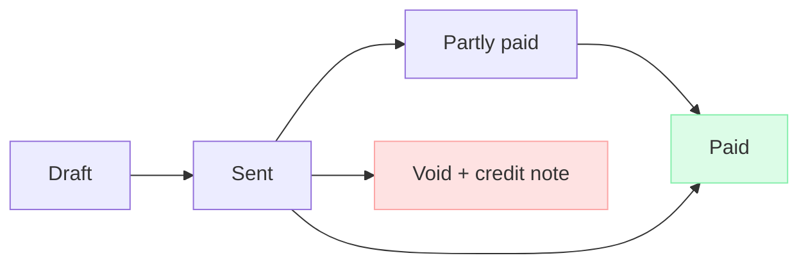
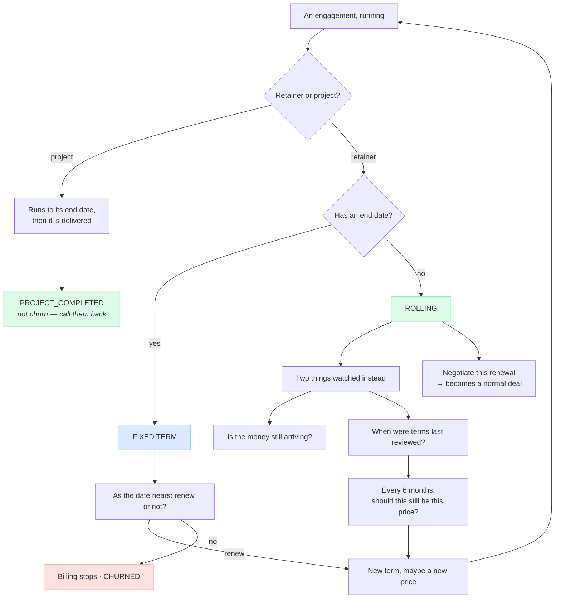

# Flowzen — Master Plan & System Design

**The single source of truth.** What exists today, what's wrong with it, what we're building
instead, why every decision was made, and what comes next.

Written so that someone could build Flowzen from this document alone.

---

## 0 · How to use this document

**It is meant to grow.** New ideas go into **§7 Backlog** first. When one is agreed, it moves up
into the design (§3) or the journey (§4), a row is added to the decision log (§2), and the changelog
below gets a line.

**Rules for adding to it:**

1. Every decision carries its **reasoning**. A decision without a "why" gets re-argued in a month.
2. Every claim about the current system carries its **evidence** — a number, a file, a measurement.
3. Rejected ideas stay in **§7.3** with the reason. Otherwise they come back every quarter.
4. Nothing is deleted from this document. It is amended.

### Changelog

| Date | Change |
|---|---|
| 2026-08 | Initial consolidation — current-state audit, target schema, journey, build plan |
| 2026-08 | Time tracking and internal cost rates **removed** — system reports gross margin, never profit |
| 2026-08 | Client-facing portal **rejected for now** — Flowzen stays internal |
| 2026-08 | Confirmed **full rewrite** over staged migration |
| 2026-08 | **Configuration round settled** — organisation `state` + `gstNumber` with the tax split computed; the default pipeline seed written out; lost reasons, sources and services made configurable; file storage, compression and upload caps specified; build order updated |
| 2026-08 | **Scope narrowed to internal use.** Flowzen is not being given to other agencies yet — there is no environment for it. §8 becomes a map rather than a plan, the rewrite's justification drops its product leg, and §3.11 keeps its columns but not the per-organisation scheduler |
| 2026-08 | **Invite and sign-in flow specified** — the invitation creates the account, accepting it activates it via Google *or* a password, and one account may carry both |
| 2026-08 | **Google Workspace sign-in added** beside password login, per organisation. Mail sending **staged** — agency address in config now, an email provider with domain verification later, stored SMTP credentials never |
| 2026-08 | **Quote sending reworked** — two send routes (from Flowzen or by hand), the organisation's **own mail account** as sender, decline recording, and a 7-day chase for quotes with no answer |
| 2026-08 | **All §7.4 open questions answered** — quotes stay manual (accept link rejected, manual acceptance designed instead), review interval 6 months, one currency per organisation |
| 2026-08 | **Delivery module specified** — `Project`, `ProjectMember`, `Task` and the computed health rule written out; they were referenced throughout but never defined |
| 2026-08 | **Project simplified** (§7.4.4 resolved) — the client is its only parent and is required; the engagement link is **removed entirely** and the type is displayed instead |
| 2026-08 | **Quote carries the engagement type** (C1 resolved) — the win pre-fills from it rather than asking cold. **C3 reshaped**: calendar as the floor, signals as the trigger, with the proxy limitation recorded |
| 2026-08 | **Company status settled** (C2 resolved) — stored with a **single writer**, and `PROJECT_COMPLETED` restored: a delivered project is not churn |
| 2026-08 | **Roles reworked** — five as a ladder (Super Admin · Admin · Manager · Sales · Member), one per person, money as the boundary. Multi-role explored against a real staffing scenario and dropped as unnecessary; storage stays a set so it is reversible |

### Contents

| § | |
|---|---|
| **1** | Where we are today — and what's broken |
| **2** | Decisions, with reasoning |
| **3** | The target system design |
| **4** | How it works — the journey |
| **5** | The rules that hold everywhere |
| **6** | The build plan |
| **7** | Backlog — what we're going to add |
| **8** | Beyond the schema — what productising demands |

> **Viewing:** diagrams are Mermaid. In VS Code press `Ctrl+Shift+V`. Also renders on GitHub.

---

# 1 · Where we are today

## 1.1 What exists

A monorepo — Express + Prisma + Postgres API, Next.js web app — with three modules an organisation
can switch on: **CRM** (pipeline, quotations), **PM** (clients, projects, tasks), **Revenue**
(subscriptions, contracts, invoices, payments, expenses).

It works, it is in daily use by one agency, and it has real customers and real money in it.

## 1.2 What we measured

Everything below was verified against the live system — driving the real HTTP API, not reading code
and guessing.

**The nine real leads in the working organisation:**

```
company                   stage             source     owner  value  close  f/up  acts  quotes
Heaven's Elix             ACTIVE_RETAINER   EXCEL        ·      Y      ·      ·      0      0
Tamil Nadu Pickleball     ACTIVE_RETAINER   EXCEL        ·      Y      ·      ·      0      0
Da One High Performance   ACTIVE_RETAINER   MANUAL       Y      Y      ·      ·      0      0
Vyoma                     ACTIVE_RETAINER   EXCEL        ·      Y      ·      ·      0      0
Go Play Ventures          ACTIVE_PROJECT    EXCEL        ·      Y      ·      ·      0      0
Essa                      PROPOSAL          MANUAL       ·      ·      ·      Y      5      0
ICube                     PROPOSAL          MANUAL       ·      ·      ·      Y      6      0
Pink Beauty Parlour       MEETING           OTHER        ·      ·      ·      Y      3      0
Voso                      ACTIVE_RETAINER   REFERRAL     ·      Y      Y      ·      8      0
```

> **The deals with numbers have no activity. The deals with activity have no numbers.**
> Only Voso has both — and Voso is the only deal that travelled the whole journey.

Totals: owner **1/9** · close date **1/9** · notes **0/9** · **quotations 0/9**.

The Quotations module — numbering, line items, tax, PDF, email, accept-to-contract — has never been
used on a real deal.

## 1.3 What's broken

Each of these was proved, not inferred.

### ① A one-off project gets billed monthly, forever

The board's **Active** column maps to two stages, and the drop handler always picks the first:

```
'Active' column  →  ['ACTIVE_RETAINER', 'ACTIVE_PROJECT']
                          ↑ always this one
```

Tested against the live API with a ₹5,00,000 one-time deal:

```
drag to "Active" with contractType = ONE_TIME   →  200 OK
  lead.stage         = ACTIVE_RETAINER
  lead.contractType  = ONE_TIME          ← saved correctly, then ignored
  subscription       = 5,00,000 MONTHLY ACTIVE
  contract           = none
```

The dialog **asks** which type it is and saves the answer — the stage was already decided when the
card was dropped. Worse than not asking: everything looks correct while a subscription bills monthly
underneath.

**Consequence:** `ACTIVE_PROJECT` is unreachable from the UI. Both project deals in the database got
there by other routes.

### ② ₹4,20,000 a month of revenue is invisible

Five of eight won deals have **no revenue record at all**:

| Deal | Value |
|---|---|
| Da One High Performance | ₹1,70,000 |
| Vyoma | ₹1,40,000 |
| Tamil Nadu Pickleball | ₹70,000 |
| Heaven's Elix | ₹40,000 |
| Go Play Ventures | ₹90,000 (project) |

All five entered through CSV import, which deliberately skips the revenue cascade. They appear as
active clients, appear in renewals, and contribute nothing to MRR.

### ③ Two screens report different MRR

Renewals sums `lead.dealValue`. Revenue sums active subscriptions. They disagree for any retainer
with no subscription — **four of five**.

### ④ The renewals screen cannot work

```
company                  value      start        END DATE
Da One                   170000     2026-04-22   — none —
Vyoma                    140000     2026-03-01   — none —
Tamil Nadu Pickleball     70000     2026-02-16   — none —
Voso                     128000     —            — none —
Heaven's Elix             40000     2026-04-25   — none —

with an end date: 0/5      autoRenewal = true: 0/5
```

These are **rolling** retainers — monthly, until someone stops them. The screen sorts by
`contractEndDate` and buckets "due in 30 days"; with every end date null it shows a total, two zeroes
and an undated list.

The structural cause: `Subscription` has **no `endDate` field**. The retainer's end date lives on the
*lead*. That is why renewals queries leads, and why won leads can never leave the board.

### ⑤ The whole CRM is locked to administrators

Created four users and tested each:

```
role             pipeline  tasks  projects  clients  revenue
ADMIN            200       200    200       200      200
PROJECT_MANAGER  403       200    200       200      403
TEAM_MEMBER      403       200    200       200      403
```

Leads can be assigned to those people, and the daily scanner emails them about follow-ups — on
records they get 403 on.

### ⑥ Parking a deal destroys its position

`POST /leads/:id/unhold` digs through stage history to guess where a deal came from, falling back to
`NEW_LEAD`. A deal parked at Negotiation can return as a New Lead.

There are also **two hold implementations that disagree** — the Hold button freezes billing without
freezing projects, and skips the sibling-deal check the stage path performs.

### ⑦ Hardcoded to one country in 37 places

`IST`, `Asia/Kolkata` and `en-IN` across 9 files. The organisation record has `currency` but no
timezone and no locale. The daily scanner is one cron at 08:00 IST for every organisation.

### ⑧ Smaller, confirmed

| | Evidence |
|---|---|
| Analytics tab never live-refreshes | No SSE subscription in `PipelineDashboard` |
| `GET /crm/forecast` has no caller | Dead endpoint |
| View Settings column toggles do nothing | `visibleColumns` never reaches the list view — but it toasts "saved" |
| Intelligence / LinkedIn module cannot run | No `OPENAI_API_KEY` or `APIFY_TOKEN`; 0 dossiers ever generated |
| One buyer cannot have two open deals | Phone uniqueness returns 409 — yet `Lead.clientId` is deliberately non-unique |
| Stale thresholds exist and are scanned daily | But never shown on the board |
| Document prefix hardcoded `EL/` | Numbering itself is correctly atomic |

---

# 2 · Decisions, with reasoning

Every settled decision. Amend rather than delete.

| Decision | Outcome | Reasoning |
|---|---|---|
| **Who it is for** | **Internal use only, for now** | There is no environment for supporting outside customers yet. Productising stays possible and is not designed against — it is simply not the goal, so nothing is built *only* to serve it (§8) |
| **Approach** | **Full rewrite of the core** | No parallel developer, no production data at risk, and the §1.3 defects are structural — a one-off project billing monthly forever is a bug whoever is using it |
| **Lead and Client** | **Merged into one `Company`** | Two records for one organisation always drift apart; the copy at the win is the origin of half the bugs |
| **Company / Deal split** | **Required** | Concurrent deals with one customer are normal everywhere; today phone uniqueness blocks it |
| **Pipeline stages** | **Configurable rows, not an enum** | Every agency sells differently — an enum means every customer works your way |
| **Subscription + Contract** | **Merged into one `Engagement`** | They differ in how often they bill. That is a field, not a table — and two tables gave two MRR answers |
| **Retainer vs project** | Decided at **Won**, stored once in `contractType` | The stage duplicating it is what allows them to disagree |
| **Active as two stages** | **Collapsed** | Fixes the billing bug by construction, not by patch |
| **On Hold** | **A flag on the deal** | Being a stage destroys the position; pausing a customer is a separate, explicit action |
| **Retainer end dates** | **Optional — absent means rolling** | 0 of 5 real retainers have one. Inventing a date invents a deadline |
| **Rolling engagements** | **Reviewed, not renewed** — every 6 months | Nothing expires; the risk is a price that never moved |
| **Renewals screen** | **Removed** — lives on the company page | Renewing is a conversation about one relationship; a filter on the client list covers "what's due" |
| **Won deals on the board** | **Leave at Won** | A pipeline answers one question; after that it is a relationship |
| **Lost deals** | **Never reopen** — a revival is a new deal | Otherwise cycle time and win rate are lies |
| **Quote parent** | **The Deal**, required | One parent removes the one-party constraint and the re-pointing dance |
| **Project parent** | **Company, required — and the only one.** No engagement link at all | Requiring an engagement blocks work that starts before the paperwork, and every renewal would force re-pointing every running project. The engagement type is **displayed** on the project, read from the client — context, not a relationship, so nothing needs maintaining |
| **Timezone & locale** | **Per organisation** | 37 hardcoded India references today |
| **The organisation's tax identity** | **`state` and `gstNumber` added** | An invoice has two parties: CGST+SGST versus IGST is decided by comparing their states, and a GST invoice is invalid without the seller's GSTIN. `Company` had both; the organisation had neither |
| **CGST/SGST vs IGST** | **Computed, then frozen onto the invoice** | Both states are known at issue time. Asking a human to choose is asking them to re-derive what the system knows — and to get it wrong occasionally |
| **Configurable lists** | **Lost reasons, sources and services** — configurable. **Expense categories and stage kind** — fixed | Configurable where the values describe the agency's way of working; fixed where they drive logic. The current lost-reason enum has both `BUDGET` and `NO_BUDGET`, which is what an unmaintained enum looks like |
| **Service catalogue** | **Optional per line, never enforced** | A catalogue that blocks the unusual sale is one people work around by mispricing something instead |
| **Existing data** | **Nothing carried across.** Fresh database, hand-written seed | A port script would be shaped by the old schema's compromises and inherit the gaps the rewrite exists to remove. Re-entering the live deals by hand also fills in the owner and close date §1.2 shows they lack |
| **Files** | **Object storage, compressed on the way in and out, capped server-side** | Attachments were removed once because server disk filled. The same compression also stops large email attachments bouncing quotations into spam |
| **Billing for Flowzen itself** | **Not now** — invoice early customers by hand, from Flowzen | Payment processing is the easy part; the ladder from a failed payment to a suspended account is weeks of decisions. Being your own first customer is also the sharpest test the design will get |
| **Google Workspace login** | **Added** — alongside password login, per organisation | Agencies on Workspace already have an account per employee. Login uses non-sensitive scopes only, so it costs days rather than the weeks the mail-sending equivalent would |
| **Both methods on one account** | **Allowed** — password and Google, either signs you in | Whichever is to hand works. The only invariant is that an active account always has at least one way in |
| **Accepting an invite with Google** | **The Google email must equal the invited address** | Otherwise a forwarded invite link hands someone else's account, and role, to whoever clicks it |
| **Google as the only login** | **No** — password login stays available | If one provider is the only door, an outage locks out the owner too. Contractors also have no Workspace account |
| **Auto-creating accounts on first sign-in** | **Off by default** | A Workspace holds accounts for people who never need Flowzen. The switch exists for agencies that want it |
| **Per-tenant mail sending** | **A provider with domain verification, not stored SMTP credentials** | Removes encrypting passwords, testing connections and debugging customers' mail servers — and adds delivery and bounce webhooks, so a bounced quote stops being invisible |
| **Quote delivery** | **Both** — send from Flowzen, or download and send it yourself | Sending already works and is kept, but a quote also goes out by WhatsApp or from someone's own inbox. A manual send records when it went and how, so the two are never confused |
| **Sending address** | **The organisation's own mail account**, with Reply-To as the fallback | Changing only the `From` line puts the mail in spam — the domain has to vouch for the sender. Sending through the agency's account also puts the quote in their Sent folder and lands the reply in their inbox |
| **Quote with no answer** | **Chased after 7 days** | Accepted and declined both get recorded. Silence gets recorded by nobody, which is exactly why it needs the system |
| **Acceptance timestamp** | **Two fields** — when they accepted, and when it was recorded | A client who agreed on Tuesday and was entered on Friday accepted on Tuesday. Storing only the typing date makes every sales-cycle figure wrong by however long people take to write things up |
| **Review interval** | **6 months** | Confirmed |
| **Currency** | **One per organisation** | Confirmed. Already stored on every money record, so multi-currency needs no migration later |
| **Engagement type** | **On the quote *and* confirmed at the win** | A quote total of ₹4,80,000 could be ₹40,000 monthly or a one-off build, and the deal value follows the quote — so an unstated type inflates the forecast twelvefold. But quotes are used on 0 of 9 real deals, so the win cannot depend on one existing |
| **Review triggers** | **Calendar as the floor, signals as the trigger** | A date is a reminder people dismiss. Signals fire when something is actually true — accepting that without hours they are proxies, not measurements |
| **Company status** | **Stored, not derived** — five values | Unlike overdue or project health, it has a single natural moment of change: an engagement starting or ending. That makes it safe to store, and keeps the client list a plain query |
| **`PROJECT_COMPLETED` kept** | **Yes** — a finished project is not churn | An agency delivering 20 websites a year would otherwise show 20 churned customers in its best year. Churn measures lost recurring revenue, not endings |
| **Who writes the status** | **Exactly one function** | *"Dashboard says 1, list says 5"* was never caused by storing a value — it was caused by several places each deciding it independently |
| **Roles** | **Five, as a ladder** — Super Admin · Admin · Manager · Sales · Member | §1.3 ⑤ measured it: today everyone below Admin gets 403 on the pipeline and on revenue, while still being assigned leads and emailed about them. A ladder also means "what can this person do?" is answered by reading one word |
| **Roles per person** | **One** | A working scenario — two people each doing sales, delivery and people management — turned out to be *the same job*, not two roles each. Splitting Sales from Delivery earned nothing when both people ticked both |
| **The permission boundary** | **Money** | In an agency nothing else is genuinely secret. Deals, clients and workload are better shared; revenue is the one thing that is not |
| **Super Admin vs Admin** | **Four differences only** — billing, ownership transfer, deleting the org, granting Admin | Otherwise they are two names for one role, which is the duplication this document exists to remove |
| **Role storage** | **A set table, a dropdown UI** | Costs nothing extra to build now, and makes the eventual move to checkboxes a UI change rather than a migration |
| **Project-level roles** | **Backlog** | A second concept to learn, and nothing in the real scenario needs it yet |
| **Custom roles with hand-picked permissions** | **Deferred** | Needs a permission catalogue and a UI to manage it before it is usable; five rungs fit on one screen |
| **Time tracking & cost rates** | **Removed** | Timesheet friction and the monitoring it implies outweigh the number. System reports **gross margin, never profit** |
| **Client-facing portal** | **Not now** | Flowzen stays internal. Customers receive documents you send — quotes and invoices — and nothing else |
| **Delivery pipeline** | **Not needed** | Projects already does this |
| **Company/Deal object model beyond this** | **Deferred** | Full CRM-style object separation is over-engineering at this size |

---

# 3 · The target system design

Ten moves. The first seven delete a duplication or remove a hardcoded assumption. The last three add
what a product needs.

## 3.1 The shape



**One company record.** Whether they have bought or not. Winning copies nothing.

## 3.2 Move 1 · One Company, not Lead and Client

```prisma
model Company {
  id             String        @id @default(cuid())
  organizationId String
  name           String
  industry       String?
  website        String?
  email          String?
  phone          String?
  address        String?
  city           String?
  state          String?
  zip            String?
  country        String?
  billingAddress String?       @db.Text
  gstNumber      String?
  companySize    String?

  status         CompanyStatus @default(PROSPECT)
  ownerId        String?       // account manager
  source         LeadSource    @default(MANUAL)

  archivedAt     DateTime?
  createdAt      DateTime      @default(now())
  updatedAt      DateTime      @updatedAt

  contacts    Contact[]
  deals       Deal[]
  engagements Engagement[]
  projects    Project[]
  quotes      Quote[]
  invoices    Invoice[]
  payments    Payment[]
  expenses    Expense[]
  activities  Activity[]

  @@index([organizationId, status])
  @@index([organizationId, name])
  @@map("companies")
}

enum CompanyStatus {
  PROSPECT           // never bought anything
  ACTIVE             // something is running right now
  ONHOLD             // everything is paused, deliberately
  PROJECT_COMPLETED  // delivered, nothing running — a good ending
  CHURNED            // a retainer stopped — a bad ending
}

model Contact {
  id          String      @id @default(cuid())
  companyId   String
  name        String
  designation String?
  email       String?
  phone       String?
  linkedinUrl String?
  role        ContactRole    // DECISION_MAKER · CHAMPION · INFLUENCER · GATEKEEPER
  isPrimary   Boolean     @default(false)
  notes       String?     @db.Text
  createdAt   DateTime    @default(now())

  company     Company     @relation(fields: [companyId], references: [id], onDelete: Cascade)
  @@index([companyId])
  @@map("contacts")
}
```

> **On PROSPECT.** It was removed from the old `ClientStatus` and that was right — a *client* is a
> customer by definition, so "prospect client" was a contradiction that made the dashboard disagree
> with the list. Here it is coherent: `Company` is one table for both, so it needs a value meaning
> "not a customer yet". Same word, different meaning.

### Why a finished project is not churn

A one-time project ending is **success** — you delivered what you sold. Filing it as churn is wrong
in a way that spreads: **an agency delivering 20 websites a year would show 20 churned customers**
and appear to be bleeding clients during its best year. The number becomes one nobody trusts.

Churn measures **money**, not mood: did something recurring stop? A project ending stops nothing
recurring, because nothing recurring existed.

**The rule, applied when a company's last live engagement ends:**

```
the engagement that ended was a PROJECT   →  PROJECT_COMPLETED
the engagement that ended was a RETAINER  →  CHURNED
```

**An amicable non-renewal is still churn.** A fixed-term retainer that ran its course and was not
renewed lost recurring revenue however friendly the ending was.

Each status also has to earn its place by implying a **different next action** — otherwise it is
decoration:

| Status | What you do about it |
|---|---|
| `PROSPECT` | Sell to them |
| `ACTIVE` | Deliver, and review the price every 6 months (§4.10) |
| `ONHOLD` | Find out when they are coming back |
| **`PROJECT_COMPLETED`** | **Check in — they are the warmest lead you have** |
| `CHURNED` | Find out what went wrong |

That fourth row is the reason the value exists. A company that has just finished a project is the
easiest sale in the building; buried in a list marked *churned*, nobody ever calls them.

**Coming back does not rewrite history.** A company that finished a project in March and returns in
September stays `PROJECT_COMPLETED` while the new deal is pursued, and becomes `ACTIVE` when it is
won. Status describes the **engagement relationship**; the pipeline shows the pursuit. Keeping those
apart is what stops one field doing two jobs badly.

### One function writes this field, and only one

The status is **stored**, not derived — but it earns that only under a hard constraint:

> **Every path that could change a company's status calls the same function**, which reads that
> company's engagements and returns the answer. Winning a deal, an engagement ending, a pause, an
> import — all of them call it. None of them writes the column themselves.

This is the whole lesson of *"dashboard says 1, list says 5"*. That bug was never caused by storing
a value; it was caused by **several places each deciding it independently**. One writer removes the
class of bug without paying the query cost of computing it on every list load.

The same reasoning is why invoice `OVERDUE` (§3.8) and project health (§4.8) are computed rather
than stored: neither has a single natural moment when it changes. Company status does — an
engagement starting or ending — which is what makes storing it safe here and not there.

## 3.3 Move 2 · Deal is separate from Company

```prisma
model Deal {
  id                String   @id @default(cuid())
  organizationId    String
  companyId         String              // many deals per company
  dealNumber        String?

  stageId           String              // a row, not an enum value
  value             Decimal? @db.Decimal(12, 2)
  expectedCloseDate DateTime?
  ownerId           String?
  source            LeadSource @default(MANUAL)
  priority          Priority   @default(MEDIUM)

  contractType      ContractType?       // RETAINER | PROJECT — asked at Won

  isOnHold          Boolean  @default(false)
  heldSince         DateTime?
  holdReason        String?

  blockedOn         String?             // what it is waiting on
  nextStepDate      DateTime?

  lostReason        LostReason?
  followUpDate      DateTime?
  lastContactedAt   DateTime?

  createdAt         DateTime @default(now())
  updatedAt         DateTime @updatedAt

  company      Company        @relation(fields: [companyId], references: [id], onDelete: Cascade)
  stage        Stage          @relation(fields: [stageId], references: [id])
  stageHistory StageHistory[]
  quotes       Quote[]
  tasks        Task[]
  activities   Activity[]
  engagement   Engagement?

  @@unique([organizationId, dealNumber])
  @@index([organizationId, stageId])
  @@index([companyId])
  @@map("deals")
}
```

Gone from the old stage enum: `ACTIVE_RETAINER` / `ACTIVE_PROJECT` (that is `contractType`),
`ON_HOLD` (a flag), `PROJECT_COMPLETED` (the engagement's state), `CHURNED` (the company's).

## 3.4 Move 3 · Stages are rows, not an enum

**This is the change the billing bug is asking for.** `ACTIVE_RETAINER` and `ACTIVE_PROJECT` are
stage *values*, which is precisely why one column has to map to two of them and why the drop handler
picks the wrong one (§1.3 ①). Stages stop being an enum, the two values leave it, and the bug has
nowhere left to live. Renaming and reordering your own columns is the part you notice; removing the
defect is the reason.

*(It is also what would make Flowzen sellable — but that is a side effect, not the justification.
See §8.)*

```prisma
model Pipeline {
  id             String    @id @default(cuid())
  organizationId String
  name           String
  isDefault      Boolean   @default(false)
  position       Int       @default(0)
  archivedAt     DateTime?
  stages         Stage[]
  @@index([organizationId])
  @@map("pipelines")
}

model Stage {
  id          String    @id @default(cuid())
  pipelineId  String
  name        String              // whatever the agency calls it
  position    Int
  kind        StageKind @default(OPEN)   // what it MEANS, regardless of name
  probability Decimal   @default(0) @db.Decimal(4, 3)
  rottingDays Int?                // per-stage patience
  archivedAt  DateTime?

  pipeline    Pipeline  @relation(fields: [pipelineId], references: [id], onDelete: Cascade)
  deals       Deal[]
  @@unique([pipelineId, position])
  @@map("stages")
}

enum StageKind {
  OPEN   // still in play
  WON    // exactly one per pipeline — creates the engagement
  LOST   // requires a reason
}
```

**`kind` is the load-bearing part.** Rename "Won & Closed" to "Signed" and every rule still fires,
because no rule ever reads a name.

**What agencies can change:** names, order, adding and removing stages, probability, patience
threshold, and which custom fields each stage prompts for.

**What they cannot:** removing the won or lost stage, having two of either, or placing anything after
them. If stages were entirely free-form, someone would add "Onboarding" after Won and won deals would
never leave the board — which is the exact problem this design removes.

**When stages change:** renaming and reordering are free (history points at ids). Deleting a stage
with deals in it is **blocked** until they are moved. Deleting an empty stage **archives** it, so old
history stays resolvable.

### The default pipeline, seeded on signup

Taken from the stages already in use, with the four values that are no longer stages removed —
`ACTIVE_RETAINER` and `ACTIVE_PROJECT` become `contractType`, `ON_HOLD` becomes a flag,
`PROJECT_COMPLETED` and `CHURNED` become the engagement's and the company's state (§3.3).

| # | Name | Kind | Probability |
|---|---|---|---|
| 1 | New Lead | `OPEN` | 0.10 |
| 2 | Outreach | `OPEN` | 0.20 |
| 3 | Meeting | `OPEN` | 0.40 |
| 4 | Proposal | `OPEN` | 0.60 |
| 5 | Negotiation | `OPEN` | 0.75 |
| 6 | Contract | `OPEN` | 0.90 |
| 7 | **Won** | `WON` | 1.00 |
| 8 | **Lost** | `LOST` | 0.00 |

Every one of them is renameable and reorderable afterwards. The seed exists so that nobody's first
experience is a blank configuration screen (§4.3).

### Which other lists are configurable

Stages are not the only list an agency wants to shape. The rule is **configurable when the values
describe the agency's own way of working; fixed when they drive logic.**

| List | Decision | Why |
|---|---|---|
| **Lost reasons** | **Configurable rows** | Every agency loses deals for its own reasons, and the current enum has both `BUDGET` **and** `NO_BUDGET` — two values nobody can choose between, which is what an unmaintainable enum looks like |
| **Lead sources** | **Configurable rows** | Fourteen values today, several of which nobody uses. Where deals come from changes every year |
| **Services** | **Configurable rows** (§3.12) | The catalogue of what you sell |
| **Expense categories** | **Fixed enum** | Five values that feed margin reporting. Nothing about an agency's identity is expressed by them |
| **Stage kind** | **Fixed enum** | `OPEN`/`WON`/`LOST` is what every rule reads. Configurable meanings are not meanings |

Each configurable list is **archived rather than deleted**, so historical records stay readable —
the same rule as stages and custom fields.

## 3.5 Move 4 · Custom fields

An agency defines its own fields on deals, companies or contacts — each with a real type: text,
number, date, dropdown, multi-select, checkbox, link. A **stage** then chooses which it prompts for.

**The field belongs to the record, not the stage.** A field owned by a stage cannot be filtered,
reported on, or seen once the deal moves past — and is orphaned when the stage is deleted. This
replaces today's `DealField`, a free key/value table with seven keys in use that nothing reads.

Fields can be marked required to enter a stage — **optional by default**, because a product full of
mandatory fields teaches people to type rubbish to get past them.

Deleting a field **archives** it; historical values stay readable.

> **Design note for later modules:** custom fields are generic across entity types from day one. A
> future HR module then inherits them for free. See §7.

## 3.6 Move 5 · One Engagement, not Subscription and Contract

```prisma
model Engagement {
  id               String           @id @default(cuid())
  organizationId   String
  companyId        String
  dealId           String?          // null for imported / manual

  type             EngagementType   // RETAINER | PROJECT
  status           EngagementStatus @default(ACTIVE)

  amount           Decimal          @db.Decimal(12, 2)
  currency         String
  billingFrequency BillingFrequency @default(MONTHLY)
  taxIncluded      Boolean          @default(false)
  cgst             Decimal          @default(0) @db.Decimal(12, 2)
  sgst             Decimal          @default(0) @db.Decimal(12, 2)
  igst             Decimal          @default(0) @db.Decimal(12, 2)
  advanceAmount    Decimal?         @db.Decimal(12, 2)
  advanceReceived  Boolean          @default(false)

  startDate        DateTime
  endDate          DateTime?        // NULL = ROLLING
  nextBillingDate  DateTime?

  reviewIntervalMonths Int?         @default(6)
  nextReviewDate   DateTime?
  lastReviewedAt   DateTime?

  notes            String?          @db.Text
  createdAt        DateTime         @default(now())
  updatedAt        DateTime         @updatedAt

  company    Company              @relation(fields: [companyId], references: [id])
  deal       Deal?                @relation(fields: [dealId], references: [id], onDelete: SetNull)
  revisions  EngagementRevision[]
  invoices   Invoice[]

  @@unique([dealId])        // one won deal can never mint two engagements
  @@index([organizationId, status])
  @@map("engagements")
}

enum EngagementType   { RETAINER  PROJECT }
enum EngagementStatus { ACTIVE  PAUSED  ENDED }
enum BillingFrequency { MONTHLY  QUARTERLY  YEARLY  ONE_TIME }
```

**One MRR definition, forever:**

```sql
SELECT SUM(CASE billing_frequency
    WHEN 'MONTHLY'   THEN amount
    WHEN 'QUARTERLY' THEN amount / 3
    WHEN 'YEARLY'    THEN amount / 12 END)
FROM engagements
WHERE status = 'ACTIVE' AND billing_frequency <> 'ONE_TIME';
```

## 3.7 Move 6 · Engagement revisions — history you can report on

```prisma
model EngagementRevision {
  id               String           @id @default(cuid())
  engagementId     String
  amount           Decimal          @db.Decimal(12, 2)
  billingFrequency BillingFrequency
  status           EngagementStatus
  effectiveFrom    DateTime
  reason           String?          // "6-month review", "paused", "scope increase"
  changedById      String
  createdAt        DateTime         @default(now())

  engagement       Engagement       @relation(fields: [engagementId], references: [id], onDelete: Cascade)
  @@index([engagementId, effectiveFrom])
  @@map("engagement_revisions")
}
```

**Why revisions, not monthly snapshots.** Raising a client from ₹40,000 to ₹55,000 overwrites the old
figure, and *"what was our MRR last March?"* becomes permanently unanswerable — you find out the day
you ask. A snapshot is a guess on a schedule; revisions give the exact value on any date and double
as the audit trail for every price change.

## 3.8 Move 7 · Invoices become a lifecycle

```prisma
model Invoice {
  id             String        @id @default(cuid())
  organizationId String
  companyId      String
  engagementId   String?
  quoteId        String?

  number         String
  type           InvoiceType   @default(INVOICE)
  issueDate      DateTime
  dueDate        DateTime
  status         InvoiceStatus @default(DRAFT)

  lineItems      Json          // frozen snapshot — an issued invoice never changes
  subtotal       Decimal       @db.Decimal(12, 2)
  cgst           Decimal       @default(0) @db.Decimal(12, 2)
  sgst           Decimal       @default(0) @db.Decimal(12, 2)
  igst           Decimal       @default(0) @db.Decimal(12, 2)
  total          Decimal       @db.Decimal(12, 2)
  currency       String

  payments       Payment[]
  @@unique([organizationId, number])
  @@map("invoices")
}

enum InvoiceType   { INVOICE  CREDIT_NOTE  PROFORMA }
enum InvoiceStatus { DRAFT  SENT  PARTIALLY_PAID  PAID  VOID }
```

**`OVERDUE` is deliberately not a status.** It is sent, unpaid, and past due. Storing it needs a
nightly job — and the night that job fails, receivables are silently wrong.

**Payments attach to the invoice**, not just the company, or "which invoice did this ₹50,000 settle?"
has no answer.

## 3.9 Move 8 · One timeline

```prisma
model Activity {
  id           String       @id @default(cuid())
  type         ActivityType
  message      String
  body         String?      @db.Text
  direction    String?
  metadata     Json?
  occurredAt   DateTime     @default(now())   // when it HAPPENED
  createdAt    DateTime     @default(now())   // when it was recorded

  userId       String
  companyId    String?
  dealId       String?
  projectId    String?
  taskId       String?
  engagementId String?

  @@index([dealId, occurredAt])
  @@index([companyId, occurredAt])
  @@map("activities")
}
```

Replaces both today's `Activity` **and** `Note` — adding a note currently writes two records that can
disagree. Also drops the polymorphic `entityType`/`entityId` pair, which recorded the same
relationship a second time in a way the database could not enforce.

**`occurredAt` separate from `createdAt`:** a call logged on Friday about a Tuesday conversation
belongs on Tuesday, or every "last contacted" figure is wrong by however long people take to write
things up.

## 3.10 Move 9 · Roles

Five roles, forming a **ladder**. Each contains everything below it, so a person holds exactly one
and you read their access by reading their title.

```prisma
enum Role { SUPER_ADMIN  ADMIN  MANAGER  SALES  MEMBER }
```

### What each one adds

| | Adds on top of the rung below |
|---|---|
| **Super Admin** | Billing, transferring ownership, deleting the organisation, granting Admin |
| **Admin** | The money — invoices, payments, revenue — and all settings |
| **Manager** | Delivery — projects, tasks, and staffing who does what |
| **Sales** | The pipeline — leads, deals, quotes, clients |
| **Member** | Their own tasks |

### The full picture

| | Super Admin | Admin | Manager | Sales | Member |
|---|---|---|---|---|---|
| Companies & contacts | full | full | full | full | read — theirs |
| Deals & pipeline | full | full | full | full | — |
| Quotes | full | full | full | full | — |
| What a client pays | full | full | full | read | — |
| Projects | full | full | full | read | assigned |
| Tasks | full | full | full | own | own |
| **Invoices & payments** | full | full | — | — | — |
| **Revenue & reports** | full | full | — | — | — |
| Assign people to work | full | full | full | — | — |
| Invite / remove people | full | full | — | — | — |
| Settings | full | full | — | — | — |
| **Billing & ownership** | **full** | — | — | — | — |

### Super Admin is not a second Admin

An earlier draft had these as identical rows — two names for one thing, which is the kind of
duplication this document exists to remove. They differ on four things, and only these four:

**Only Super Admin can** pay for Flowzen, transfer ownership, delete the organisation, and make
someone else an Admin.

**There is exactly one**, and the role is **transferred, never granted** — which is already how the
current code behaves.

### Where the line falls, and why

**Money is the boundary that matters.** In an agency almost nothing else is secret — deals, clients,
projects and who is busy are all better shared. Revenue is the exception: what each client pays in
total, what has been billed, what has arrived. That is the line between Manager and Admin, and it is
the only line most agencies actually need.

**Manager sees what a client pays but not what they have been billed.** Not a contradiction — a
Manager writes the quote, so they already know the price. What is hidden is invoices, payments and
the agency's totals.

### Stored as a set, shown as a dropdown

```prisma
model UserRole {
  id             String   @id @default(cuid())
  userId         String
  organizationId String
  role           Role
  grantedById    String?
  grantedAt      DateTime @default(now())

  user           User     @relation(fields: [userId], references: [id], onDelete: Cascade)

  @@unique([userId, role])
  @@index([organizationId, role])
  @@map("user_roles")
}
```

One row per person today, and the interface shows a single dropdown. The table costs nothing extra
to build now, and the day a customer needs a combination the ladder cannot express — someone who
runs delivery but must not touch the pipeline, or a bookkeeper who only handles invoices — it
becomes a set of checkboxes. **A UI change, not a migration.**

### The trade a ladder makes

Rungs cannot be mixed. A pure project manager who does no selling still gets `MANAGER`, which
includes the pipeline. There is no delivery-without-sales rung.

That is the right trade at agency size — everyone sees the deals anyway — and it buys the thing that
matters: *"what can this person do?"* is answered by reading one word. The escape hatch above exists
precisely so the trade is reversible.

### Three rules

| Rule | Where enforced |
|---|---|
| **Nobody changes their own role** | Service — the check that stops quiet self-promotion |
| Only Super Admin grants or revokes Admin | Service |
| Every grant and revoke is audited | §3.12 already lists role changes among the four audited events |

### The role is read live, not from the token

The current auth middleware re-reads the role from the database on every request. Keep that: a role
change takes effect on the person's **next click**, with no logout. A role cached in a JWT is a role
that stays wrong until the token expires.

### Three levels of check

"Can they see it?" is three different questions with three different mechanisms:

| Level | Question | How | Example |
|---|---|---|---|
| **Page** | May you open this at all? | `403` | Manager → invoices |
| **Row** | Which records come back? | A filter in the query | Member → only their own tasks |
| **Field** | Which columns are in the response? | Stripped before sending | Sales → a project, but not its internal notes |

Most of the time it should be rows, not 403s. People should see their own world rather than hit
walls.

**Ownership is separate from permission.** A company has an account owner and a deal has a deal
owner. Those decide who gets *notified* and who is accountable — not who is *allowed*.

**Deal visibility is an organisation setting**, not a role — everyone sees all deals, or people see
only their own.

## 3.11 Move 10 · Nothing hardcoded to one country

```prisma
model Organization {
  // ... existing
  currency        String  @default("INR")
  timezone        String  @default("Asia/Kolkata")   // IANA name
  locale          String  @default("en-IN")
  dateFormat      String  @default("dd MMM yyyy")
  fiscalYearStart Int     @default(4)
  documentPrefix  String  @default("FZ")

  // The seller's own tax identity — see below
  state           String?
  gstNumber       String?
}
```

**The columns are in scope. The per-organisation scheduler is not.**

With Flowzen internal (§2), there is one organisation and it is in India. The value of these columns
is that **every day-boundary calculation, currency format and document prefix reads from
configuration instead of a constant** — which deletes the 37 hardcoded references in §1.3 ⑦ and
costs nothing in a schema being written from scratch.

What is **out of scope** is the machinery those columns would eventually justify: a scanner running
per organisation in each one's own morning, rather than a single daily job. One organisation, one
timezone, one cron. The columns make that change cheap later; building it now buys nothing.

Document numbering — already correctly atomic — takes its prefix from here, and the prefix is a
**settings field**, not a constant. Today it is hardcoded `EL/` (§1.3 ⑧).

### The organisation's own tax identity

`state` and `gstNumber` are on the organisation because **an invoice has two parties and the tax
depends on both.**

```
seller state == buyer state   →  CGST + SGST
seller state != buyer state   →  IGST
```

`Company` already carries `state` and `gstNumber`; the organisation had neither, so nothing in the
system could work out which side of that rule an invoice falls on — and a GST invoice is not valid
without the seller's GSTIN printed on it either.

**The split is computed, not typed.** Both states are known at the moment the invoice is issued, so
asking a human to choose between CGST/SGST and IGST is asking them to re-derive something the system
already knows — and to get it wrong occasionally. The **computed values are then frozen onto the
invoice** with the rest of its totals (§3.8), because an issued document never changes even if the
company later corrects its address.

## 3.12 Settled details

### The quotation carries the engagement type

```prisma
model Quote {
  id             String        @id @default(cuid())
  organizationId String
  companyId      String
  dealId         String                     // required — one parent (§2)
  number         String

  engagementType EngagementType             // RETAINER | PROJECT — decided here
  billingFrequency BillingFrequency         // what the total below MEANS

  lineItems      Json
  subtotal       Decimal       @db.Decimal(12, 2)
  total          Decimal       @db.Decimal(12, 2)
  currency       String
  status         QuoteStatus   @default(DRAFT)
  validUntil     DateTime?

  sentAt         DateTime?                  // when it actually went out
  sentVia        SentVia?                   // through Flowzen, or by hand
  sentById       String?                    // who marked it, when sent by hand
  // The client's answer arrives outside Flowzen, so it is recorded by hand — see below
  acceptedAt     DateTime?                  // when the CLIENT said yes
  acceptedVia    AcceptedVia?               // how they said it
  acceptedNote   String?
  declinedAt     DateTime?
  declineReason  String?
  recordedById   String?                    // who typed it in
  recordedAt     DateTime?                  // when they typed it in

  @@unique([organizationId, number])
  @@map("quotes")
}

enum QuoteStatus  { DRAFT  SENT  ACCEPTED  DECLINED  EXPIRED }
enum SentVia      { FLOWZEN_EMAIL  MANUAL_EMAIL  WHATSAPP  IN_PERSON  OTHER }
enum AcceptedVia  { EMAIL  CALL  WHATSAPP  IN_PERSON  SIGNED_DOCUMENT  OTHER }
```

**The reason is not convenience — it is ambiguity.** A quote totalling ₹4,80,000 could be ₹40,000 a
month for a year, or a one-off ₹4.8 lakh build, and the document currently cannot say which. Since
the deal's value follows the quote total (§4.6), a retainer quote makes the deal look **twelve times
its monthly fee** — and that number goes straight into the pipeline forecast.

With the type and frequency on the quote, the document knows whether its total is *per month* or *in
total*, and prints accordingly.

**It does not replace the question at the win.** Quotations are used on **0 of 9** real deals today
(§1.2), so a deal won without one would have nowhere to read the type from. Deals also change shape
— you quote a project, they ask for a retainer.

> So the win still asks — but **pre-filled from the accepted quote**, and editable. Confirming, not
> deciding.

### The service catalogue — a starting point, not a constraint

```prisma
model Service {
  id             String    @id @default(cuid())
  organizationId String
  name           String              // "Social Media Management"
  description    String?
  defaultRate    Decimal?  @db.Decimal(12, 2)
  unit           String?             // "month" · "page" · "video"
  archivedAt     DateTime?

  @@unique([organizationId, name])
  @@map("services")
}
```

**A quote line may name a service or be typed from scratch.** Picking one fills in the description
and the rate, both still editable on that line. Nothing forces a line to come from the catalogue — a
catalogue that blocks the unusual sale is one people work around by mispricing something instead.

**The line stores its own text and rate**, never a live reference back to the service. Raising your
standard rate must not silently rewrite a quote you sent last month.

### Two ways to send it

```
                    ┌─ Send from Flowzen ──→ PDF generated, emailed
Build the quotation ┤                        sentAt set automatically
                    └─ Download the PDF ───→ you send it yourself
                                             then "Mark as sent" — when? how?
```

| | What happens | What is recorded |
|---|---|---|
| **Send from Flowzen** | Generates the PDF and emails it | `sentAt` set by the system, `sentVia = FLOWZEN_EMAIL` |
| **Send it yourself** | Download the PDF, send it from your own mail or WhatsApp | You supply the date, `sentVia` and `sentById` |

**When Flowzen sends it, the status only moves to `SENT` if the mail actually left.** A failed send
leaves the quote exactly as it was. That is already how the current code behaves, and its reasoning
holds: *a quote marked SENT that never arrived is worse than one still marked draft.*

**A manually-marked send is a human claim, not something the system witnessed.** Storing `sentVia`
keeps the two distinguishable, so nobody later mistakes one for the other.

### Sending from the organisation's own email address

Quotations should arrive from the address an agency actually uses for them — `accounts@`, not a
Flowzen system address.

**Changing only the `From` line does not work.** Email requires the domain to vouch for whoever
sends on its behalf; a server the domain has not authorised gets its mail put in spam or rejected.

So the organisation supplies its own mail account:

```prisma
model Organization {
  // ... existing config from §3.11
  mailFromName   String?          // "EyeLevel Accounts"
  mailFromEmail  String?          // "accounts@eyelevel.in"
  mailReplyTo    String?          // optional — defaults to the deal owner
  smtpHost       String?
  smtpPort       Int?
  smtpUser       String?
  smtpPassword   String?          // ENCRYPTED AT REST, never returned by any API
}
```

Flowzen then sends **through that account**, which buys three things a `From` override cannot:

- It genuinely is that address, so it passes the domain checks and reaches the inbox
- **The mail appears in that account's Sent folder** — the agency's own mail history stays complete
- **Replies land in that inbox**, which is where the client's answer needs to arrive

**Falls back to a Reply-To** when no account is configured: Flowzen sends from the system address
with `Reply-To` set to the agency's, so replies still reach the right person. Correct, but the
client sees the wrong sender — which is why it is the fallback and not the design.

**Build it in stages — the columns above are the destination, not the first step.**

| | What | Effort | When |
|---|---|---|---|
| **1** | The agency's sending address, **entered in settings** — one organisation, one account | **half a day** | Now |
| **2** | An email **provider** with domain verification — Resend, Postmark, SES | 1–2 days | The second customer |
| **3** | ~~Raw SMTP credentials per organisation~~ | several days + ongoing | **Skip** |

**Stage 1 is the whole requirement while there is one agency.** One organisation, one quotations
address, entered on the settings screen alongside the document prefix and tax defaults — the same
place everything else about the organisation is configured, so nobody has to edit a file on a server
to change who quotations come from.

**Stage 2 replaces the SMTP columns above with a provider identity**, and the agency adds three DNS
records once. That deletes the expensive part entirely — no passwords to encrypt, no auth failures
to support, no mail servers of other people's to debug. It also adds **delivery and bounce
webhooks**, so `sentAt` can mean *it arrived* rather than *we handed it over*, and a bounced quote
stops being invisible.

**Stage 3 is the version to avoid.** Holding customers' mail passwords means owning deliverability
you cannot control.

Whatever stage is live, any stored password is encrypted at rest with the same care already taken
over API keys (§3.13), and is never returned by any API.

> §8 lists per-tenant email as a product requirement — *"one SMTP account will not survive many
> tenants sending quotes."* Stage 2 is that requirement, and it is also what makes the client's reply
> arrive in the right inbox.

### Recording the answer

The client replies to that email — or phones, or says yes in a meeting. **There is no accept link
and no portal** (§7.3), so somebody records the outcome. There are three, and all three need a home:

| Outcome | Recorded as |
|---|---|
| **Accepted** | When · how · note → prompts the win |
| **Declined** | When · how · **why** → the deal closes lost with a reason |
| **No reply at all** | Nobody records anything — so the system has to chase |

**The third is the one that gets forgotten.** A quote sitting `SENT` with no answer after seven days
belongs on the owner's morning list. The daily scanner already exists (§4.12); this is one more rule
in it.

**The reply itself goes on the timeline.** `Activity` carries `body` and `direction` (§3.9), so the
client's actual words — *"can you do 35k instead"* — sit on the deal where anyone can read them.
That is the evidence an accept link would have produced, in a form that also captures a negotiation
rather than only a yes.

Marking a quote accepted asks four things:

| Field | Why it is asked |
|---|---|
| **When did they accept?** | Defaults to now, **but editable** |
| **How?** | `EMAIL · CALL · WHATSAPP · IN_PERSON · SIGNED_DOCUMENT` |
| A note | *"Confirmed on the call with Rahul"* — optional |
| — | `recordedById` and `recordedAt` are captured automatically |

**`acceptedAt` and `recordedAt` are separate fields, and that is the whole point.** A client who
agreed on Tuesday but was entered on Friday accepted on **Tuesday**. Store only the typing date and
every sales-cycle figure is wrong by however long people take to write things up — the same reason
`Activity` splits `occurredAt` from `createdAt` (§3.9).

**Accepting a quote prompts the win; it does not perform it.** Winning still needs a start date
(§4.7), which the person marking the quote may not have. So the prompt appears, pre-filled, and a
human finishes it.

**Only one quote per deal can be accepted.** Accepting version three marks versions one and two
`DECLINED` — otherwise a deal has two live prices and the engagement can be built from the wrong one.

### A project belongs to a client, and only to a client

```prisma
model Project {
  id             String        @id @default(cuid())
  organizationId String
  companyId      String                    // REQUIRED — and the only parent
  name           String
  description    String?       @db.Text
  status         ProjectStatus @default(PLANNING)
  priority       Priority      @default(MEDIUM)
  startDate      DateTime?
  dueDate        DateTime?
  completedAt    DateTime?
  ownerId        String?                   // the lead
  createdAt      DateTime      @default(now())
  updatedAt      DateTime      @updatedAt

  company        Company         @relation(fields: [companyId], references: [id])
  tasks          Task[]
  members        ProjectMember[]
  expenses       Expense[]
  activities     Activity[]

  @@index([organizationId, status])
  @@index([companyId])
  @@map("projects")
}

enum ProjectStatus { PLANNING  ACTIVE  ON_HOLD  COMPLETED  CANCELLED }
```

**There is no link from a project to an engagement.** An earlier draft carried an optional
`engagementId`, and it was removed rather than made required. Requiring it would block work that
starts before the paperwork, and — worse — every retainer renewal creates a new engagement, so every
running project would have to be re-pointed at it. Forget one and its work is counted against
revenue that has already ended. §2 rejected exactly that re-pointing pattern for quotes; it should
not be adopted here.

**The engagement type is displayed, not linked.** The project page reads it from the client:

```
Nike · RETAINER · ₹40,000 / month          ← read from the company's live engagement
```

It is **context, not a relationship** — which is why nothing has to be maintained when the
engagement renews, ends or changes price.

**Two consequences, accepted:**

- **Reporting is per client, not per engagement.** *"What did we deliver for this specific
  retainer?"* is no longer answerable. *"What did we deliver for this client?"* is — and that is the
  question actually being asked.
- **Expenses roll up to the client.** Gross margin (§4.9) is measured per client rather than per
  engagement.

**Internal projects need a company record.** Since `companyId` is required, work for your own agency
means creating a company for yourself — or simply not tracking it in Flowzen.

### Documents and files — generated, uploaded, and kept small

Two kinds of file exist, and they need different handling:

| | Where it comes from | Size risk |
|---|---|---|
| **Generated** | Flowzen renders the quote or invoice PDF | Controlled — we author it |
| **Uploaded** | Somebody attaches a signed contract, a scan, a brief | **Uncontrolled** — a phone photo of a signed page is routinely 8 MB |

**Attachments were removed once already because server storage filled up** (§7.5). Bringing them
back without solving size brings the same failure back with it.

**Three rules:**

**① Files live in object storage, not on the server's disk.** The database stores a key; the file
sits in a bucket. Disk space stops being a thing that can run out, and backups stop carrying
gigabytes of PDFs.

**② Every generated PDF is compressed before it is stored or emailed.** Fonts subsetted, images
downsampled to a sensible print resolution, no embedded originals. A quotation is a few pages of
text and a logo — anything over a few hundred kilobytes means something is being embedded that
should not be.

**③ Uploads are compressed and capped on the way in.** Images are re-encoded and resized; PDFs are
run through the same compression as generated ones; a hard per-file limit is enforced **server-side**
and a total per organisation is tracked. The limit is a setting, not a constant.

> Compression matters twice over: a large attachment on an email is the most common reason a
> quotation bounces or lands in spam — so the same work that protects storage also protects
> deliverability (§3.12).

### Signing in with Google Workspace

Agencies running Google Workspace already have an account for every employee. Signing in with it
removes a password nobody wanted to manage.

**This is the cheap kind of OAuth.** Login needs only `openid email profile` — non-sensitive scopes,
so there is no Google review, no security assessment and no user cap. That is what made OAuth for
*sending* mail expensive (§7.3); none of it applies to logging in.

```prisma
model User {
  password      String?                        // NOW NULLABLE — Google users have none
  googleId      String?      @unique
  authProvider  AuthProvider @default(PASSWORD)
}

enum AuthProvider { PASSWORD  GOOGLE }

model Organization {
  googleWorkspaceDomain String?                // only this domain may sign in
  allowPasswordLogin    Boolean @default(true)
  autoProvisionUsers    Boolean @default(false)
}
```

**`password` becoming nullable is the only real change.** Everything else is additive.

**It must be per organisation, never hardcoded.** The next customer has a different Workspace domain
— or none, and needs password login.

**The invitation creates the account; signing in only activates it.**

```
Owner enters priya@eyelevel.in
        ↓
User row created — status PENDING, no password, no Google
        ↓
Invite email with a one-time link
        ↓
Priya clicks it → "Set up your account"
        ↓
   ┌────────────────────┬────────────────────┐
   │ Continue with      │ Set a password     │
   │ Google             │                    │
   └────────────────────┴────────────────────┘
        ↓                        ↓
  googleId saved           password saved
        ↓                        ↓
              status → ACTIVE
```

Because the row exists from the moment of the invite, a role can be assigned before that person has
ever logged in.

**One account can carry both methods.** `password` and `googleId` are independently nullable, and the
service enforces one rule: **at least one must be set on an ACTIVE account.** So a profile later
offers *"Set a password"* to someone who joined through Google, and *"Connect Google"* to someone who
joined with a password. Somebody travelling without their phone signs in with the password; somebody
who has forgotten it clicks Google. Neither route locks anyone out.

**The email must match — this is the one that matters.**

> When an invitation is accepted with Google, the Google account's email must equal the invited
> address.

Without that check there is a real hole: the invite link is forwarded, a colleague clicks *Continue
with Google* while signed into their own account, and receives the account — and the role — intended
for someone else. The same rule applies to linking Google to an existing account later: the addresses
must match, or the person must already be signed in.

**Edge cases, decided:**

| Situation | Behaviour |
|---|---|
| A Google-only user clicks *Forgot password* | *"This account signs in with Google"* — not a reset email into the void |
| A Google-only user submits email and any password | The same hint. It admits the account exists, which is acceptable while organisations are invite-only |
| The Google account is not on the organisation's domain | Rejected |
| Removing the Google link with no password set | Blocked — an account may never be left with no way in |
| An invite link is used twice | Expired: *"already set up — just sign in"* |

**Four decisions, and why:**

| | Decision | Reasoning |
|---|---|---|
| **Google *and* password** | Both, with password login off by default per org | If Google is the only door and it breaks, nobody gets in — including the owner. Contractors also have no Workspace account |
| **Signing in does not create an account** | Invite first; Google then replaces the password | A Workspace contains accounts for people who never need Flowzen. `autoProvisionUsers` exists for agencies that want the opposite |
| **Leaving is two steps** | Suspend in Google *and* deactivate in Flowzen | Real directory sync is a much larger project. Until then, suspending Google silently leaves the Flowzen account alive |
| **Matched on verified email** | Plus one-time account linking when the addresses differ | `priya@` and `priya.k@` are the same person to everyone except a string comparison |

**How it fits the existing auth:**

```
1. Click "Sign in with Google"
2. → Google's consent screen
3. ← a one-time code comes back
4. The SERVER swaps it for an ID token          (never the browser)
5. Verify: signature · email_verified · hd claim
6. Find the user → issue the normal JWT cookie
7. Everything after this point is unchanged
```

**Google replaces one step, not the system.** It stands in for *"check the password"* and nothing
else — the JWT cookie, `tokenVersion` revocation and every permission check in §3.10 are untouched.

**Three rules that make it safe:**

- **Verify the ID token on the server.** One handed over by the browser proves nothing
- **Require `email_verified`** to be true
- **Check the `hd` claim**, not merely that the address ends with the right domain

> **Consent screen: Internal.** It restricts the app to the agency's own Workspace and skips the
> consent prompt for staff entirely — correct while Flowzen is internal (§2). Switching to
> *External* later needs basic verification and no code change; the choice is a setting in Google's
> console, not an architecture.

### Who is on a project

```prisma
model ProjectMember {
  id        String   @id @default(cuid())
  projectId String
  userId    String
  addedAt   DateTime @default(now())

  @@unique([projectId, userId])
  @@map("project_members")
}
```

No role column. Project-level roles were considered and moved to the backlog (§7.3) — a second
permission concept to learn, and the five rungs in §3.10 already cover who may do what.

### Tasks

```prisma
model Task {
  id             String     @id @default(cuid())
  organizationId String
  projectId      String?               // delivery
  dealId         String?               // pre-sales
  title          String
  description    String?    @db.Text
  status         TaskStatus @default(TODO)
  priority       Priority   @default(MEDIUM)

  assigneeId     String?
  reviewerId     String?               // checked before it reaches a client

  dueDate        DateTime?
  completedAt    DateTime?
  parentTaskId   String?               // subtasks
  recurrence     Json?                 // retainer work that repeats monthly
  position       Int        @default(0)

  createdAt      DateTime   @default(now())
  updatedAt      DateTime   @updatedAt

  @@index([projectId, status])
  @@index([assigneeId, dueDate])
  @@index([dealId])
  @@map("tasks")
}

enum TaskStatus { TODO  IN_PROGRESS  IN_REVIEW  DONE  BLOCKED }
```

**Tasks** belong to exactly one of a project (delivery) or a deal (pre-sales). Never both — enforced
by a check constraint, the same way `quote_documents_one_party` already works (§3.13), so the
application cannot violate it even by accident.

**`reviewerId` is separate from `assigneeId`** because agency work is checked before it goes out, and
the checker is frequently not on the project otherwise. `IN_REVIEW` is a real status for the same
reason — work sitting with a reviewer is not done, and it is not in progress either.

### Project health is computed, never stored

```
OFF_TRACK   the due date has passed and the project is not complete
AT_RISK     any task is overdue, or the due date is within 7 days with open tasks
ON_TRACK    otherwise
```

No column. A health flag someone sets by hand is green everywhere, forever — the same reasoning that
keeps invoice `OVERDUE` out of the schema (§3.8). Unlike company status (§3.2), health has no single
moment when it changes: it changes because a date passed while nobody was looking.

**Currency** is one per organisation in version one. Stored on every money record so multi-currency
needs no migration later — and when it comes, the exchange rate must be stored on the invoice at
issue time, never looked up live.

**Document numbering** is already correct — an atomic upsert per organisation, scope and year.

**Duplicates.** Manual create: exact email or phone **blocks** and shows the existing record; a
similar company name **warns**. Import never blocks the file — it flags rows.

**Audit.** Four things, because they involve money or access: engagement terms changing, payments
created or deleted, roles granted or revoked, and company status changing.

## 3.13 What the current schema gets right — keep all of it

- **`@@unique([sourceLeadId])`** — DB-enforced revenue idempotency, concurrency-safe. Carried forward
  as `@@unique([dealId])`
- **`Decimal` for money everywhere**, never Float
- **Deliberate `onDelete`** — `SetNull` so deleting a deal never destroys an account
- **Organisation scoping on every query**
- **`quote_documents_one_party`** — a check constraint enforcing a rule the app cannot violate

---

# 4 · How it works — the journey

## 4.1 Two rules that explain almost everything

> **① A company is one record, whether or not they have ever bought.**
> **② A company becomes a customer only when a deal is won.**

## 4.2 The whole flow



## 4.3 Setup — before any lead exists

Configure once per organisation: currency, timezone, locale, date format, fiscal year start,
document prefix, tax defaults. Switch on the modules you want. Invite people and give them roles and
teams. Define your pipeline and any custom fields.

New organisations get a **default pipeline seeded on signup** — nobody's first experience should be a
blank configuration screen.

## 4.4 A company enters



**An owner and a follow-up date from the very first moment.** Every reminder the system sends is
addressed to whoever owns the record — a company with no owner is invisible to all of them. Today 8
of 9 have no owner and both daily scanners skip them.

## 4.5 The deal is worked

Log calls, meetings, emails and notes onto **one timeline** that can only be added to. Create tasks.
Set follow-ups. Move stages. Park a deal that stalls — it keeps its column.

**Stages can be skipped and dragged backwards.** Real deals do not move in a straight line, and
forcing a strict order teaches people to lie to the board.

**Two things are always required**, enforced on the server: a **value and close date** to reach
negotiation, and an **engagement type and start date** to win. A forecast without an amount and a
date cannot be planned against; billing without a type is billing that is wrong.

**Two stall signals on the card:** how long it has sat still against that stage's own patience, and
what it is waiting on. A stalled deal in a weekly email is a deal nobody touches.

## 4.6 Quoting

Line items with quantity, rate, discount and tax. **Every total is computed by the server** — a
document must never bill an amount that arrived from a form. The deal's value follows the quote total,
because typing the number twice is how the two end up disagreeing.

**The quote states what kind of engagement it is** — retainer or project — and how often it bills
(§3.12). That is what makes its total readable: ₹40,000 **per month** and ₹4,80,000 **in total** are
different documents, and until the quote says which, the deal value derived from it is a guess.

**Send it from Flowzen, or download the PDF and send it yourself** — both are supported, and a
manual send asks when it went and how (§3.12). Sent from Flowzen, it goes **through the agency's own
mail account**, so it arrives from the address clients expect and their replies land in that inbox.

**The reply is what is recorded by hand**: the client answers by email, phone or in a meeting, and
someone captures **when they actually said yes** and through which channel — not merely when it was
typed in. Accepting then offers to win the deal, pre-filled. A decline records its reason, and a
quote with **no answer at all after seven days** appears on the owner's morning list.

## 4.7 Winning



**Nothing is copied.** The company record has existed since they first appeared — it changes status.

**The type is confirmed here, not decided here.** If the deal has an accepted quote, its engagement
type and billing frequency arrive pre-filled (§3.12) — the person winning the deal agrees rather
than remembers. The field stays editable and stays required, because a deal can be won without a
quote, and because what a client finally agrees to is not always what you quoted.

## 4.8 Delivering

Projects belong to the **company** — that is their only parent, and it is required. What the client
is on (retainer or project, and at what price) is **shown** on the project, read live from their
engagement rather than stored on the project itself. Tasks carry an
assignee **and a separate reviewer**, because agency work is checked before it goes to a client.
Recurring tasks cover retainer work that repeats monthly. **Project health is computed** from overdue
tasks and dates — a health flag someone sets by hand is green everywhere, forever.

## 4.9 Getting paid



Expenses are logged against companies or projects. Revenue minus expenses gives **gross margin** —
not profit, because Flowzen does not track what your own team's effort cost.

## 4.10 Keeping the customer



**The first question is what kind of engagement it is, not whether it has an end date.** A project
always has one, so splitting on the date first sends every delivered project down the churn path —
which is exactly the mistake §3.2 removes.

**Rolling engagements are reviewed, not renewed.** Nothing expires — but the fee stays where it
started while the work quietly grows.

## 4.11 Pausing and losing

Parking a **deal** costs nothing — no billing to stop. Pausing a **customer** stops real money. One
gesture doing both means billing stops as a side effect of a drag.

Before freezing anything, the system checks for another live engagement with that company.

**Nothing is ever deleted.** Companies are retired, never erased.

## 4.12 What runs without anyone clicking

Through the day: tasks due soon, tasks now overdue. Each morning **in the organisation's own
timezone**: follow-ups due, deals gone quiet per stage, reviews and renewals approaching, payments
that have not arrived, and **quotations sent more than seven days ago with no answer** — the one
outcome nobody ever records by hand.

**Sent to one person, not everyone.** A notification to the whole team is one nobody acts on.

---

# 5 · The rules that hold everywhere

| The rule | Why |
|---|---|
| One company record, prospect or customer | Two records for one organisation always drift apart |
| A company becomes a customer only by winning a deal | So the customer list and the pipeline cannot disagree |
| One company, many deals | Customers come back, and buy more than one thing |
| The pipeline ends at won or lost | After that it is a relationship, not a pursuit |
| The kind of work is decided at the win | Retainers and projects bill differently from day one |
| One engagement per won deal, enforced by the database | Two clicks at the same instant must not bill twice |
| Commercial changes are never overwritten | Or last year's revenue becomes unknowable |
| An end date is optional, and its absence means something | Most retainers just run |
| Rolling engagements are reviewed, not renewed | The risk is not expiry — it is a price that never moved |
| Parking a deal and pausing a customer are different | One stops nothing; the other stops money |
| An issued invoice never changes | Void it and credit-note it; that is what an audit needs |
| Facts that can be worked out are never stored | A stored "overdue" is wrong the night the job fails |
| A stored status has exactly one writer | Two places deciding the same fact is how a dashboard and a list disagree |
| A finished project is not churn | Churn measures lost recurring revenue, not endings |
| A lost deal never reopens | Or cycle time and win rate are lies |
| Nothing is deleted, only retired | History stays true, and customers come back |
| Money is never a rounding-prone number | An invoice off by a paisa is a dispute |
| Rules are enforced on the server, never only in the browser | A rule the API can skip is not a rule |
| One role per person, and each contains the one below | So "what can they do?" is answered by reading one word |
| Money is the only thing hidden from a manager | Everything else in an agency is better shared than guarded |
| Nobody changes their own role | Otherwise the permission system is a suggestion |
| An active account always has at least one way in | Removing the last sign-in method locks someone out permanently |
| An invitation can only be accepted by the address it was sent to | Or a forwarded link hands over somebody else's account and role |
| The role is read from the database, never from the token | A cached role stays wrong until the token expires |
| Every screen is scoped to your organisation | Nobody sees another agency's anything |
| The timeline is only ever added to | A history you can edit is not a history |
| Nothing assumes one country | Dates, days and money belong to whoever is using it |
| Gross margin, never profit | The system does not know what your team's effort cost, and will not pretend |

---

# 6 · The build plan

## 6.1 Approach — full rewrite of the core

A staged migration was the earlier recommendation, on two assumptions that turned out to be wrong: a
second developer shipping in parallel (they stopped) and production data with real money (there is
none).

**It does not rest on Flowzen becoming a product.** That was once a third reason and is no longer
one — Flowzen is internal for now (§2). The rewrite stands on its own: the defects in §1.3 are
structural rather than cosmetic, and a one-off project that bills monthly forever is a bug whoever
is using it.

**Rewritten:** CRM and Revenue — every route touching `Lead`, `Client`, `Subscription`, `Contract`.
**Mostly intact:** PM — Projects and Tasks — which only need their parent to become `Company`.
**Mostly untouched:** organisations, notifications infrastructure, file handling, SSE. **Auth keeps
its shape** — JWT cookie, `tokenVersion` revocation — and gains Google Workspace sign-in beside the
password (§3.12), which makes `User.password` nullable but changes nothing downstream of login.
**Dropped:** time entries and hourly cost rates.

## 6.2 Order

Not shipping stages — the order that keeps the build coherent.

| | Build | Why here |
|---|---|---|
| **1** | `Organization` config — timezone, locale, fiscal year, document prefix, **state and GSTIN**, **the quotation sending address** | Everything with a date, a number or a tax line depends on it |
| **2** | `Pipeline` + `Stage` + default seed | Deals cannot exist without a stage to point at |
| **3** | `Company` + `Contact` | The root of everything |
| **4** | `Deal` + `StageHistory` + `Task` | The pipeline |
| **5** | `Engagement` + `EngagementRevision` | The win has somewhere to land, with history from day one |
| **6** | `Quote` → Deal, the `Service` catalogue, **both send routes**, **acceptance and decline recording** | Pricing, and the first thing that leaves the building — so PDF generation and compression land here too |
| **7** | Repoint `Project` at Company | Delivery |
| **8** | `Invoice` + `Payment` | Money in |
| **9** | `Activity` as the one timeline | Cross-cutting; needs the rest to exist |
| **10** | Custom fields | Generic across entity types |
| **11** | **Identity, roles and permissions** — the five rungs, row and field filtering, **Google sign-in and the invite fork** | Everything they protect now exists, so each rung can be tested against real objects. Login and roles share the members screen, so building them apart means building that page twice |
| **12** | The owner's view — dashboards and reports | Reads everything above |

`EngagementRevision` at step 5, not later: revision history only works if it starts when the
engagement does.

**The schema is written once, at the start — the order above is the order things are *built*, not
the order columns appear.** Auth is the trap here: Google sign-in is step 11, but `password` becoming
nullable, `googleId`, `authProvider` and the organisation's Google columns all belong in the first
schema. Leave them out and this project needs the migration it was specifically designed to avoid.

## 6.3 Start with the tests

**The existing e2e suite is the most valuable asset for this rewrite.** Its 81 checks encode the
business rules — a client is never auto-deleted, revenue is idempotent, a partial update must not
wipe contacts, a won deal survives a backward drag. Those rules survive completely even though every
table underneath them changes.

Port the assertions to the new shape **first**. They will all fail. Then build until they pass.

## 6.4 Data

**A fresh database with a seed. Nothing is carried across — decided, not assumed.**

That includes the nine real leads in §1.2. They are re-entered by hand if they are still live, which
takes minutes and has a useful side effect: every one of them arrives with the owner, close date and
contract type that §1.2 shows they are currently missing.

**Write the seed by hand rather than porting the old data.** A script that reads the old database
would be shaped by the old schema's compromises — and its output would inherit exactly the gaps the
rewrite exists to remove. A hand-written seed is also the honest test of the new schema: if a
realistic agency cannot be expressed in it, that is worth discovering on day one.

---

# 7 · Backlog — what we're going to add

New ideas go here first. When agreed, they move up into §3 or §4 and gain a row in §2.

## 7.1 Agreed, not yet designed

| # | Item | Why it matters | Size |
|---|---|---|---|
| **B1** | **Onboarding checklist at the win** — auto-created tasks on the company: kickoff call, brand assets, access credentials, signed contract, introduce the team | Today the gap between "won" and "delivering" is somebody's memory. It is where a new customer forms their first impression | small |
| **B2** | **Recurring invoices from the engagement** — the engagement raises its own draft each period; a human approves and sends | A monthly retainer is 12 invoices a year. If that is manual it is the most forgettable job you have, and forgetting it means not getting paid | medium |
| **B3** | **Payment reminders** — 7 days, 30 days, escalation; "these three clients owe you ₹4L" on the morning screen | Receivables exist as a number today; nothing turns it into an action. The scanner already exists — one more rule | small |
| **B4** | **Milestone billing** — a project engagement billed 50/50, in thirds, or on phase delivery | A ₹6,00,000 website is rarely one invoice. Agencies live on advances | medium |
| ~~**B5**~~ | ~~Quote accept link~~ — **replaced by manual acceptance, folded into §3.12** | Flowzen already emails the quote; it is the client's *answer* that arrives outside the system. Instead of a link, marking a quote accepted records **when they actually said yes** and through which channel — recovering the timestamp accuracy the link was wanted for, without anything customer-facing | done |
| **B6** | **Rotting badge on the board** — the per-stage thresholds already exist and are scanned daily, but nothing is shown on the card | Smallest work on the list; probably the biggest behaviour change | small |
| **B7** | **Job functions** — org-defined labels a person can hold several of at once: Designer, SEO, Copywriter, Account Manager. Replaces the free-text `designation` | A **third axis**, and not a permission one: what someone *does*, not what they may *see*. Turns "which designers are on something this week" from a guess into a filter. Explicitly **not** capacity planning (§7.3) — no hours, just who does what | small |

## 7.2 Design changes still to fold in

| # | Change | Why |
|---|---|---|
| ~~**C1**~~ | ~~Engagement type on the quotation~~ — **RESOLVED, folded into §3.12** | Settled as **both**: the quote carries the type and frequency, and the win pre-fills from it rather than asking cold. It could not replace the question outright — quotations are used on 0 of 9 deals today, and a deal can change shape after it is quoted |
| ~~**C2**~~ | ~~Derive `Company.status` instead of storing it~~ — **RESOLVED, folded into §3.2** | Settled as **stored with a single writer**: the field has one natural moment of change, so storing it is safe as long as one function owns it. `PROJECT_COMPLETED` added at the same time — a delivered project is not churn |
| **C3** | **Signal-based review triggers**, not only the calendar. **Shape: calendar as the floor, signals as the trigger** — never go more than 6 months without looking, but fire earlier when the work has visibly grown | *"Six months have passed"* is not a reason to change a price; it is a reminder people learn to dismiss, and it is wrong in both directions — too late when a client tripled their work in month two, too early when nothing changed |

### On C3 — what the signals can and cannot be

**Time tracking was removed, so hours cannot be measured.** Every workload signal is therefore a
**proxy**, and should be described as one:

| Signal | Source |
|---|---|
| Task volume this quarter vs. when the price was set | Tasks on that company's projects |
| Number of active projects under the engagement | Projects |
| A new deal won for the same company | They are buying more — look at the whole relationship |
| Months since the price last changed | `EngagementRevision` — the floor |

A ten-minute task and a two-day task count the same, so this will be directionally right and
sometimes wrong. That is an acceptable trade — **a rough proxy that fires at the right moment beats
an exact number that fires on a schedule** — but it is a proxy, not a measurement.

**C3 needs no schema change.** `nextReviewDate` and `EngagementRevision` already hold everything;
it is a rule in the daily scanner, which already exists. It is also the one item that **cannot** be
built early, because on day one there is no history to compare against.

**C1 and C2 are resolved. C3 stays here** — no schema impact, and it needs data the system will not
have until it has been running.

## 7.3 Deliberately not doing

Kept here with reasons, so they do not return every quarter.

| Item | Why not |
|---|---|
| **Client-facing portal** | Flowzen stays internal. Customers receive documents you send them and nothing else |
| **Quote accept link** | Considered as "not really a portal" and still rejected. Flowzen already emails the quote; only the client's *answer* comes back outside it, and manual acceptance (§3.12) captures that by asking *when did they accept?* rather than *when are you typing this?* |
| **Time tracking / cost rates** | Timesheet friction and the monitoring it implies outweigh the number. System reports gross margin |
| **Lead scoring** | Noise at this volume. With four open deals you know which matter |
| **Email inbox sync** | Genuinely useful, genuinely a swamp — OAuth, threading, privacy, sync failures. Not before the core works |
| **Gmail OAuth for *sending*** | Beaten from both sides: more work than a Gmail app password today, less universal than a provider tomorrow — and Gmail-only, so Microsoft 365 agencies need it built a second time. Its one real advantage, reading the inbox to catch the client's reply automatically, unlocks the row above, which is already declined. **Sign-in with Google is unrelated and is being built** (§3.12) — that uses non-sensitive scopes and needs no review |
| **A second pipeline in the UI** | The model supports it from day one; the interface should not offer it yet |
| **Capacity planning** | Cannot be done properly without hours, and doing it badly is worse than not at all |
| **Delivery / onboarding pipeline** | Projects already does this |
| **Full CRM object separation** | Over-engineering at this size |
| **Several roles per person** | Tried and dropped. The scenario that motivated it — two people each doing sales, delivery and people management — turned out to describe *one job*, so both simply became Manager. Storage stays a set (§3.10) so this is reversible without a migration |
| **A separate People / HR role** | Managing the team splits in two: staffing the work, which is Manager, and inviting or removing people, which is Admin. Neither needed a role of its own. When the HR module lands it gets one, for profiles and pay |
| **Deny / negative permissions** | Makes a person's effective access unanswerable without replaying every rule in order. A ladder means the answer is always readable |
| **Custom roles with hand-picked permissions** | A real requirement eventually, the wrong shape now — it needs a permission catalogue and a management UI before it is usable. Revisit when a customer's structure genuinely does not fit the six |

## 7.4 Open questions

**All four are now answered.** Kept here with their answers rather than deleted, per §0 rule 4.

1. ~~**Does the quote accept link count as customer-facing?**~~ **Yes — rejected.** Flowzen emails
   the quote; only the client's answer comes back outside it. Replaced by **manual acceptance**
   (§3.12), which records when they actually said yes and through which channel.
2. ~~**Review interval**~~ — **6 months confirmed.** `reviewIntervalMonths @default(6)` stands.
3. ~~**Multi-currency**~~ — **one per organisation is enough.** Revisit only when a customer bills
   in two currencies; the currency is already stored on every money record, so it needs no migration
   when that day comes.
4. ~~**Does `Project` ever need a required engagement link?**~~ **RESOLVED — no link at all.** The
   company is the only parent, and it is required; the engagement type is displayed on the project,
   read from the client. Folded into §3.12.

## 7.5 Future modules

The module system already takes a plain string key, so adding one needs **no migration** — insert a
row, gate the routes, gate the navigation.

**HR / employee profiles** is wanted eventually. Two things to keep clean now, both free:

- **Custom fields are generic across entity types** (§3.5), so HR inherits them
- **Do not add more person-about-the-human fields to `User`.** It is already both a login account and
  an employee record. When HR starts, add an `EmployeeProfile` alongside — one-to-one for people who
  log in, standalone for those who do not, because an employee exists before they have a login, keeps
  their record after they leave, and a contractor may never have one

**One flag:** file attachments were removed to stop server storage filling up. HR cannot exist
without documents — offer letters, ID proofs, contracts — so that decision gets revisited, and the
answer should be **external object storage**, not the server's own disk.

---

# 8 · If and when Flowzen is productised

> **None of this section is in scope.** Flowzen is internal for now (§2) — there is no environment
> for supporting outside customers. This is kept as a **map of the distance**, not a plan, so that
> nothing here is half-built by accident and nothing is accidentally designed against.

**The rule while it stays out of scope:** nothing gets built *only* to serve a future external
customer. Where a product requirement happens to coincide with something internally useful — one
company record, configurable stages, roles beyond admin — it is built for the internal reason and
the product benefit is a side effect.

Roughly in the order a first external customer would hit it.

| Area | What it means |
|---|---|
| **Signup & onboarding** | Self-serve organisation creation, default pipeline seeded, an empty state that teaches |
| **Roles & permissions** | Beyond a sales role — who sees revenue, who can delete, who configures |
| **Tenant isolation you can prove** | Every query is org-scoped today. A product needs tests that *demonstrate* it, because "we checked" is not an answer to a security review |
| **Per-org configuration** | Pipelines, stages, lost reasons, sources, services, tax rates, numbering, email templates |
| **Billing for Flowzen itself** | ~~Plans, seats, module entitlements~~ — **deferred, not in scope.** The first customers get invoiced **by hand, out of Flowzen**: each agency is a `Company`, their subscription an `Engagement`, their invoices from §3.8. Build the real thing when manual invoicing starts to hurt — and by then you will know what the plans should be, which is not knowable now |
| **Data export** | Customers must be able to leave with their data — and it is the fastest way to earn trust |
| **Audit trail** | Complete and readable |
| **Email deliverability** | One SMTP account will not survive many tenants sending quotes |
| **Versioned public API** | It becomes a contract you cannot casually change |
| **Support surface** | Errors a customer can act on, and a way to see what happened without opening their database |

**Honest estimate:** the schema work is perhaps a third of the distance between here and a product
another agency pays for. That is not an argument against it — it is an argument for knowing which
project you are starting.

**And the project being started is the internal one.** Which is the easier of the two, and the one
whose value does not depend on finding a customer: every defect in §1.3 is costing an agency that
already exists.
