# Flowzen — How It Works, End to End

**The walkthrough.** Every step from an empty system to a paid invoice, with the features and fields
at each point.

| | |
|---|---|
| **This document** | *How it works* — the flow, the screens, the fields |
| **`FLOWZEN-MASTER-PLAN.md`** | *Why it works that way* — decisions, reasoning, evidence, schema |

It describes the **target design**, not what is running today. Where the two differ, the master plan
§1.3 lists what is wrong with the current system.

> **Viewing:** diagrams are Mermaid. In VS Code press `Ctrl+Shift+V`. Also renders on GitHub.

---

## Contents

| § | |
|---|---|
| **1** | The whole thing in one picture |
| **2** | Before anything — setup |
| **3** | A company arrives |
| **4** | Working the deal |
| **5** | Quoting |
| **6** | Winning — the moment everything changes |
| **7** | The engagement — what bills them |
| **8** | Delivery — projects and tasks |
| **9** | Money in, money out |
| **10** | Keeping the customer |
| **11** | Pausing, losing, leaving |
| **12** | What runs without anyone clicking |
| **13** | Who sees what |
| **14** | Getting in — invites and sign-in |
| **15** | Field reference |

---

# 1 · The whole thing in one picture

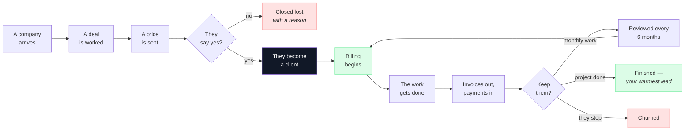

**Two rules explain almost everything below:**

> **① A company is one record, whether or not they have ever bought.**
> **② A company becomes a client only when a deal is won.**

Nothing is ever copied from one record into another. Winning changes a status; it does not create a
second version of the customer.

---

# 2 · Before anything — setup

Done once, by the Super Admin.

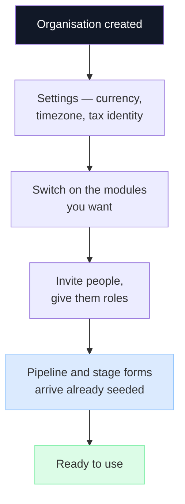

## 2.1 Organisation settings

| Field | What it does |
|---|---|
| Name, logo, website, industry | Appears on documents |
| Address, phone | Printed on quotes and invoices |
| **Currency** | One per organisation. Stored on every money record |
| **Timezone** | Every "today", "overdue" and "due in 7 days" is calculated in it |
| **Locale** | Number and date formatting |
| **Date format** | How dates are displayed |
| **Fiscal year start** | Which month year-to-date figures begin from |
| **Document prefix** | The letters before every quote and invoice number |
| **State** | Decides CGST+SGST vs IGST on every invoice |
| **GST number** | Legally required on a GST invoice |
| **Sending name and address** | Who quotations appear to come from |
| **Mail account** | So mail arrives from you, sits in your Sent folder, and replies come back to you |
| Tax defaults | Pre-filled on new quotes |
| **Google Workspace domain** | Only this domain may sign in with Google |
| **Allow password login** | On or off, for the whole organisation |

## 2.2 Modules

Three, each switchable:

| Module | Contains |
|---|---|
| **CRM** | Companies, deals, the pipeline, quotations |
| **PM** | Projects, tasks |
| **Revenue** | Engagements, invoices, payments, expenses |

Switching one off hides its navigation and blocks its routes. The data stays.

## 2.3 People and roles

Five roles, forming a ladder — each contains everything below it. A person holds one.

| Role | Adds on top of the one below |
|---|---|
| **Super Admin** | Billing, transferring ownership, deleting the organisation, granting Admin |
| **Admin** | The money — invoices, payments, revenue — and all settings |
| **Manager** | Delivery — projects, tasks, and staffing who does what |
| **Sales** | The pipeline — leads, deals, quotes, clients |
| **Member** | Their own tasks |

## 2.4 The pipeline

Arrives seeded. Nobody faces a blank board.

| # | Stage | Means | Probability |
|---|---|---|---|
| 1 | New Lead | open | 10% |
| 2 | Outreach | open | 20% |
| 3 | Meeting | open | 40% |
| 4 | Proposal | open | 60% |
| 5 | Negotiation | open | 75% |
| 6 | Contract | open | 90% |
| 7 | **Won** | **won** | 100% |
| 8 | **Lost** | **lost** | 0% |

**Each stage also carries a patience threshold** — how many days a deal may sit there before the card
is flagged as going stale.

**The won and lost stages cannot be removed, duplicated, or have anything placed after them.**
Otherwise somebody adds "Onboarding" after Won and won deals never leave the board.

---

# 3 · A company arrives

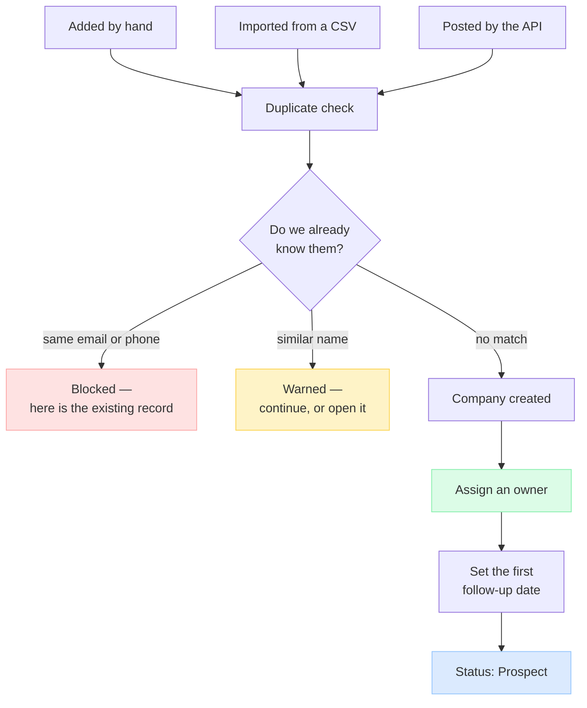

**An owner and a follow-up date from the very first moment.** Every reminder Flowzen sends is
addressed to whoever owns the record. A company with no owner is invisible to all of them.

**Import never blocks the file.** It flags the rows it is unsure about and lets the rest through.

## 3.1 Company fields

| Field | Notes |
|---|---|
| Name | |
| Industry, website, company size | |
| Email, phone | Used for the duplicate check |
| Address, city, **state**, zip, country | State decides the tax treatment on invoices |
| Billing address | If it differs |
| **GST number** | Printed on their invoices |
| **Status** | Prospect · Active · On hold · Project completed · Churned |
| **Owner** | The account manager. Decides who gets reminded |
| Source | Where they came from |
| Archived at | Companies are retired, never deleted |

**Status is never typed by a human.** It is set by one piece of code that looks at the company's
engagements:

```
has something running       →  Active
everything paused           →  On hold
had a project, it finished  →  Project completed
had a retainer, it stopped  →  Churned
never bought anything       →  Prospect
```

## 3.2 Contact fields

A company is an organisation; the people in it live here.

| Field | Notes |
|---|---|
| Name, designation | |
| Email, phone, LinkedIn | |
| **Role** | Decision maker · Champion · Influencer · Gatekeeper |
| **Primary** | The main person. Shown on the card, carried onto quotations |
| Notes | |

---

# 4 · Working the deal

**One company can have many deals.** Customers come back and buy more than one thing.

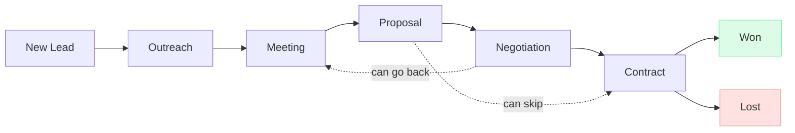

**Stages can be skipped and dragged backwards.** Real deals do not move in a straight line, and
forcing a strict order teaches people to lie to the board.

**Two things are required, enforced by the server, not just the form:**

| To reach | You must have |
|---|---|
| **Negotiation** | A value and an expected close date |
| **Won** | An engagement type and a start date |

A forecast without an amount and a date cannot be planned against. Billing without a type is billing
that is wrong.

## 4.1 Deal fields

| Field | Notes |
|---|---|
| Company | Required |
| Deal number | |
| **Stage** | Where it sits on the board |
| **Value** | What you expect to win |
| **Expected close date** | |
| **Owner** | Whose deal it is |
| Source, priority | |
| **Contract type** | Retainer or project — set at the win |
| **On hold** + since + reason | A flag, not a stage, so the deal keeps its column |
| **Blocked on** | What it is waiting for |
| Next step date | |
| **Lost reason** | Required to close it lost |
| Follow-up date | |
| Last contacted at | |

## 4.2 Stage forms

Each stage can ask for a few things when a deal arrives in it.

```
┌─ Won ───────────────────────────────┐
│  Retainer or project?   [required]  │  ← a hard rule. Cannot be removed
│  Start date             [required]  │  ← a hard rule
│  Payment terms                      │  ← part of the form
│  Audit required?                    │  ← part of the form
└─────────────────────────────────────┘
```

**Some prompts can never be removed.** The Won stage always asks for engagement type and start date,
because billing is built from the answers.

**A field belongs to the deal, not to the stage.** So the answer stays visible after the deal has
moved on, and the same field can be asked at two different stages.

**Optional by default.** Every required field is one more thing someone must type to move a deal, and
a form full of them teaches people to type rubbish to get past it.

## 4.3 The timeline

Calls, meetings, emails and notes all land on **one timeline** on the deal.

| Field | Notes |
|---|---|
| Type | Call · meeting · email · note · stage change · system |
| Message | The one-line summary |
| Body | The full text, if there is one |
| Direction | Incoming or outgoing |
| **Occurred at** | When it actually happened |
| **Created at** | When it was typed in |

**Those last two are deliberately separate.** A call logged on Friday about a Tuesday conversation
belongs on Tuesday — otherwise every "last contacted" figure is wrong by however long people take to
write things up.

**The timeline can only be added to.** A history you can edit is not a history.

## 4.4 Tasks on a deal

A task belongs to **either** a deal (pre-sales) **or** a project (delivery). Never both.

## 4.5 Stall signals

Two things on the card, so a stalled deal is visible without opening it:

- **How long it has sat still**, against that stage's own patience threshold
- **What it is waiting on** — the blocked-on field

---

# 5 · Quoting

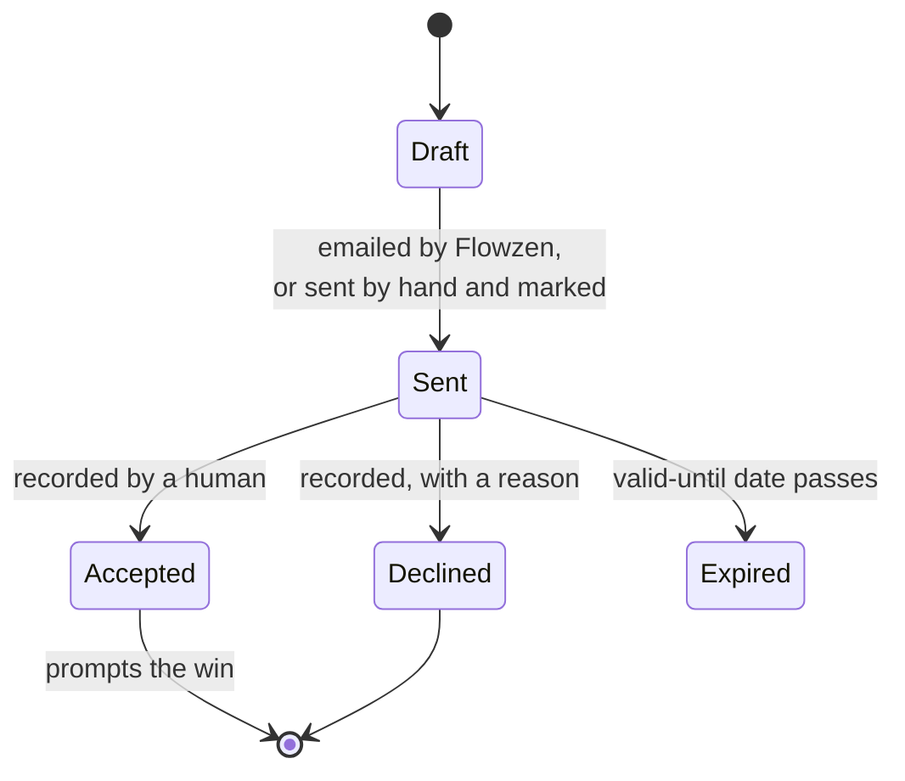

## 5.1 Quote fields

| Field | Notes |
|---|---|
| Company, **deal** | The deal is required — one parent |
| Number | Automatic, using the organisation's prefix |
| **Engagement type** | **Retainer or project** |
| **Billing frequency** | Monthly · quarterly · yearly · one-time |
| Line items | See below |
| Subtotal, CGST, SGST, IGST, total | **All computed by the server** |
| Currency | |
| Valid until | Drives expiry |
| Status | Draft · Sent · Accepted · Declined · Expired |
| **Sent at**, sent via, sent by | |
| **Accepted at**, accepted via, note | |
| Declined at, decline reason | |
| Recorded by, recorded at | |

**Why the type and frequency are on the quote:** a total of ₹4,80,000 could be ₹40,000 a month for a
year, or a one-off build. The document cannot say which without them — and since the deal's value
follows the quote total, an unstated type makes the deal look **twelve times** its monthly fee.

## 5.2 Line items

Each line: description, quantity, rate, discount, tax.

**Every total is computed by the server.** A document must never bill an amount that arrived from a
form.

**The deal's value follows the quote total** — typing the number twice is how the two end up
disagreeing.

## 5.3 The service catalogue

A list of what you sell — name, description, default rate, unit.

Picking one fills in the line; you can still edit it, and you can type a line from scratch. **The
line keeps its own text and rate**, so raising your standard rate never rewrites a quote you sent
last month.

## 5.4 Sending it

```
                    ┌─ Send from Flowzen ──→ PDF made, emailed from your address
Build the quotation ┤                        sent-at filled in automatically
                    └─ Download the PDF ───→ you send it yourself
                                             then "mark as sent" — when? how?
```

**When Flowzen sends it, the status only moves to Sent if the mail actually left.** A failed send
leaves the quote alone — a quote marked sent that never arrived is worse than one still marked draft.

**Every PDF is compressed** before it is stored or emailed. A large attachment is the most common
reason a quotation lands in spam.

## 5.5 Recording the answer

The client replies by email, phone, or in a meeting — outside Flowzen either way. So somebody records
it.

| Outcome | What is recorded |
|---|---|
| **Accepted** | When · how · a note → **offers to win the deal, pre-filled** |
| **Declined** | When · how · **why** → the deal closes lost with a reason |
| **No reply** | Nobody records anything → after 7 days it appears on the owner's morning list |

**When they accepted, not when you typed it.** A client who agreed on Tuesday and was entered on
Friday accepted on Tuesday.

**Only one quote per deal can be accepted.** Accepting version three declines versions one and two,
so a deal never has two live prices.

---

# 6 · Winning — the moment everything changes

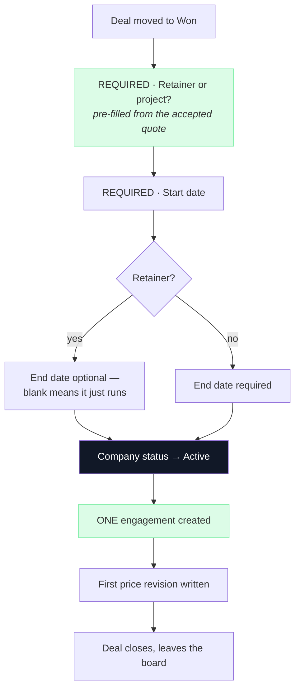

**All of it happens together or none of it does.** One click cannot half-win a deal.

**One engagement per won deal, enforced by the database.** Two people clicking at the same instant
cannot bill the client twice.

**Nothing is copied.** The company record has existed since they first appeared. It changes status.

**Won deals stay at Won.** They do not travel further along the board — a pipeline answers one
question, and after that it is a relationship, not a pursuit.

**A lost deal never reopens.** A revival is a new deal, or cycle time and win rate become lies.

---

# 7 · The engagement — what bills them

One thing describes what a client is paying for. Retainers and projects differ in **how often they
bill**, which is a field, not a separate concept.

## 7.1 Fields

| Field | Notes |
|---|---|
| Company, deal | The deal is optional — imported ones have none |
| **Type** | Retainer or project |
| **Status** | Active · Paused · Ended |
| **Amount**, currency | |
| **Billing frequency** | Monthly · quarterly · yearly · one-time |
| Tax included, CGST, SGST, IGST | |
| Advance amount, advance received | |
| **Start date** | |
| **End date** | **Blank means rolling** |
| Next billing date | |
| **Review interval** | Default 6 months |
| Next review date, last reviewed at | |
| Payment terms | 100% advance · 50-50 · monthly · milestone |
| Notes | |

## 7.2 Rolling versus fixed term

**A blank end date is not missing data. It means something.**

| | |
|---|---|
| **Fixed term** | Has an end date. It will expire, and someone has to decide whether to renew |
| **Rolling** | No end date. It just runs until somebody stops it |

Most retainers are rolling. Inventing an end date invents a deadline that nobody agreed to.

## 7.3 Price history

**Every commercial change writes a revision** — the amount, the frequency, the status, the date it
took effect, the reason, and who made it.

**Why:** raising a client from ₹40,000 to ₹55,000 overwrites the old figure. Without revisions,
*"what was our monthly revenue last March?"* becomes permanently unanswerable — and you find out on
the day you ask.

## 7.4 One definition of monthly revenue

```
monthly revenue  =  sum of every ACTIVE engagement, converted to a monthly figure
                    quarterly ÷ 3      yearly ÷ 12      one-time excluded
```

**One definition, used by every screen.** Today two screens calculate it two different ways and
disagree for four of five clients.

---

# 8 · Delivery — projects and tasks

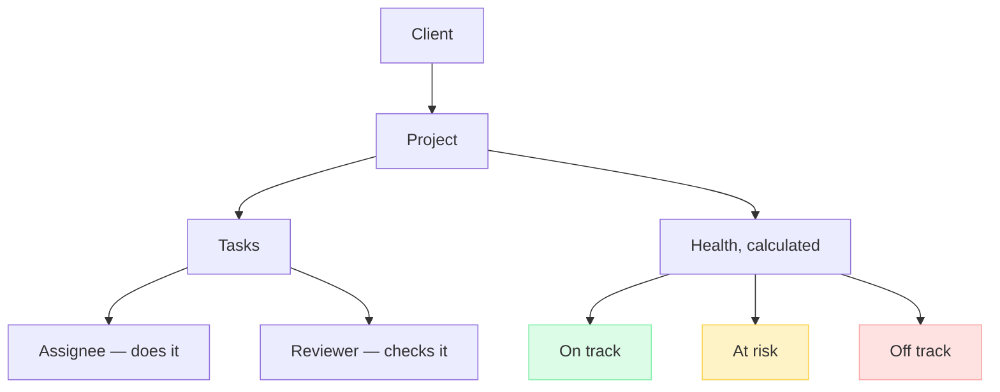

## 8.1 Project fields

| Field | Notes |
|---|---|
| **Company** | Required — and the only parent |
| Name, description | |
| Status | Planning · Active · On hold · Completed · Cancelled |
| Priority | |
| Start date, due date, completed at | |
| Lead | |

**A project links to the client, not to an engagement.** What the client is on — retainer or project,
and at what price — is **shown** on the project, read from the client. It is context, not a
connection, so nothing has to be re-pointed when an engagement renews or ends.

## 8.2 Task fields

| Field | Notes |
|---|---|
| **Project or deal** | Exactly one. Never both |
| Title, description | |
| Status | To do · In progress · **In review** · Done · Blocked |
| Priority | |
| **Assignee** | Who does it |
| **Reviewer** | Who checks it |
| Due date, completed at | |
| Parent task | For subtasks |
| **Recurrence** | Retainer work that repeats monthly |

**In review is a real status** because work sitting with a reviewer is neither done nor in progress.

## 8.3 Health is calculated

```
Off track   the due date has passed and it is not finished
At risk     a task is overdue, or the due date is within 7 days with work still open
On track    otherwise
```

**Nobody sets this by hand.** A health flag someone sets is green everywhere, forever.

---

# 9 · Money in, money out

## 9.1 The whole revenue flow

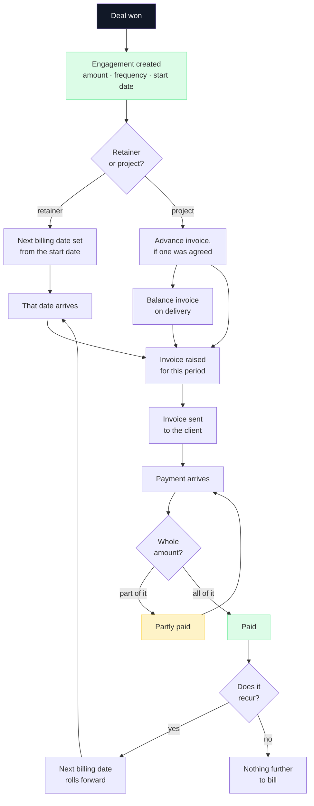

**The engagement is the source of every invoice.** It knows the amount, how often it bills, and when
the next one is due. An invoice is one period of that engagement turned into a document.

## 9.2 Where an invoice actually comes from

| | How it starts |
|---|---|
| **A retainer period** | The engagement's next billing date arrives → an invoice for that period |
| **A project advance** | Raised at the start, for the agreed percentage |
| **A project balance** | Raised on delivery |
| **Anything else** | Raised by hand against the company |

**Today all of these are raised by a person.** Flowzen tells you an invoice is due; it does not create
one on its own. See §9.10 — that is the honest list of what is still manual, and the first thing
worth automating.

## 9.3 The retainer billing cycle

A ₹40,000-a-month retainer starting 1 April:

```
1 Apr   engagement starts        next billing date = 1 Apr
1 Apr   invoice #1 raised        ₹40,000 + tax        next billing date → 1 May
        sent · paid
1 May   invoice #2 raised        ₹40,000 + tax        next billing date → 1 Jun
        sent · paid
        …and so on, until the engagement is paused or ended
```

**The next billing date moves only when an invoice is actually raised** — never on a timer. If nobody
raises May's invoice, the date stays at 1 May and keeps appearing as due. A cycle that rolls forward
by itself hides the month you forgot to bill.

**Quarterly and yearly work identically**, with a longer step.

**Raising the price** writes a revision (§7.3) and takes effect from the date given. Invoices before
that date keep the old amount — they are frozen documents.

## 9.4 Project billing

A ₹6,00,000 website, 50% advance:

```
at the start   advance invoice     ₹3,00,000 + tax
on delivery    balance invoice     ₹3,00,000 + tax
```

The engagement records the advance amount and whether it has been received, so *"have they paid the
advance?"* is answerable before any work starts.

**Splitting a project into more than two invoices — thirds, or per phase — is not built yet.** Until
it is, raise each one by hand against the same engagement.

## 9.5 When money arrives

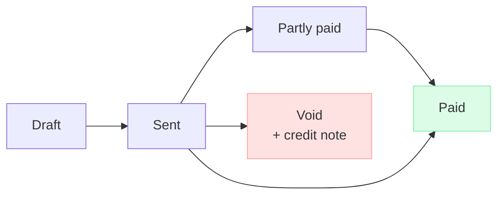

A payment is recorded **against a specific invoice**, with the amount, the date it arrived, how it
came, and its reference.

**The invoice's status follows the payments, and one piece of code decides it:**

```
payments total  =  0                →  still Sent
payments total  <  invoice total    →  Partly paid
payments total  >= invoice total    →  Paid
```

Never set by hand, and never by more than one place — that is how a list and a dashboard start
disagreeing.

**Recording a payment is audited.** So is deleting one.

## 9.6 Invoice fields

| Field | Notes |
|---|---|
| Company, engagement, quote | |
| **Number** | Automatic, unique, never reused |
| Type | Invoice · credit note · proforma |
| Issue date, **due date** | |
| Status | Draft · Sent · Partly paid · Paid · Void |
| **Line items** | A frozen snapshot |
| Subtotal, **CGST / SGST / IGST**, total | Computed from the two parties' states |
| Currency | |

**Overdue is deliberately not a status.** It is *sent, unpaid, and past due* — worked out on the spot.
Storing it needs a nightly job, and the night that job fails your receivables are silently wrong.

**An issued invoice never changes.** If it is wrong you void it and issue a credit note. That is what
an audit needs to see.

## 9.7 Payment fields

| Field | Notes |
|---|---|
| **Invoice** | So "which invoice did this settle?" has an answer |
| Amount, date received | |
| Method | Bank · UPI · cheque · cash |
| Reference number | |
| Recorded by | Payments are audited |

Several payments can settle one invoice. That is what *partly paid* means.

## 9.8 Expense fields

| Field | Notes |
|---|---|
| Company or project | |
| Amount, date | |
| Category | Vendor · travel · equipment · marketing · misc |
| Description, vendor | |
| Receipt | |

## 9.9 Every number on the revenue screen, and where it comes from

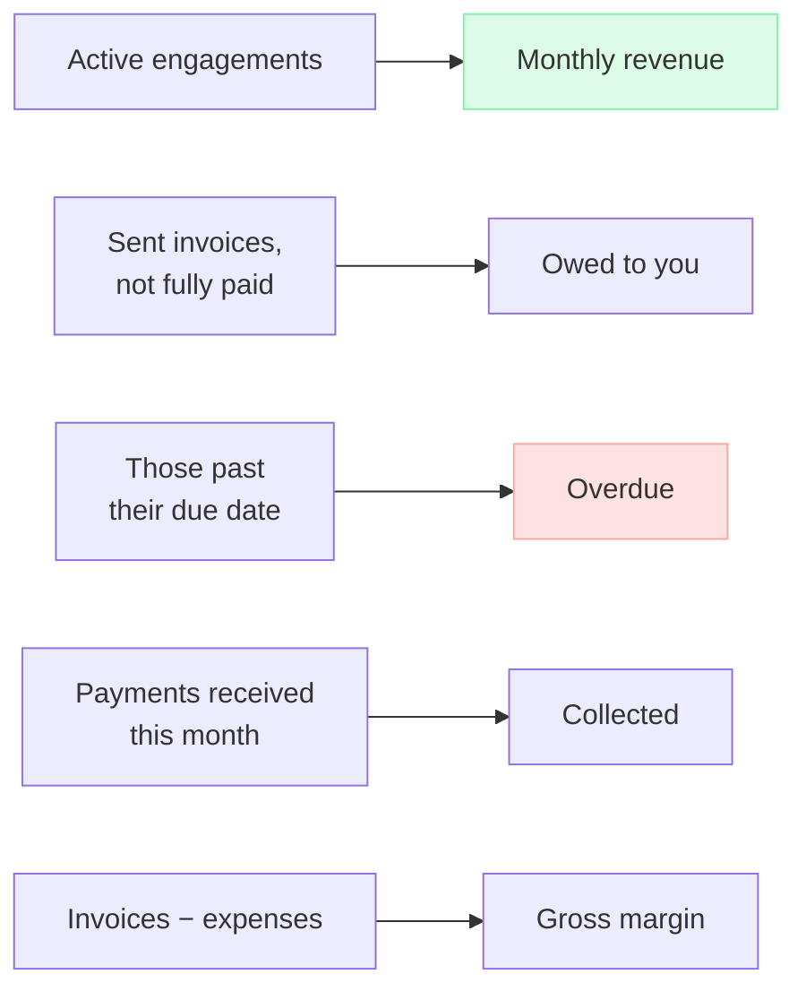

| Number | Exactly what it is |
|---|---|
| **Monthly revenue** | Every **active** engagement, converted to a monthly figure. Quarterly ÷ 3, yearly ÷ 12, one-time excluded |
| **Owed to you** | Every sent invoice, minus what has been paid against it |
| **Overdue** | The same, filtered to those past their due date. **Worked out on the spot** — not a stored flag |
| **Collected** | Payments received in the period. What actually landed, not what was billed |
| **Gross margin** | Invoiced minus expenses |

**Billed is not collected, and neither is revenue.** Three different numbers that people routinely
treat as one:

```
monthly revenue    what the contracts say you earn
billed             what you have actually invoiced
collected          what has actually arrived
```

A month can look strong on revenue and be empty in the bank. All three are shown, separately.

## 9.10 Gross margin, never profit

```
invoiced  −  expenses  =  gross margin
```

**Not profit.** Flowzen does not track what your own team's effort cost, and will not pretend to.
Time tracking was deliberately removed.

Margin is measured **per client**, not per engagement — projects and expenses attach to the company,
so *"what did we make on this client?"* is the question it answers.

## 9.11 What is still done by hand

Being honest about it, because a diagram makes everything look automatic:

| Step | Today | Planned |
|---|---|---|
| Raising each retainer invoice | **By hand**, prompted when due | The engagement raises its own draft; a human approves and sends |
| Splitting a project into milestones | **By hand** | Milestone billing |
| Chasing an unpaid invoice | Appears on the morning list — **you send the email** | Automatic reminders at 7 and 30 days |
| Recording a payment | **By hand**, from the bank statement | — |
| Marking an engagement ended | **By hand** | — |

**The first row is the one that costs you.** A monthly retainer is twelve invoices a year, per client
— and if that is a manual job it is the most forgettable one you have. Forgetting it means not being
paid, and the client will not remind you.

---

# 10 · Keeping the customer

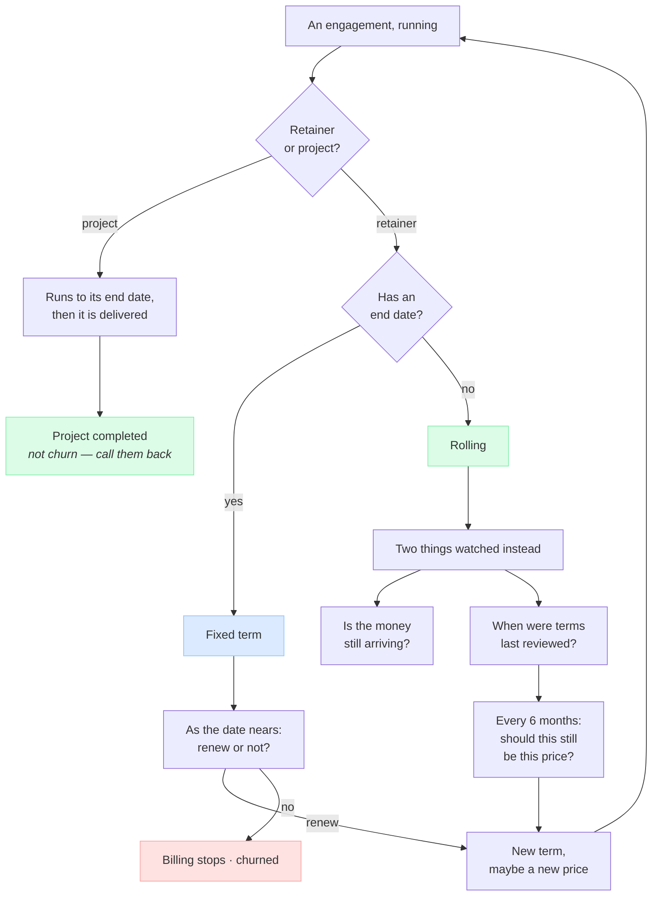

**Rolling engagements are reviewed, not renewed.** Nothing expires — so the risk is not expiry. It is
a fee that stays where it started while the work quietly grows.

**A finished project is not churn.** An agency delivering twenty websites a year would otherwise show
twenty churned clients in its best year. Churn measures **lost recurring revenue**, not endings.

**And a finished project is your warmest lead.** Buried in a list marked *churned*, nobody ever calls
them.

**Renewals live on the client's own page**, not on a separate screen. Renewing is a conversation
about one relationship.

---

# 11 · Pausing, losing, leaving

| Action | What it stops |
|---|---|
| **Park a deal** | Nothing — there is no billing yet. It keeps its column and its position |
| **Pause a client** | Real money. Billing halts |

**One gesture must never do both.** Otherwise billing stops as a side effect of dragging a card.

Before freezing anything, Flowzen checks whether that company has another live engagement.

**Nothing is ever deleted.** Companies are retired. Lost deals stay lost, with their reason. People
come back, and you want to know what happened last time.

---

# 12 · What runs without anyone clicking

**Through the day:** tasks due soon, tasks now overdue.

**Each morning, in your own timezone:**

- Follow-ups due today
- Deals that have gone quiet, measured against each stage's own patience
- **Quotations sent more than 7 days ago with no answer** — the one outcome nobody records by hand
- Reviews and renewals approaching
- Payments that have not arrived

**Sent to one person, not everyone.** A notification addressed to the whole team is one nobody acts
on. Each goes to whoever owns the record.

**Repeats are updated, not re-sent.** An overdue invoice that generates a fresh notification every
morning produces thirty identical ones in a month, and the day that starts is the day people stop
looking.

---

# 13 · Who sees what

| | Super Admin | Admin | Manager | Sales | Member |
|---|---|---|---|---|---|
| Companies & contacts | full | full | full | full | read — theirs |
| Deals & pipeline | full | full | full | full | — |
| Quotes | full | full | full | full | — |
| What a client pays | full | full | full | read | — |
| Projects | full | full | full | read | assigned |
| Tasks | full | full | full | own | own |
| **Invoices & payments** | full | full | — | — | — |
| **Revenue & reports** | full | full | — | — | — |
| Assign people to work | full | full | full | — | — |
| Invite / remove people | full | full | — | — | — |
| Settings | full | full | — | — | — |
| **Billing & ownership** | **full** | — | — | — | — |

**Money is the one real dividing line.** In an agency, deals, clients, projects and who is busy are
all better shared than guarded. Revenue is the exception.

**Ownership is separate from permission.** A company has an account owner and a deal has a deal
owner. Those decide who gets **notified** and who is accountable — not who is **allowed**.

**A rule is enforced on the server, never only in the browser.** Hiding a button is not security.

---

# 14 · Getting in — invites and sign-in

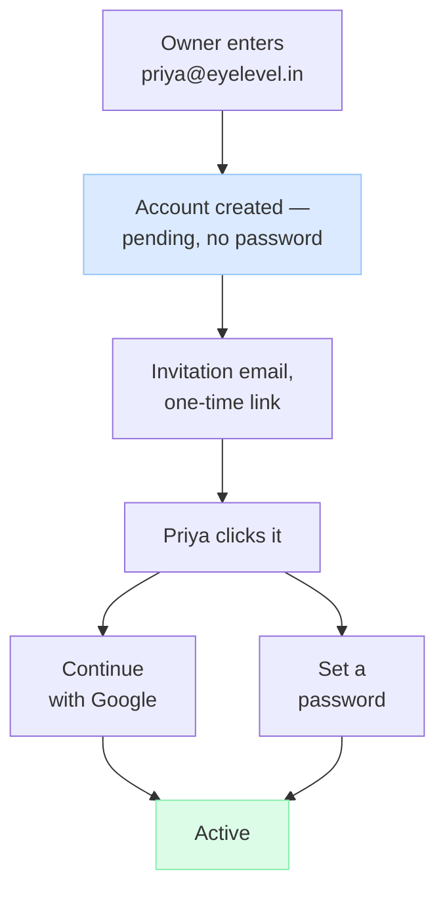

**The invitation creates the account; signing in only activates it.** So a role can be given to
someone before they have ever logged in.

**One account can carry both methods.** Someone who joined with Google can add a password later, and
the other way round. An active account must always have **at least one** way in.

**An invitation can only be accepted by the address it was sent to.** Otherwise a forwarded link
hands somebody else's account — and role — to whoever clicks it.

**A role change takes effect on the next click.** No logging out, no waiting.

---

# 15 · Field reference

Everything above, in one place.

| Record | Fields |
|---|---|
| **Organisation** | name · logo · website · industry · size · address · phone · currency · timezone · locale · date format · fiscal year start · document prefix · state · GST number · sending name · sending address · mail account · Google domain · allow password login |
| **User** | name · email · avatar · **role** · designation · phone · joining date · status · password *(optional)* · Google id · auth provider |
| **Company** | name · industry · website · size · email · phone · address · city · **state** · zip · country · billing address · **GST number** · **status** · **owner** · source · archived at |
| **Contact** | name · designation · email · phone · LinkedIn · **role** · primary · notes |
| **Pipeline / Stage** | name · position · **kind** · probability · patience threshold · archived at |
| **Deal** | company · number · **stage** · **value** · **expected close date** · **owner** · source · priority · **contract type** · on hold + since + reason · blocked on · next step date · **lost reason** · follow-up date · last contacted |
| **Stage history** | deal · from stage · to stage · when · who |
| **Quote** | company · **deal** · number · **engagement type** · **billing frequency** · line items · subtotal · CGST · SGST · IGST · total · currency · valid until · status · sent at/via/by · accepted at/via/note · declined at/reason · recorded by/at |
| **Service** | name · description · default rate · unit · archived at |
| **Engagement** | company · deal · **type** · **status** · **amount** · currency · **billing frequency** · tax fields · advance · **start date** · **end date** · next billing date · review interval · next review · last reviewed · payment terms · notes |
| **Engagement revision** | amount · frequency · status · effective from · reason · changed by |
| **Project** | **company** · name · description · status · priority · start · due · completed at · lead |
| **Project member** | project · user |
| **Task** | **project or deal** · title · description · status · priority · **assignee** · **reviewer** · due date · completed at · parent task · recurrence |
| **Invoice** | company · engagement · quote · **number** · type · issue date · **due date** · status · **line items** · subtotal · CGST · SGST · IGST · total · currency |
| **Payment** | **invoice** · amount · date received · method · reference · recorded by |
| **Expense** | company or project · amount · date · category · description · vendor · receipt |
| **Activity** | type · message · body · direction · **occurred at** · **created at** · user · and what it is attached to |
| **Notification** | type · message · link · recipient · read · created |
| **Audit log** | what changed · who · when · which record · before and after |

---

## The rules that hold everywhere

| The rule | Why |
|---|---|
| One company record, prospect or client | Two records for one company always drift apart |
| A company becomes a client only by winning a deal | So the client list and the pipeline cannot disagree |
| One company, many deals | Customers come back and buy more than one thing |
| The pipeline ends at won or lost | After that it is a relationship, not a pursuit |
| Retainer or project is decided at the win | They bill differently from day one |
| One engagement per won deal | Two clicks at the same instant must not bill twice |
| Price changes are never overwritten | Or last year's revenue becomes unknowable |
| A blank end date means rolling | Most retainers just run |
| Rolling engagements are reviewed, not renewed | The risk is a price that never moved |
| Parking a deal and pausing a client are different | One stops nothing; the other stops money |
| An issued invoice never changes | Void it and credit-note it |
| Anything that can be worked out is not stored | A stored "overdue" is wrong the night the job fails |
| A finished project is not churn | Churn measures lost recurring revenue, not endings |
| A lost deal never reopens | Or cycle time and win rate are lies |
| Nothing is deleted, only retired | History stays true, and customers come back |
| Money is never a rounding-prone number | An invoice off by a paisa is a dispute |
| Rules are enforced on the server | A rule the browser can skip is not a rule |
| Every screen is scoped to your organisation | |
| The timeline is only ever added to | A history you can edit is not a history |
| Nothing assumes one country | Dates, days and money belong to whoever is using it |
| Gross margin, never profit | The system does not know what your team's effort cost |
