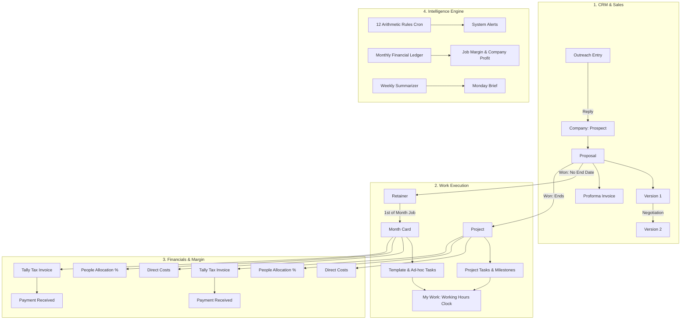

# Flowzen · System Architecture & Implementation Plan

**Document Version:** 1.0  
**Date:** 29 August 2026  
**Status:** System Engineering Specification  
**Reference:** [`docs/PROJECT_BRIEF.md`](file:///d:/Harish/Flowzen/flowzen/docs/PROJECT_BRIEF.md) & [`docs/SCHEMA_PLAN.md`](file:///d:/Harish/Flowzen/flowzen/docs/SCHEMA_PLAN.md)

---

## 1. System Vision & Architecture Overview

Flowzen is built to replace fragmented tools, spreadsheets, and manual memory with a single reliable operating system for creative and growth studios.



---

## 2. Granular Permissions & Role-Based Access Control (RBAC)

### 2.1 The 12 Permission Keys
Permissions are assigned per user and evaluated strictly on the **server side**.

| Permission Key | Name | What it Grants |
|---|---|---|
| `work.own` | My Work | View, start, pause, and complete tasks assigned to self; create self-assigned tasks. |
| `work.team` | Team Work | View and assign tasks for direct department/team members; inspect team load. |
| `work.all` | All Work | View all live retainers, month cards, and projects across the agency. |
| `company.read` | Companies | View companies, associated people, and interaction history. |
| `company.write` | Edit Companies | Create and edit companies and people; promote outreach entries. |
| `pipeline.read` | Pipeline & Proposals | View pipeline board, proposals, versions, and proformas (**includes deal values**). |
| `pipeline.write` | Create Proposals | Create and revise proposals, issue proformas, record deal outcomes. |
| `money.status` | Money (Status Only) | View invoice/proforma payment status (`Paid` / `Unpaid`), **without rupee amounts**. |
| `money.figures` | Money (Figures) | View monetary figures, costs, gross margins, project profitability, and client totals. |
| `cost.enter` | Enter Costs | Record direct vendor expenses, client costs, and operational bills. |
| `reports.read` | Reports & Brief | Access management analytics, forecasts, client profitability, and Monday Brief. |
| `setup.admin` | Setup & Administration | Manage users, salaries, task templates, numbering series, and system configuration. |

---

### 2.2 Role Preset Matrix

Presets streamline onboarding while allowing individual permission overrides:

| Permission | Employee | Head | BD / Sales | Accounts | Management (Admin) |
|---|:---:|:---:|:---:|:---:|:---:|
| `work.own` | ✓ | ✓ | ✓ | ✓ | ✓ |
| `work.team` | | ✓ | | | ✓ |
| `work.all` | | ✓ | | | ✓ |
| `company.read` | | | ✓ | ✓ | ✓ |
| `company.write` | | | ✓ | | ✓ |
| `pipeline.read` | | | ✓ | | ✓ |
| `pipeline.write` | | | ✓ | | ✓ |
| `money.status` | | ✓ | ✓ | ✓ | ✓ |
| `money.figures` | | | | ✓ | ✓ |
| `cost.enter` | | ✓ | | ✓ | ✓ |
| `reports.read` | | | | | ✓ |
| `setup.admin` | | | | | ✓ |

### 2.3 Non-Negotiable Security Invariants
1. **Deal Values $\ne$ Cost Figures**: BD users hold `pipeline.read` and must see proposal values to sell. They do **not** have `money.figures` and must never receive vendor costs, contractor bills, team salaries, or margins.
2. **Salary Masking in Allocations**: Department heads confirming monthly team splits on the allocation screen (`work.team`) see **percentages only**. Rupees are computed dynamically by the backend for authorized callers with `money.figures`.
3. **Server-Side Authorization**: The client never masks unauthorized data sent in API payloads. If a user lacks permission, the field is stripped before serialization.

---

## 3. The 12 Deterministic Business Rules

Evaluated hourly by the background worker. Every alert links to the source record and auto-resolves when the condition clears.

| # | Rule Identifier | Trigger Condition | Target & Escalation |
|---|---|---|---|
| 1 | `RULE_PROPOSAL_FOLLOWUP` | `stage` in (`PROPOSAL_SENT`, `IN_NEGOTIATION`) AND days since last version $> 5$ AND outcome is null. | Task to owner at 5 days; Escalates to Management at 10 days. |
| 2 | `RULE_PROFORMA_UNPAID` | `Proforma.status == UNPAID` AND days since `raisedAt` $> 7$. | High Alert $\rightarrow$ Accounts & Management. |
| 3 | `RULE_INVOICE_OVERDUE` | `now > dueAt` AND `status != PAID`. | Alert weighted by client's historical payment delay median. |
| 4 | `RULE_PROJECT_OVER_ESTIMATE`| `actualCost > estimatedCost` AND `percentComplete < 100`. | Delivery Alert $\rightarrow$ Project Owner & Head. |
| 5 | `RULE_PROJECT_BEHIND` | `percentTimeElapsed - percentComplete > 15%`. | Delivery Alert $\rightarrow$ Project Owner & Head. |
| 6 | `RULE_PERSON_OVERLOADED` | `openTasks > 1.3 × trailing 8-week median open tasks`. | People Alert $\rightarrow$ Department Head. |
| 7 | `RULE_PERSON_UNDERLOADED`| `openTasks < 0.6 × trailing 8-week median open tasks`. | People Alert $\rightarrow$ Department Head. |
| 8 | `RULE_TASK_AGING` | Open working hours $> 2 \times$ median benchmark for that task type. | Delivery Alert $\rightarrow$ Department Head. |
| 9 | `RULE_RETAINER_NO_CONTRACT` | `termMonths is null` AND `status == ACTIVE`. | Risk Alert $\rightarrow$ Account Owner & Management. |
| 10 | `RULE_RENEWAL_APPROACHING` | `renewalDate` within 45 days. | Risk Alert $\rightarrow$ Account Owner. |
| 11 | `RULE_CLIENT_QUIET` | No task, meeting, or invoice on `Company` for $> 21$ days. | Risk Alert $\rightarrow$ Account Owner. |
| 12 | `RULE_MONTHCARD_UNINVOICED` | `MonthCard.status == CLOSED` AND `invoiceId is null` after 5 days. | Money Alert $\rightarrow$ Accounts Desk. |

---

## 4. Scheduled Jobs & Automation Engine

```
[Background Cron Worker]
 ├── 00:05 on 1st of Month ──> Month Roll: Create MonthCards + Spawn Template Tasks
 ├── 00:15 on 1st of Month ──> Recurring Costs: Generate Draft Bills (Rent, Software, Salaries)
 ├── Hourly (Every 60m)    ──> Rule Scanner: Evaluate 12 Rules, Raise & Auto-Resolve Alerts
 ├── 00:30 on 25th of Month ──> Allocations: Compute Proposed % from Task Volume & Notify Heads
 └── 07:00 every Monday    ──> Monday Brief: Assemble Metrics + Weekly Narrative & Email
```

### 4.1 1st of Month: Retainer Month Roll (00:05 IST)
* Iterates through all `Retainer` rows where `status == ACTIVE`.
* Idempotently creates `MonthCard` with `month = "YYYY-MM"` and snapshots `revenue = Retainer.monthlyValue`.
* Reads linked `TaskTemplate` and schedules all default items across assigned team members and due days.

### 4.2 25th of Month: People Allocation (00:30 IST)
* Aggregates completed task counts per user across all active `MonthCard` and `Project` records.
* Calculates `proposedPercent` for each user's workload.
* Generates draft `PeopleAllocation` records and alerts Department Heads to review and confirm percentage splits.

### 4.3 Working Hours & Task Clock Algorithm
* **Clock Window**: Monday through Saturday, **10:00 to 19:00 IST** (9 hours/day).
* **Exclusions**: Sundays and configured agency public holidays.
* **Waiting Buffer**: When status changes to `WAITING`, clock freezes and duration accumulates in `waitingTotalMinutes`.
* **Reopen Counter**: Moving a task from `DONE` back to `OPEN` increments `reopenCount` and resumes the working hours clock.

---

## 5. Screen & UI Specifications

The UI consists of **12 main screens**, **3 detail records**, and **9 modal forms**.

### 5.1 Main Application Screens
1. **My Work (`work.own`)**: Daily personal cockpit. Shows Overdue, Today, This Week, and Done tasks. Includes tick-to-complete actions and elapsed working time.
2. **Team (`work.team`)**: Department workload view, capacity load bars, bottleneck alerts, average completion time.
3. **Companies (`company.read`)**: Master company directory tabbed by `Prospect`, `Client`, and `Past`.
4. **Outreach List (`company.read`)**: Staging table for cold scraped leads. One-click promote to Prospect on reply.
5. **Pipeline (`pipeline.read`)**: 6-stage sales board showing weighted values and step-by-step conversion rates.
6. **Proposals (`pipeline.read`)**: Proposal list with version history chips and proforma registry.
7. **Live Work (`work.all`)**: Unified view of active Retainers (with Month Cards) and live Projects.
8. **Monday Brief (`reports.read`)**: Executive weekly read, proactive questions, and grouped operational alerts.
9. **Money (`money.figures`)**: Client profitability table, company overheads, actual monthly P&L, collections, and loan balances.
10. **Forecast (`reports.read`)**: 3-month forward revenue projection splitting Retainers and One-Time Milestones.
11. **Setup (`setup.admin`)**: Users & salaries, permission matrix, task templates, numbering series.
12. **Build Spec (`setup.admin`)**: In-app developer reference documentation.

### 5.2 The 3 Master Detail Views
* **Company Record**: Four tabs — Overview, Proposals (with Version history), Money (Invoices/Costs), and Activity History.
* **Month Card Detail**: Single month of a retainer — Tasks, direct costs, confirmed team allocations, linked Tally invoice, gross margin.
* **Project Detail**: Fixed project cockpit — Quoted vs Estimated vs Actual cost, milestone billing breakdown, team allocations.

### 5.3 The 9 Standard Forms
1. `TaskForm` (Title, work link, assignee, due date, notes)
2. `CompanyForm` (Name, vertical, city, GSTIN, billing address, owner)
3. `PersonForm` (Name, role: Approver/Payer/Contact, email, phone)
4. `ProposalForm` (Company, kind: Retainer/Project, owner)
5. `ProposalVersionForm` (Value, scope summary, sent date, attachment)
6. `ProjectForm` (Name, quoted value, estimated cost, timeline)
7. `CostForm` (Type: Direct/Company/Capital, work link, vendor, amount, paid by, treatment)
8. `ProformaForm` (Company, source, amount, validity date, snapshotted GSTIN/terms)
9. `InvoiceForm` (Tally number, date, amount, proforma link, due date)

---

## 6. Approved AI Scope (Strict Boundaries)

AI strictly analyzes **data within the system** and operates under four controlled touchpoints:

| Touchpoint | Capability | Safety Constraint |
|---|---|---|
| **1. Monday Brief** | Generates executive narrative summarizing the week's financial and delivery metrics. | Read-only; informs leadership without taking automated actions. |
| **2. Ask the Business** | Answers plain-English questions (e.g., *"What was our average margin on video shoots last quarter?"*). | Runs under the active user's permissions and cites record IDs. |
| **3. Draft Assistant** | Generates drafts for proposals, scope summaries, follow-up messages, and client status reports. | Produces editable drafts only; **never auto-sends**. |
| **4. Expense Categorizer** | Suggests cost categories from receipt text and vendor descriptions. | Flags low-confidence suggestions for human review. |

---

## 7. Phased Implementation Roadmap

```
[Phase 1: Foundations] ──> [Phase 2: Sales & Pipeline] ──> [Phase 3: Work & Month Roll]
                                                                      │
[Phase 6: Intelligence] <── [Phase 5: Margin & Allocations] <── [Phase 4: Money & Invoicing]
          │
[Phase 7: Assistance & AI]
```

### Stage 1 · Foundations (Core Spine)
* Clean database migrations for Users, RBAC permissions, Company, Person, OutreachEntry, and Activity log.
* Auth session management and server-side permission middleware.
* Company CRUD with automatic derived status (`Prospect` $\rightarrow$ `Client` $\rightarrow$ `Past`).
* Outreach promotion flow.

### Stage 2 · Sales & Pipeline
* Proposals with immutable `ProposalVersion` history.
* Sequential `Proforma` generation (`EL/PI/26-27/NNN`).
* Dynamic stage derivation (`Talking` $\rightarrow$ `Proposal sent` $\rightarrow$ `In negotiation` $\rightarrow$ `Proforma issued` $\rightarrow$ `Won` / `Lost`).

### Stage 3 · Work Execution & Retainers
* Retainers, MonthCards, Projects, Milestones, and Tasks.
* 1st-of-month roll background cron.
* Task clock engine with Mon–Sat 10:00–19:00 IST working hours and waiting hold tracking.
* "My Work" and "Team Workload" frontend screens.

### Stage 4 · Money & Financial Ledger
* Cost entry with mandatory `workId` on Direct costs.
* Tally Invoice entry, Proforma reconciliation, and Payment recording.
* Collections tracker and overdue aging.

### Stage 5 · Margin & People Allocations
* 25th-of-month allocation calculation job.
* Department Head percentage confirmation screen (without salary exposure).
* Real-time calculation of Job Profit, Job Margin, and Company Net P&L.

### Stage 6 · Intelligence & 12 Rules Engine
* Background rule engine scanning all 12 conditions hourly.
* Alert notification center and auto-resolution lifecycle.
* 3-Month Forward Forecast screen.

### Stage 7 · Assistance & Monday Brief
* Monday morning executive brief compiler and email dispatch.
* Permission-scoped "Ask the Business" natural language query endpoint.
