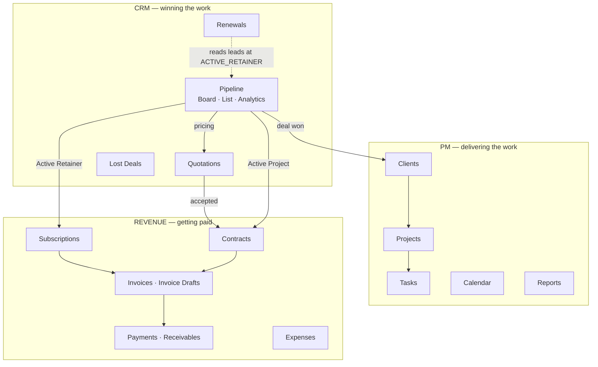
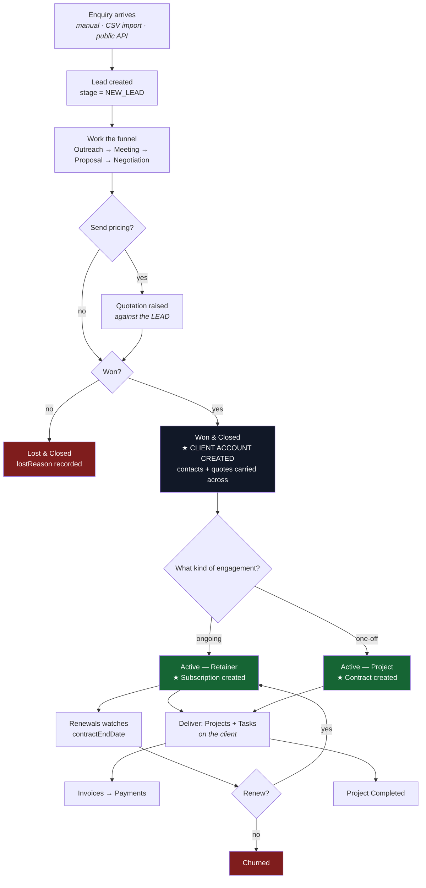
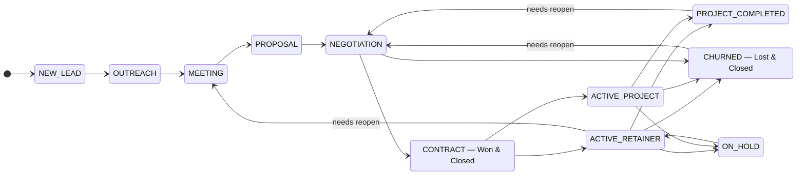
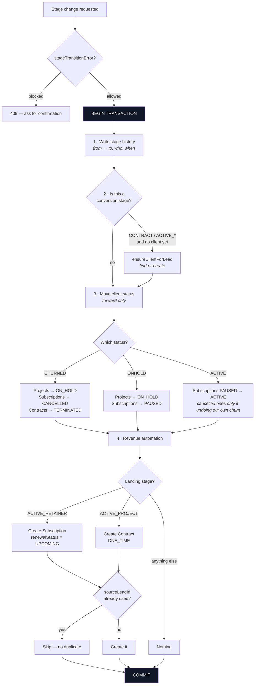
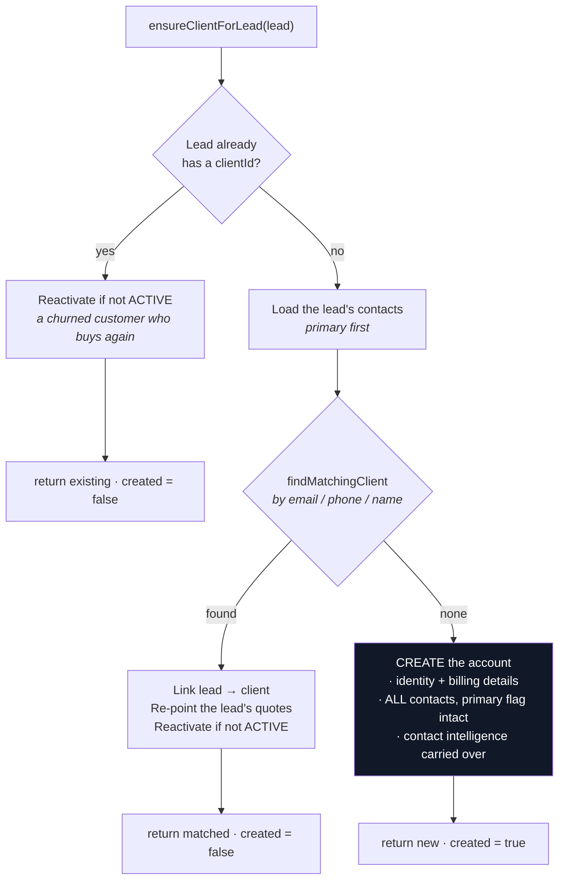
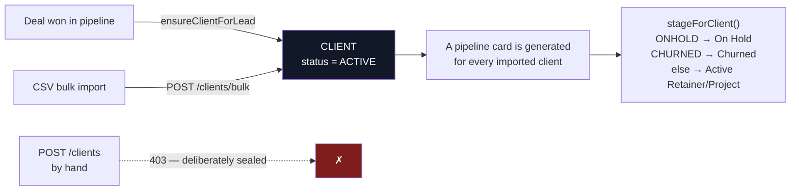
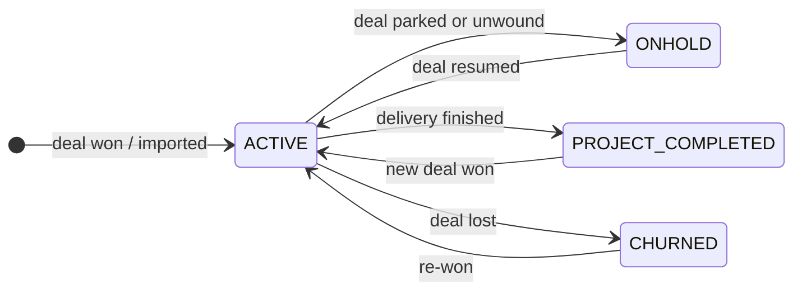
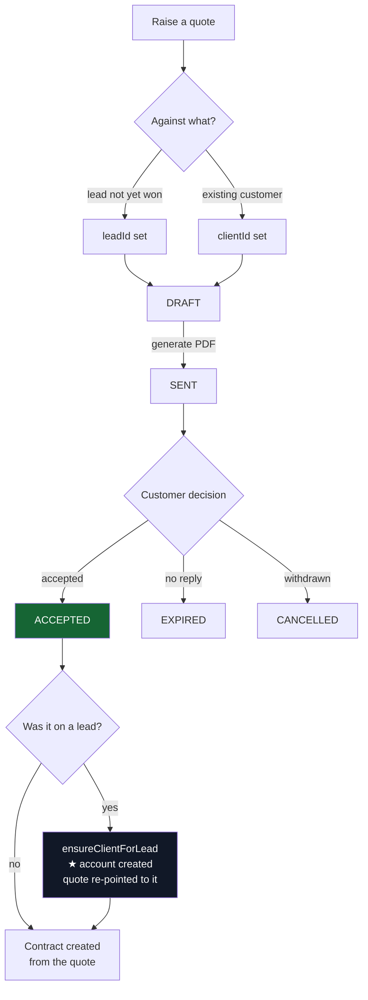
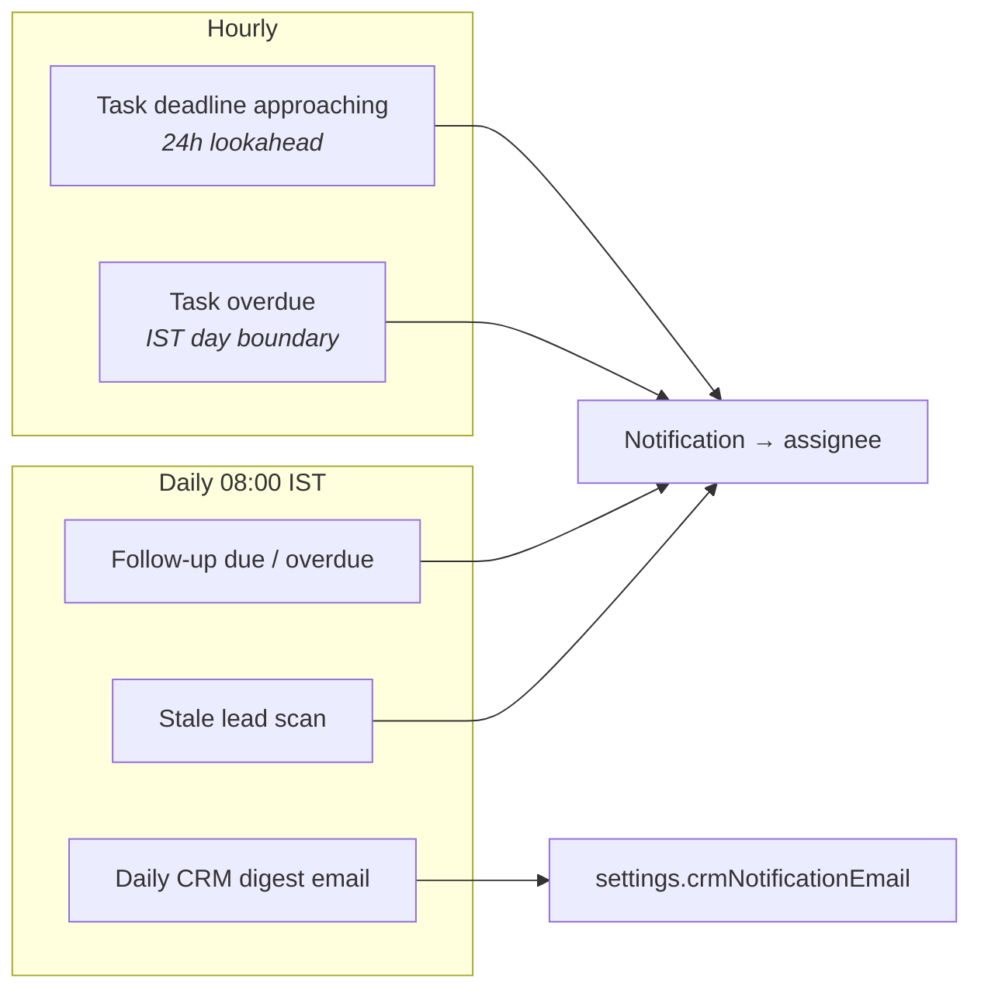
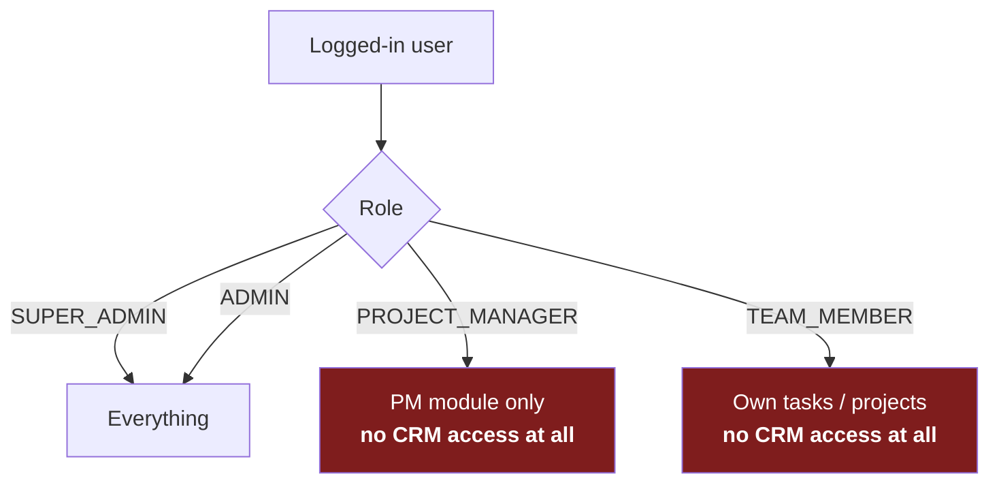

# Flowzen — How the Application Flows

Written from the code, not from a spec. Every rule below is enforced somewhere real; the file
reference is given so you can check any claim.

> **Viewing this:** the diagrams are Mermaid. In VS Code press `Ctrl+Shift+V` for the Markdown
> preview (install the *Markdown Preview Mermaid Support* extension if the blocks show as text).
> They also render natively on GitHub.

---

## 1. The application map

Three modules, each gated per organisation (`Organization.modules`). Your org has all three on.

**The one seam that matters:** the CRM works on **Leads**, everything downstream works on
**Clients**. A Lead becomes a Client at exactly one moment — the win.

---

## 2. End to end: enquiry to cash

**The surprise worth knowing:** *"Won & Closed" creates no money record.* Winning marks the deal
won and creates the account. The Subscription or Contract appears at **Active**, because that is
the first moment retainer-vs-project is known — and the two bill completely differently.

---

## 3. The pipeline state machine

Eleven stages. Deliberately free-form — you can skip, jump, and move backwards. Only two moves are
guarded, and both are guarded because they would otherwise desync the board from live billing.

### The two guards

| Move | Why it is blocked | Response |
|---|---|---|
| Leaving a **closed** deal (Churned / Project Completed) back into the funnel | The board would show it live again while its billing stays terminated | `409 DEAL_CLOSED` — needs `reopen: true` |
| Dragging a **won** deal back past the win line into pre-negotiation | The board would say "Negotiation" while the subscription keeps billing underneath | `409` — needs `reopen: true`, then parks the account |

Both live in `stageTransitionError()` —
[leadStage.service.ts:40](apps/api/src/services/leadStage.service.ts#L40).

---

## 4. What actually happens when you drag a card

Every stage change runs through **one** function, `applyLeadStageEffects()`, inside a single
database transaction. Before it existed, the drag endpoint and the detail-edit endpoint each had
their own copy and had drifted — winning the same deal two different ways produced different
financial records.

### Three rules encoded here

1. **Client status only moves forward.** Dragging a won deal backwards can pause an account
   (`ONHOLD`) but can never write a status saying a billed customer isn't one.
2. **Revenue is idempotent**, keyed on `sourceLeadId`. A deal that leaves and re-enters Active
   never mints a second subscription.
3. **The churn cascade checks for sibling deals first.** Projects hang off the *client*, not the
   deal — so parking one deal must not freeze delivery work belonging to another live deal on the
   same account.

---

## 5. Lead → Client conversion

The account is **found or created** — never blindly created. This is what stops a repeat customer
existing twice.

**Never deletes, never unlinks.** And `Lead.clientId` is deliberately **not unique** — one account,
many deals.

Deleting a lead uses `onDelete: SetNull`: the sales record can go, the account it produced — with
its projects, payments and history — stays.

---

## 6. The two doors into Clients

Imported clients get a pipeline card so an existing retainer is visible to **Renewals** — which is
the single thing an imported retainer most needs.

---

## 7. Client lifecycle

Four states, all of which describe a **customer**. There is no "prospect" — a not-yet-customer is a
Lead on the board. The status is never hand-editable; it is driven entirely by the deal's stage.

---

## 8. Quotation flow

A quote document must point at **exactly one** of client or lead — enforced by the database
constraint `quote_documents_one_party`. When a lead's quote is accepted, the quote is re-pointed to
the new account so the paperwork follows the customer.

---

## 9. Automatic background jobs

⚠️ **Both CRM scanners require `assignedToId` to be set.** Today 8 of your 9 leads have no owner, so
follow-up and stale-lead alerts skip them entirely.

---

## 10. Who can do what

The whole `/api/crm` router is mounted behind `authorize('SUPER_ADMIN','ADMIN')` —
[index.ts:95](apps/api/src/index.ts#L95). This is the biggest structural constraint in the product:
leads can be *assigned* to anyone, and the scanners notify assignees, but a non-admin assignee gets
**403** opening the lead they were notified about.

---

## Quick reference

| Rule | Where |
|---|---|
| A Client is born only at a win or by import | `clientConversion.service.ts` · `POST /clients` returns 403 |
| Money records appear at **Active**, not at Won | `leadStage.service.ts:209` |
| Revenue is idempotent per lead | `sourceLeadId` unique |
| One account, many deals | `Lead.clientId` non-unique |
| Deleting a lead never deletes the account | `onDelete: SetNull` |
| Client status is never hand-set | driven by stage cascade only |
| Renewals reads **leads**, not clients | `GET /crm/renewals` |
