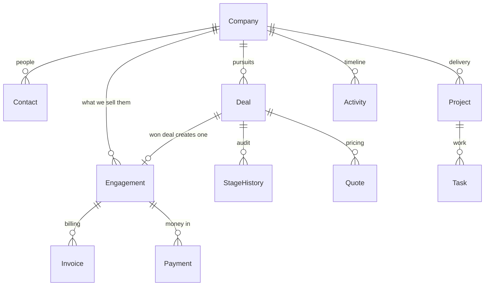
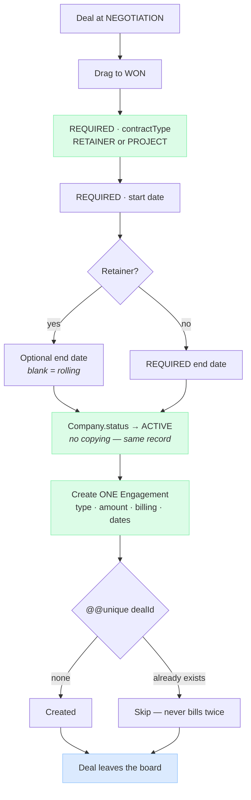
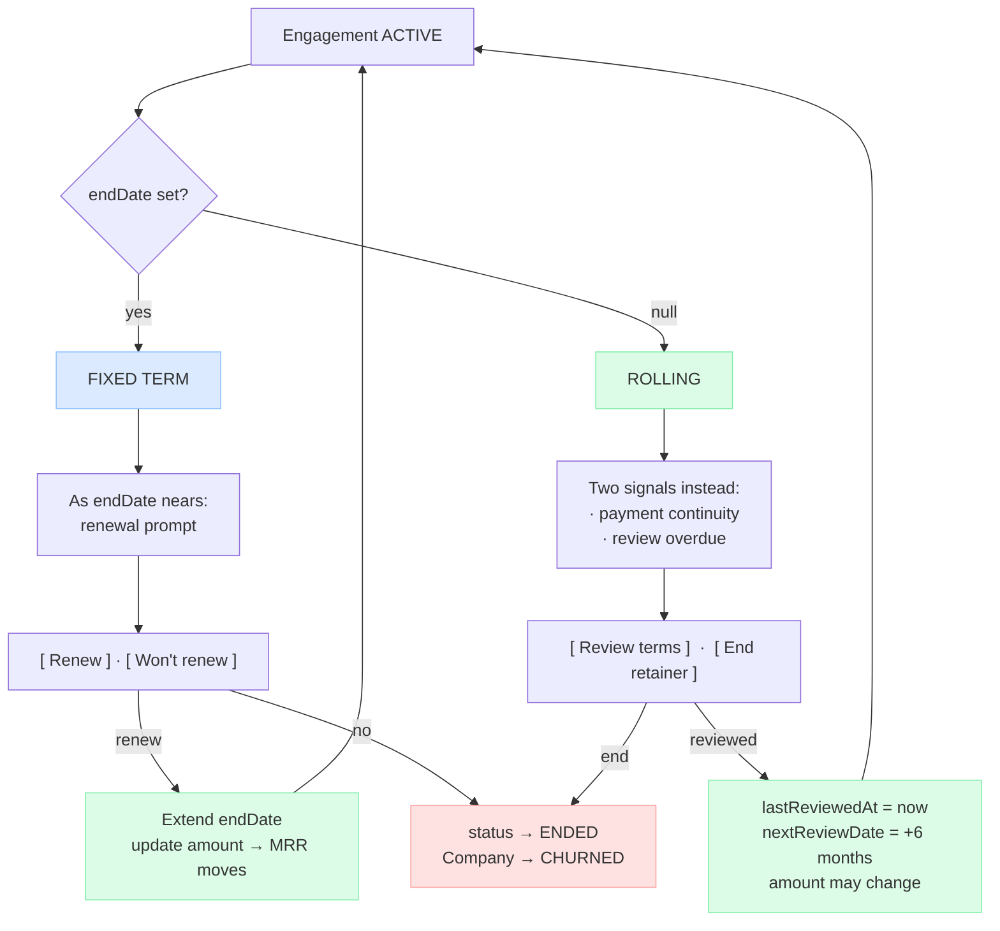
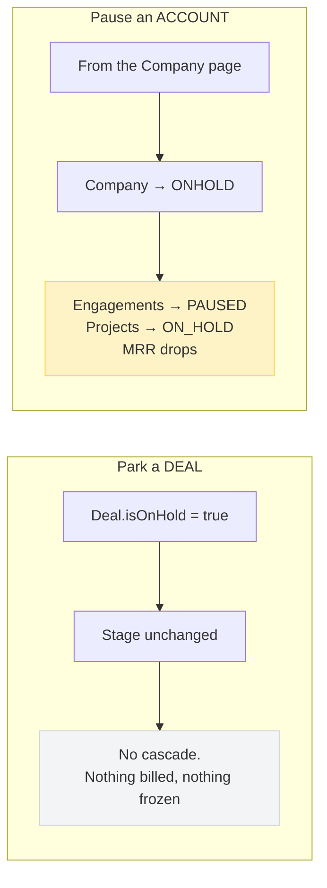

# Flowzen — Target Schema & Flow

The foundation, drawn once rather than grown feature by feature.

Ten moves. The first seven **delete a duplication** or **remove a hardcoded assumption** — every bug
found in the current system traces back to one of them. The last three add what a product needs and
an in-house tool could live without: roles, an invoice lifecycle, and history you can report on.

> ### Flowzen is being built as a product
>
> Not just an in-house tool. That decision changes the design, not only the delivery plan, and this
> document has been revised for it. Three things follow directly:
>
> - **Pipeline stages become configurable data, not a fixed enum.** Every agency sells differently.
> - **The Company / Deal split is required**, not deferred. Concurrent deals with one customer are
>   normal everywhere except here.
> - **Timezone and locale become per-organisation settings.** There are currently 37 places
>   hardcoded to India.
>
> The approach is a **full rewrite of the core**, not a staged migration — see *How to get there*.

**This is the plan.** Its companion is [JOURNEY.md](./JOURNEY.md) — the same system described as a
journey, in plain language, with the reasoning behind every step. Two documents, nothing else.

> **Viewing:** diagrams are Mermaid. In VS Code press `Ctrl+Shift+V`. Also renders on GitHub.

---

## The shape



**One company record.** Whether they've bought or not. Winning copies nothing.

---

## Move 1 · One Company, not Lead **and** Client

Today the same organisation exists twice — as a `Lead` (with `companyName` + contacts) and as a
`Client` (with `name`, `company` + contacts). Winning **copies** one into the other, then re-points
the quotes.

That copy is the origin of the dedup logic, the quote re-pointing, `lead.companyName` drifting from
`client.name`, contacts living in two tables, and the phone-uniqueness rule that blocks a second deal.

```prisma
model Company {
  id             String        @id @default(cuid())
  organizationId String
  name           String
  industry       String?
  website        String?
  email          String?
  phone          String?
  address        String?
  city           String?
  state          String?
  zip            String?
  country        String?       @default("India")
  billingAddress String?       @db.Text
  gstNumber      String?
  companySize    String?
  instagramHandle String?
  facebookPage   String?

  // PROSPECT is meaningful HERE in a way it never was on Client — see the note below.
  status         CompanyStatus @default(PROSPECT)
  ownerId        String?       // account manager
  source         LeadSource    @default(MANUAL)

  archivedAt     DateTime?
  createdAt      DateTime      @default(now())
  updatedAt      DateTime      @updatedAt

  contacts       Contact[]
  deals          Deal[]
  engagements    Engagement[]
  projects       Project[]
  quotes         Quote[]
  invoices       Invoice[]
  payments       Payment[]
  expenses       Expense[]
  activities     Activity[]

  @@index([organizationId, status])
  @@index([organizationId, name])
  @@map("companies")
}

enum CompanyStatus {
  PROSPECT   // no won deal yet
  ACTIVE     // at least one live engagement
  ONHOLD     // paused deliberately
  CHURNED    // gone
}
```

> **On PROSPECT coming back.** We deleted it from `ClientStatus` earlier this session, and that was
> right — a *client* is a customer by definition, so "prospect client" was a contradiction, and it's
> what made the dashboard disagree with the list. Here it is coherent: `Company` is **one table for
> both**, so it needs a value meaning "not a customer yet". Same word, genuinely different meaning.

```prisma
model Contact {
  id          String      @id @default(cuid())
  companyId   String
  name        String
  designation String?
  email       String?
  phone       String?
  linkedinUrl String?
  role        ContactRole
  isPrimary   Boolean     @default(false)
  notes       String?     @db.Text
  createdAt   DateTime    @default(now())

  company     Company     @relation(fields: [companyId], references: [id], onDelete: Cascade)

  @@index([companyId])
  @@map("contacts")
}
```

**One place for people.** No copying at the win, no primary-flag sync between two tables.

---

## Move 2 · Deal is separate from Company

```prisma
model Deal {
  id                String        @id @default(cuid())
  organizationId    String
  companyId         String        // ← many deals per company. No phone hack needed.
  dealNumber        String?       // FL-YYYYMM-XXXXXX

  stageId           String        // ← a row, not an enum value. See Move 2b.
  value             Decimal?      @db.Decimal(12, 2)   // money — never Float
  expectedCloseDate DateTime?
  ownerId           String?
  source            LeadSource    @default(MANUAL)
  priority          Priority      @default(MEDIUM)

  // Asked at WON. The single source of truth for retainer vs project.
  contractType      ContractType?

  // Parking a deal keeps its stage. No reconstruction from history.
  isOnHold          Boolean       @default(false)
  heldSince         DateTime?
  holdReason        String?

  // What the deal is waiting on — makes a stalled deal visibly different.
  blockedOn         String?
  nextStepDate      DateTime?

  lostReason        LostReason?
  followUpDate      DateTime?
  lastContactedAt   DateTime?

  createdAt         DateTime      @default(now())
  updatedAt         DateTime      @updatedAt

  company           Company       @relation(fields: [companyId], references: [id], onDelete: Cascade)
  stage             Stage         @relation(fields: [stageId], references: [id])
  stageHistory      StageHistory[]
  quotes            Quote[]
  tasks             Task[]
  activities        Activity[]
  engagement        Engagement?

  @@unique([organizationId, dealNumber])
  @@index([organizationId, stageId])
  @@index([companyId])
  @@map("deals")
}
```

**Stage does exactly one job: funnel position.** It ends at a verdict — won or lost — and carries no
engagement state.

Gone from the old enum: `ACTIVE_RETAINER` and `ACTIVE_PROJECT` (that's `contractType`), `ON_HOLD`
(that's a flag), `PROJECT_COMPLETED` (that's the engagement's state), `CHURNED` (that's the
company's).

## Move 2b · Stages are rows, not an enum

**This is the change that makes Flowzen sellable.** Every agency sells differently. Yours goes
Outreach → Meeting → Proposal; a dev shop goes Discovery → Scoping → SOW; a recruiter has something
else again. A fixed enum means every customer has to work the way you do.

```prisma
model Pipeline {
  id             String   @id @default(cuid())
  organizationId String
  name           String              // "Sales", "Renewals", "Partnerships"
  isDefault      Boolean  @default(false)
  position       Int      @default(0)
  archivedAt     DateTime?

  stages         Stage[]
  @@index([organizationId])
  @@map("pipelines")
}

model Stage {
  id          String    @id @default(cuid())
  pipelineId  String
  name        String              // whatever the agency calls it
  position    Int

  // What this stage MEANS, regardless of its name. The system needs this to know
  // which column wins a deal when the customer has renamed everything.
  kind        StageKind @default(OPEN)

  // Was a hardcoded map (0.10, 0.20, 0.30 ...). Now per-stage and, eventually,
  // measurable from real conversion history instead of guessed.
  probability Decimal   @default(0) @db.Decimal(4, 3)

  // Was buried in an org settings JSON blob. Now it belongs to the stage it describes.
  rottingDays Int?

  pipeline    Pipeline  @relation(fields: [pipelineId], references: [id], onDelete: Cascade)
  deals       Deal[]

  @@unique([pipelineId, position])
  @@map("stages")
}

enum StageKind {
  OPEN   // still in play
  WON    // triggers the engagement — exactly one per pipeline
  LOST   // requires a reason
}
```

**`kind` is the load-bearing part.** An agency can rename "Won & Closed" to "Signed" or "Closed Won"
and the system still knows that landing there creates the customer account and the engagement. Every
rule in the product keys off `kind`, never off a name.

**What this fixes beyond configurability:**

- Probability weights stop being invented constants and become per-stage data you can eventually
  *measure* from real history
- Rotting thresholds move out of an untyped settings blob and onto the stage they describe
- Renaming a stage no longer rewrites history — `StageHistory` points at stage **ids**
- A second pipeline (Renewals, Partnerships) costs a row, not a migration

New organisations get a sensible default pipeline seeded on signup. Nobody starts at a blank board.

---

## Move 3 · One Engagement, not Subscription **and** Contract

Those two tables are the same thing with different words — one recurring, one one-off. That's a
**field**, not a table.

```prisma
model Engagement {
  id               String           @id @default(cuid())
  organizationId   String
  companyId        String
  dealId           String?          // the deal that won it; null for imported/manual

  type             EngagementType   // RETAINER | PROJECT
  status           EngagementStatus @default(ACTIVE)

  amount           Decimal          @db.Decimal(12, 2)
  currency         String           @default("INR")
  billingFrequency BillingFrequency @default(MONTHLY)
  taxIncluded      Boolean          @default(false)
  cgst             Decimal          @default(0) @db.Decimal(12, 2)
  sgst             Decimal          @default(0) @db.Decimal(12, 2)
  igst             Decimal          @default(0) @db.Decimal(12, 2)
  advanceAmount    Decimal?         @db.Decimal(12, 2)
  advanceReceived  Boolean          @default(false)

  startDate        DateTime
  // NULL means ROLLING — runs until someone ends it. This is the default for retainers.
  endDate          DateTime?
  nextBillingDate  DateTime?

  // Rolling engagements are reviewed, not renewed: "should this still be Rs 40,000?"
  reviewIntervalMonths Int?         @default(6)
  nextReviewDate   DateTime?
  lastReviewedAt   DateTime?

  notes            String?          @db.Text
  createdAt        DateTime         @default(now())
  updatedAt        DateTime         @updatedAt

  company          Company          @relation(fields: [companyId], references: [id])
  deal             Deal?            @relation(fields: [dealId], references: [id], onDelete: SetNull)
  invoices         Invoice[]
  payments         Payment[]
  projects         Project[]

  // Keeps the concurrency-safe revenue idempotency the current schema gets right:
  // one won deal can never mint two engagements.
  @@unique([dealId])
  @@index([organizationId, status])
  @@index([companyId])
  @@map("engagements")
}

enum EngagementType   { RETAINER  PROJECT }
enum EngagementStatus { ACTIVE  PAUSED  ENDED }
enum BillingFrequency { MONTHLY  QUARTERLY  YEARLY  ONE_TIME }
```

### This kills three problems at once

**① The two-MRR bug becomes impossible.** Today Renewals sums `lead.dealValue` while Revenue sums
active subscriptions — they disagree for 4 of your 5 retainers. Now there is one definition:

```sql
-- MRR. One query, one source, no second opinion.
SELECT SUM(
  CASE billing_frequency
    WHEN 'MONTHLY'   THEN amount
    WHEN 'QUARTERLY' THEN amount / 3
    WHEN 'YEARLY'    THEN amount / 12
  END
) FROM engagements
WHERE status = 'ACTIVE' AND billing_frequency <> 'ONE_TIME';
```

**② Renewal data lives where billing lives** — not on the sales record. So a won deal never needs to
stay on the board for Renewals to find it.

**③ `endDate` exists and is nullable** — and its absence *is* the rolling flag. Today `Subscription`
has no end date at all, which is the entire reason `/crm/renewals` has to query leads.

---

## Move 4 · Delete `DealField`

Free key/value rows that no report, filter or screen reads. Seven keys in use across the whole
database; `proposalSentDate` used exactly once.

The two worth keeping become real things: `meetingDate` → a meeting **Activity**; `servicesInScope`
→ quote **line items**. The rest go.

---

## Move 5 · One timeline

Adding a note today writes **two records** — a `Note` row *and* an `Activity` of type `NOTE_ADDED`.
The Notes tab reads one, the Timeline reads the other.

**Drop `Note`.** Activity already has type, message, metadata and an author.

## Move 6 · Fix Activity's double identity

It records what it's attached to twice — a polymorphic `entityType`/`entityId` pair **and** four
nullable foreign keys. Keep the keys; the database enforces those.

```prisma
model Activity {
  id           String       @id @default(cuid())
  type         ActivityType
  message      String
  body         String?      @db.Text
  direction    String?
  metadata     Json?
  occurredAt   DateTime     @default(now())   // when it HAPPENED
  createdAt    DateTime     @default(now())   // when it was recorded

  userId       String
  companyId    String?
  dealId       String?
  projectId    String?
  taskId       String?
  engagementId String?

  @@index([dealId, occurredAt])
  @@index([companyId, occurredAt])
  @@map("activities")
}
```

`occurredAt` separate from `createdAt` matters: a call logged on Friday about a Tuesday meeting
should sit on Tuesday in the timeline.

---

## Move 7 · Nothing is hardcoded to one country

**Measured today: 37 references to IST, `Asia/Kolkata` or `en-IN` across 9 files.** The organisation
record has a `currency` field — so the instinct was right — but no timezone and no locale.

The reasoning behind the IST work was sound: a task due "today" must become overdue at midnight
where the team lives, and on a UTC server it would flag five and a half hours early, every day,
quietly. The fix was correct. It was just written as a constant instead of a setting.

Sell to an agency in Dubai or London and their tasks go overdue at the wrong hour, "due today" is
wrong, renewal windows mis-bucket, and dates read in the wrong format.

```prisma
model Organization {
  // ... existing fields
  currency       String  @default("INR")   // already here — extend the same idea
  timezone       String  @default("Asia/Kolkata")  // IANA name
  locale         String  @default("en-IN")
  dateFormat     String  @default("dd MMM yyyy")
  fiscalYearStart Int    @default(4)       // April in India, January in most places
}
```

Three consequences worth planning for:

- **Every day-boundary calculation** takes the organisation's timezone instead of a constant
- **The daily scanner cannot be one cron at 08:00 IST.** It has to run per organisation in *their*
  morning — either an hourly job that asks "whose 8am is it now?", or a per-org schedule
- **Currency is already per-org but not enforced end to end** — an engagement, an invoice and a
  payment should agree, and cross-currency reporting needs a stated policy

---

## Move 8 · Roles — who sees what

The current system has four roles and locks the **entire CRM** to two of them. A product cannot ship
that way: agencies have salespeople who aren't administrators, and bookkeepers who shouldn't see the
pipeline at all.

```prisma
enum Role {
  OWNER      // one per organisation — billing, ownership transfer, everything
  ADMIN      // everything operational, including money
  SALES      // the pipeline
  DELIVERY   // projects and the people doing them
  FINANCE    // invoices, payments, expenses — no pipeline
  MEMBER     // their own work only
}
```

| | Companies | Deals | Quotes | Engagements | Projects | Tasks | Invoices & payments | Settings & users |
|---|---|---|---|---|---|---|---|---|
| **Owner** | full | full | full | full | full | full | full | full |
| **Admin** | full | full | full | full | full | full | full | full |
| **Sales** | full | full | full | read | read | own | — | — |
| **Delivery** | read | read | — | read amount | full | full | — | — |
| **Finance** | read | read value | read | full | read | — | full | — |
| **Member** | read | — | — | — | read assigned | own | — | — |

### No cost rates, by decision

An earlier draft made internal hourly cost rates the most protected data in the system, and split
the roles around them. **Time tracking and cost rates have since been removed entirely** — nobody
logs hours, no person carries an hourly cost, and the system never calculates what work cost to
deliver.

Timesheets are a chore people quietly stop doing honestly, and a record of how long each person
spent on what becomes a monitoring tool whatever its stated purpose.

The consequence is stated plainly everywhere it matters: **Flowzen reports gross margin, never
profit.** Revenue minus money paid out, with your own team's effort excluded. Every report is
labelled that way, because a "profit" figure that silently omits an agency's largest cost would be
wrong in the flattering direction.

### Two things that aren't roles

**Deal visibility** is an organisation setting, not a role: *everyone sees all deals* or *people see
only their own*. A five-person agency wants the first; a twenty-person sales floor wants the second.
Baking it into roles would force the choice on every customer.

**Ownership is separate from permission.** A company has an account owner and a deal has a deal
owner. Those decide who gets *notified*, not who is *allowed*. Conflating them means the only way to
give someone visibility is to make them responsible.

---

## Move 9 · Invoices become a lifecycle, not a document

Today there are invoice *drafts* that generate a PDF, and payments recorded separately against a
client. Nothing tracks whether a given invoice was actually settled.

```prisma
model Invoice {
  id             String        @id @default(cuid())
  organizationId String
  companyId      String
  engagementId   String?       // what it bills for
  quoteId        String?       // where the numbers came from

  number         String        // per-org sequence — see Settled details
  type           InvoiceType   @default(INVOICE)
  issueDate      DateTime
  dueDate        DateTime
  status         InvoiceStatus @default(DRAFT)

  lineItems      Json          // a snapshot — an issued invoice never changes
  subtotal       Decimal       @db.Decimal(12, 2)
  cgst           Decimal       @default(0) @db.Decimal(12, 2)
  sgst           Decimal       @default(0) @db.Decimal(12, 2)
  igst           Decimal       @default(0) @db.Decimal(12, 2)
  total          Decimal       @db.Decimal(12, 2)
  currency       String

  payments       Payment[]
  @@unique([organizationId, number])
  @@map("invoices")
}

enum InvoiceType   { INVOICE  CREDIT_NOTE  PROFORMA }
enum InvoiceStatus { DRAFT  SENT  PARTIALLY_PAID  PAID  VOID }
```

**Three deliberate choices:**

**Line items are a frozen snapshot.** Once issued, an invoice must never change because the quote it
came from was edited. If it's wrong, you void it and issue a credit note — which is what accountants
expect and what an audit requires.

**`OVERDUE` is not a status.** It's `SENT` or `PARTIALLY_PAID` with a `dueDate` in the past. Storing
it would need a nightly job to flip records, and that job failing would silently make your
receivables wrong. Derived facts should stay derived.

**Payments attach to the invoice**, not just the company. Otherwise "which invoice did this ₹50,000
settle?" is unanswerable, and partial payments can't be tracked at all.

---

## Move 10 · The owner's view — and the one thing that makes it possible

Most of what an owner wants is already derivable: open pipeline value, weighted forecast, MRR, cash
collected versus outstanding, projects at risk, gross margin per client.

**Except anything historical.** And that's a genuine hole.

When a rolling retainer is reviewed and goes from ₹40,000 to ₹55,000, the old figure is overwritten.
So *"what was our MRR last March?"* and *"is revenue per client growing?"* become unanswerable —
permanently, and you don't find out until the day you ask.

```prisma
// Append-only. Written whenever an engagement's commercial terms change.
model EngagementRevision {
  id               String           @id @default(cuid())
  engagementId     String
  amount           Decimal          @db.Decimal(12, 2)
  billingFrequency BillingFrequency
  status           EngagementStatus
  effectiveFrom    DateTime
  reason           String?          // "6-month review", "paused", "scope increase"
  changedById      String
  createdAt        DateTime         @default(now())

  @@index([engagementId, effectiveFrom])
  @@map("engagement_revisions")
}
```

**Why revisions rather than monthly snapshots.** A snapshot is a guess taken on a schedule — it
misses anything that changed and changed back, and it's wrong for any date between snapshots.
Revisions give you the exact value on any date, and they double as the audit trail for every price
change. One small table answers "what is our MRR", "what was it", and "who raised this client's fee
and when".

This is the only structural addition the owner's view needs. Everything else is a query.

---

## The flows through it

### Deal → Won → Engagement



Nothing is copied at the win. The company record was always there; it just changes status.

### The engagement's life



### Pausing — deal vs account, finally separate



Today one action does both, via two implementations that disagree.

---

## What this removes

| | Today | Target |
|---|---|---|
| Tables | Lead, Client, Note, DealField, Subscription, Contract | Company, Deal, Engagement |
| Company records per organisation | 2 (copied at the win) | **1** |
| Contact tables | 2 (`lead_contacts`, `client_contacts`) | **1** |
| Stage enum values | 11 | **7** |
| MRR definitions | 2, disagreeing | **1** |
| Records written per note | 2 | **1** |
| Ways Activity says what it's attached to | 2 | **1** |

## Bugs that become impossible

| Bug | Why it can't happen |
|---|---|
| One-time deal billed monthly | `type` stored once |
| Two MRR numbers | One table, one query |
| Imported retainers invisible to Revenue | Import creates an Engagement, same as a win |
| Can't have two deals with one buyer | Deals hang off Company |
| Parking a deal loses its stage | It's a flag |
| Won deals stuck on the board | Renewal data isn't on the deal |
| Notes and timeline diverging | One record |
| Lead name drifting from client name | One record |

---

## Settled details

The smaller decisions, written down so they don't get re-argued or quietly assumed.

**Tasks.** A task belongs to **exactly one** of a project (delivery work) or a deal (pre-sales work
— an audit, a teardown). Never both, never neither. This rule exists today and is worth keeping.

**Currency.** One currency per organisation. An engagement, its invoices and its payments all
inherit it, and there is **no mixing in version one**. Currency is still stored on every money record
so multi-currency becomes possible later without a migration — and when it comes, the exchange rate
must be stored on the invoice **at issue time**, never looked up live, or last year's invoices change
value every morning.

**A lost deal never reopens.** Reviving a dead opportunity creates a **new deal** against the same
company, optionally referencing the old one. Reopening would corrupt every number that matters: a
deal that took three months, died, and came back six months later is not a nine-month deal, and
counting it as one makes your cycle time and win rate meaningless.

**Document numbering** is already correct — an atomic database upsert per organisation, scope and
year, so two people clicking at once cannot collide. **But the prefix is hardcoded to `EL/`.** It
must become an organisation setting, along with the format itself.

**Duplicates.** On manual create: an exact email or phone match **blocks** and shows the existing
record, because that is certainly the same person. A similar company name **warns** and lets you
continue, because "Vyoma" and "Vyoma Studios" may be two real companies. On import: never block the
file — flag the rows and let the person decide.

**Audit.** Not everything needs auditing; four things do, because they involve money or access:
engagement terms changing, payments created or deleted, roles granted or removed, and a company's
status changing. Engagement changes are already covered by revisions above.

---

## What the current schema already gets right — keep all of it

A rewrite must not throw these away. They're the instincts of someone who's been burned:

- **`@@unique([sourceLeadId])`** — DB-enforced revenue idempotency, concurrency-safe. Carried over
  above as `@@unique([dealId])`.
- **`Decimal` for money everywhere**, never Float.
- **Deliberate `onDelete`** — `SetNull` so deleting a deal never destroys an account; `Restrict`
  where records must survive.
- **Organisation scoping on every query.**
- **`quote_documents_one_party`** — a check constraint enforcing a rule the app cannot violate.

---

## How to get there

**Decision: full rewrite of the core.** Not a staged migration.

A staged path was the earlier recommendation, on three assumptions that turned out to be wrong:

| Assumption | Reality |
|---|---|
| A second developer is shipping in parallel | They've stopped. One codebase, one team |
| There is production data with real money in it | There isn't |
| It's unclear whether Flowzen becomes a product | It is a product |

All three were the reasons to go slowly. None of them hold, and a staged path would mean carrying
`Lead`, `Client`, `Subscription`, `Contract`, `Note` and `DealField` alongside their replacements for
weeks — writing compatibility code that gets deleted anyway.

### Scope

**Rewritten:** CRM and Revenue — every route touching `Lead`, `Client`, `Subscription`, `Contract`.
**Mostly intact:** PM — Projects and Tasks — which only need their parent to become `Company`.
**Dropped:** time entries and hourly cost rates.
**Untouched:** auth, organisations, notifications infrastructure, file handling, the SSE layer.

### Order within the rewrite

Not shipping stages — just the order that keeps the build coherent:

| | Build | Why here |
|---|---|---|
| **1** | `Organization` config — timezone, locale, fiscal year, doc prefix | Everything with a date or a number depends on it |
| **2** | `Pipeline` + `Stage` + default seed | Deals can't exist without a stage to point at |
| **3** | `Company` + `Contact` | The root of everything |
| **4** | `Deal` + `StageHistory` + `Task` | The pipeline |
| **5** | `Engagement` + `EngagementRevision` | The win has somewhere to land, and history from day one |
| **6** | `Quote` → Deal | Pricing |
| **7** | Repoint `Project` at Company; optional engagement link | Delivery |
| **8** | `Invoice` + `Payment` against engagements | Money in |
| **9** | `Activity` as the one timeline | Cross-cutting, needs the rest to exist |
| **10** | Roles and permissions | Everything they protect now exists |
| **11** | The owner's view — dashboards and reports | Reads everything above |

`EngagementRevision` at step 5, not later: revision history only works if it starts when the
engagement does. Bolted on afterwards, every engagement has an unknown past.

### Carrying data across

There is no production data to preserve, so this is a **fresh database with a seed**, not a
migration. Keep a one-off script that reads the current dev database and writes the new shape — worth
having so the app opens with realistic content, and it's the honest test of whether the new schema
can express everything the old one did.

---

## Decisions — settled

| Decision | Outcome | Reasoning |
|---|---|---|
| **Approach** | **Full rewrite** | No parallel developer, no production data, product intent |
| **Stages** | **Configurable rows** (`Pipeline` + `Stage`) | Every agency sells differently — an enum can't ship |
| **Company / Deal split** | **Required**, in the rewrite | Concurrent deals per customer are normal everywhere |
| **Timezone & locale** | **Per organisation** | 37 hardcoded India references today |
| **Roles** | **A sales role is mandatory** | The CRM is admin-only; unshippable as a product |
| **Quote parent** | **Deal**, required | One parent kills the one-party constraint and the re-pointing dance. A quote *is* a pursuit |
| **Review interval** | **6 months**, org default, per-engagement override | Twelve months of scope creep on a retainer is several lakh underpriced |
| **Project parent** | **Company**, optional `Engagement` link | Keeps internal projects and pre-billing kickoffs working; enables per-engagement P&L when set |
| **Delivery pipeline** | **Not needed** | Projects already does this |
| **Client-facing portal** | **Not now** | Flowzen stays an internal tool. Customers receive documents you send them — quotes and invoices — and nothing else. No login, no shared status, no approvals surface |
| **Time tracking & cost rates** | **Removed** | Timesheet friction and the monitoring it implies outweigh the number. System reports gross margin, never profit |

---

## What productising demands beyond the schema

The schema work above is the foundation, not the product. Naming the rest now so it isn't a surprise
later — roughly in the order a first external customer would hit it.

| Area | What it means |
|---|---|
| **Signup & onboarding** | Self-serve org creation, the default pipeline seeded, an empty-state that teaches rather than stares |
| **Roles & permissions** | Beyond a sales role — who sees revenue, who can delete, who configures |
| **Tenant isolation you can prove** | Every query is org-scoped today. A product needs tests that *demonstrate* it, because "we checked" is not an answer to a prospect's security review |
| **Per-org configuration** | Pipelines, stages, lost reasons, sources, services, tax rates, document numbering, email templates |
| **Billing for Flowzen itself** | Plans, seats, module entitlements. `OrganizationModule` is a good start |
| **Data export** | Customers must be able to leave with their data. Also the fastest way to earn trust |
| **Audit trail** | `AuditLog` exists; a product needs it complete and readable |
| **Email deliverability** | One SMTP account won't survive many tenants sending quotes |
| **Versioned public API** | `/api/v1` exists; it becomes a contract you can't casually change |
| **Support surface** | Errors a customer can act on, and a way for you to see what happened without opening their database |

**Honest estimate:** the schema is perhaps a third of the work between here and a product another
agency pays for. That isn't an argument against it — it's an argument for knowing which project
you're starting.
