# Flowzen — The Complete Journey

Every module, every feature, in the order they actually happen — from setting up the organisation to
renewing a customer three years later.

At each step: **what you can do**, **what the system does about it**, **what it stores**, and **why
it works that way**.

> Describes Flowzen **as designed**. The build plan is in [FOUNDATION.md](./FOUNDATION.md).
>
> **Viewing:** diagrams are Mermaid. In VS Code press `Ctrl+Shift+V`. Also renders on GitHub.

---

## The whole thing on one page

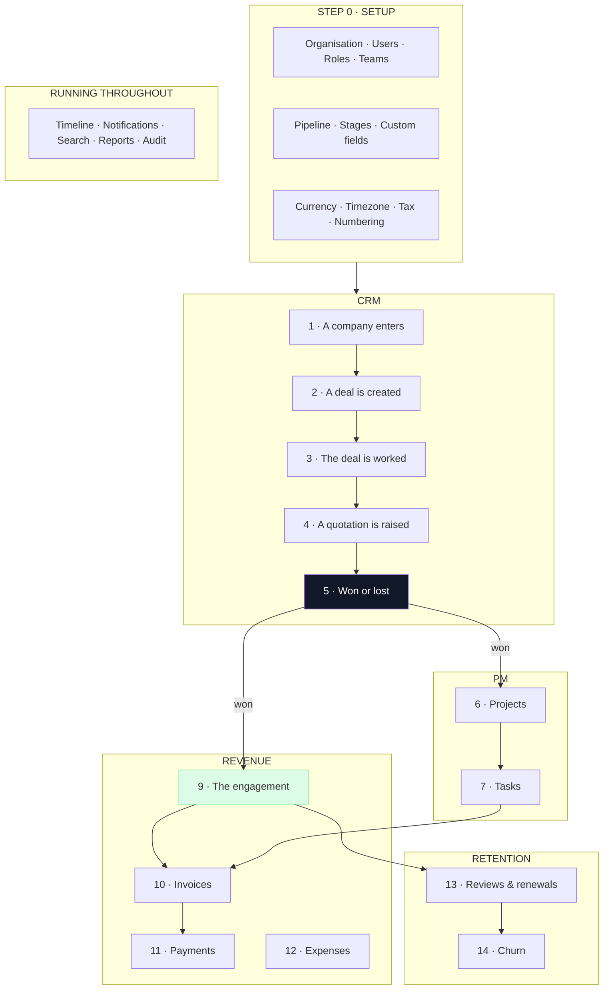

---

# Step 0 · Setup — before any lead exists

## The organisation

Everything belongs to an organisation. Every query, every screen, every record. Two agencies using
Flowzen never see a trace of each other.

**What you configure once:**

| Setting | Why it matters |
|---|---|
| **Currency** | Every amount inherits it — deals, quotes, engagements, invoices |
| **Timezone** | Decides when "today" ends, when tasks go overdue, when the morning scan runs |
| **Locale & date format** | How dates read to your team |
| **Fiscal year start** | April in India, January elsewhere — decides what "this year" means in reports |
| **Document prefix** | `EL/QT/2026/001` — your initials, not ours |
| **Tax defaults** | Rates and whether you charge CGST/SGST or IGST |

**Why these are settings and not constants.** Every one of them was hardcoded at some point, and each
would break the moment a second agency in a different country started using Flowzen.

## Modules

Three switches: **CRM**, **PM**, **Revenue**. An agency that only wants project management turns off
the other two and never sees a pipeline.

Turning a module off hides its screens and blocks its routes — it does not delete its data. Turn it
back on and everything is where you left it.

**Why modules exist.** A five-person design studio that doesn't do formal sales shouldn't be made to
meet a pipeline. Selling one product to differently-shaped agencies means letting them switch off the
parts they don't live in.

## People, roles and teams

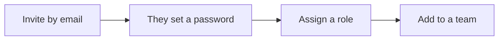

**Six roles.** Owner, Admin, Sales, Delivery, Finance, Member — covered in detail in *Step 15*.

**Teams** group people by discipline — Design, Content, Performance, Web. A team can be assigned to a
project in one action instead of picking five people. Teams have managers, who see their team's
workload.

**Flowzen deliberately does not track anyone's hours or internal cost.** See *Step 9*.

## The pipeline

You define your own board. Stages are rows you create, name, order and delete — not a fixed list.

Each stage carries:

- **A name** — whatever you call it
- **A meaning** — in play, won, or lost. The system's rules key off this, never off the name
- **A probability** — what share of deals here eventually close, used for the forecast
- **A patience threshold** — how many days before a deal sitting here is flagged as stalling

**Two stages are mandatory:** exactly one *won* and one *lost*, and nothing can come after them.

**Why nothing after won.** If stages were entirely free-form, someone would add "Onboarding" and
"Delivery" after Won — and won deals would never leave the board, which is precisely the problem the
design removes. Delivery belongs to Projects.

## Custom fields

Beyond the built-in fields, an agency defines its own — on deals, companies or contacts. Each has a
real type: text, number, date, dropdown, multi-select, checkbox, link.

A **stage** then chooses which fields it prompts for when a deal moves in.

**Why the field belongs to the record, not the stage.** A field owned by a stage is unreadable —
you can't filter by it, report on it, or see it once the deal moves on, and it's orphaned if the
stage is deleted. A field owned by the deal is data. The stage just decides when to ask.

---

# Step 1 · A company enters

## Three ways in

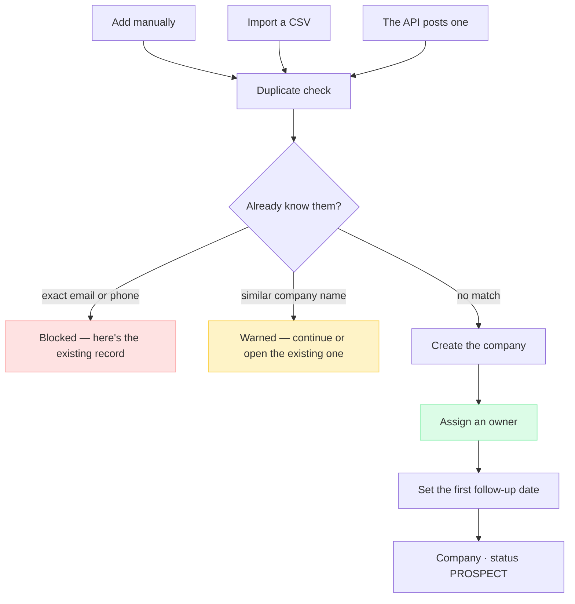

**Manual** — a form. Company name plus at least one contact with an email or phone.

**CSV import** — up to 500 rows. Rows that fail validation are returned to you with the reason,
rather than blocking the whole file. You choose the owner for the batch, or map an owner column.

**Public API** — another system (a website form, a lead-gen tool) posts a company in with an API key.
Same rules, same duplicate checks.

## What a company holds

- **Identity** — name, industry, website, size, social handles
- **Address** — including a separate billing address
- **Tax** — GST number
- **Ownership** — the account manager
- **Status** — Prospect until they win something, then Active
- **Contacts** — the people

## Contacts

Multiple people per company, one marked as **primary**. Each carries a **role in the buying
decision**: decision maker, champion, influencer, or gatekeeper.

**Why that matters.** Who you're talking to changes how you sell. A champion needs ammunition to
argue internally; a gatekeeper needs to be got past; a decision maker needs the commercial case. It
also survives the win — during delivery and renewal, knowing who actually bought from you is worth
more than knowing who signed.

## Why an owner and a follow-up date from the very first moment

Every reminder the system will ever send is addressed to whoever owns the record. **A company with
no owner is invisible to all of them** — it isn't chased, it isn't flagged as stale, it simply sits.

This isn't theoretical: in the current system, 8 of 9 companies have no owner, and both daily
scanners skip them entirely.

---

# Step 2 · A deal is created

A **deal** is one thing you're trying to sell to one company. A company can have several at once.

**Why deals are separate from companies.** Customers come back, and they buy more than one thing. A
retainer and a website build are two deals with two values, two close dates and two outcomes — not
one confused record. It also means a company you've sold to three times is still one company.

## What a deal holds

| | |
|---|---|
| **Value** | What you expect to earn |
| **Expected close date** | When you expect to know |
| **Owner** | Who is chasing it |
| **Source** | Referral, inbound, LinkedIn, event, cold call… |
| **Priority** | Low, medium, high |
| **Stage** | Where it is on your board |
| **Custom fields** | Whatever your agency tracks |

## Three ways to look at your deals

**Board** — kanban columns, drag to move. For working deals day to day.

**List** — a table you can filter and sort by stage, owner, value, source, priority, close date, or
any custom field. For finding things and bulk actions.

**Analytics** — the shape of your funnel: how many deals and how much value per stage, win rate,
average cycle time, and where deals die.

---

# Step 3 · The deal is worked

This is where most of the time goes. Five things happen here, in any order.

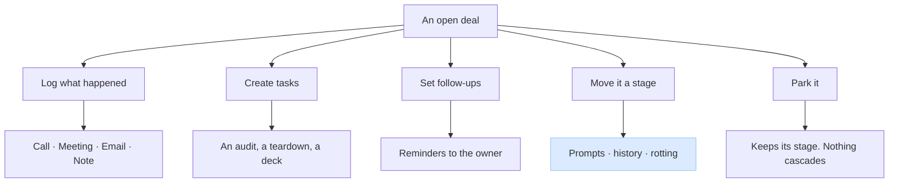

## Logging what happened

Four kinds of activity, each capturing what that kind of contact actually needs:

| | Captures |
|---|---|
| **Call** | When, how long, the outcome, and whether a follow-up is needed — which sets the follow-up date |
| **Meeting** | When, the format, who attended, and the agreed next step |
| **Email** | Subject, direction (in or out), when |
| **Note** | Free text, marked internal or shared |

Everything lands on **one timeline**, in the order it happened — filterable by kind, and never
editable after the fact.

**Why the timeline can only be added to.** A record of what happened is worth having only if nobody
can quietly change it. When a deal has gone silent for three weeks, this is the only place that says
so honestly.

**Why the logged date is separate from the recorded date.** A call logged on Friday about a Tuesday
conversation belongs on Tuesday. Otherwise your "last contacted" figures are wrong by however long
people take to write things up.

## Tasks before the win

A task can hang off a **deal** — pre-sales work like an audit or a competitor teardown — or off a
**project**, which is delivery. Never both.

Deal tasks carry an assignee, priority, due date and status. They appear in that person's task list
alongside their delivery work, because to the person doing it, work is work.

## Follow-ups

Every deal can carry a next follow-up date. The morning scan finds the ones due or overdue and tells
the owner — with context: which stage, how long since anyone last made contact.

## Moving a stage

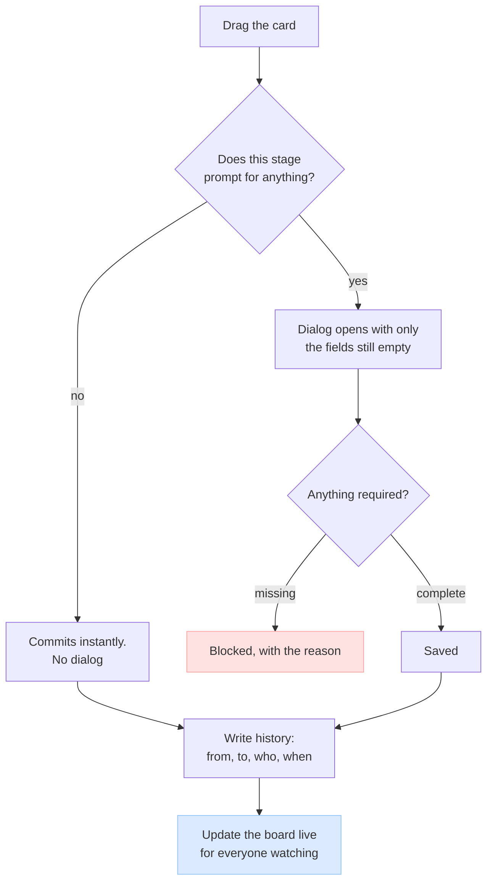

**Stages can be skipped and dragged backwards.** Real deals don't move in a straight line — a
referral can go from first contact to signed in two days. Forcing a strict order teaches people to
lie to the board.

**The dialog only asks for what's missing.** If a field was filled at an earlier stage, it isn't
asked again.

**Two things are always required**, enforced on the server and not just in the dialog: a **value and
close date** to reach negotiation, and an **engagement type and start date** to win. Everything else
is the agency's choice.

**Why those two, and why server-side.** A weighted forecast without an amount and a date is a number
you can't plan against; billing without a type is billing that's wrong. And a rule enforced only in
the browser isn't a rule — anything calling the API directly skips it.

## When a deal stalls

Two signals, both on the card:

- **How long it has sat still**, against that stage's own threshold. Past it, the card is visibly
  overdue on the board
- **What it's waiting on** — a note and a date you expect to hear back

**Why on the board and not in a report.** A stalled deal in a weekly email is a deal nobody touches.
On the card, it's the first thing you see.

## Parking a deal

Genuinely paused — their budget unlocks next quarter. The deal keeps its stage, is visibly held, and
comes back exactly where it was.

**Nothing cascades.** No billing, no projects, no customer status. Parking a deal you haven't won is
a note to yourself.

---

# Step 4 · A quotation is raised

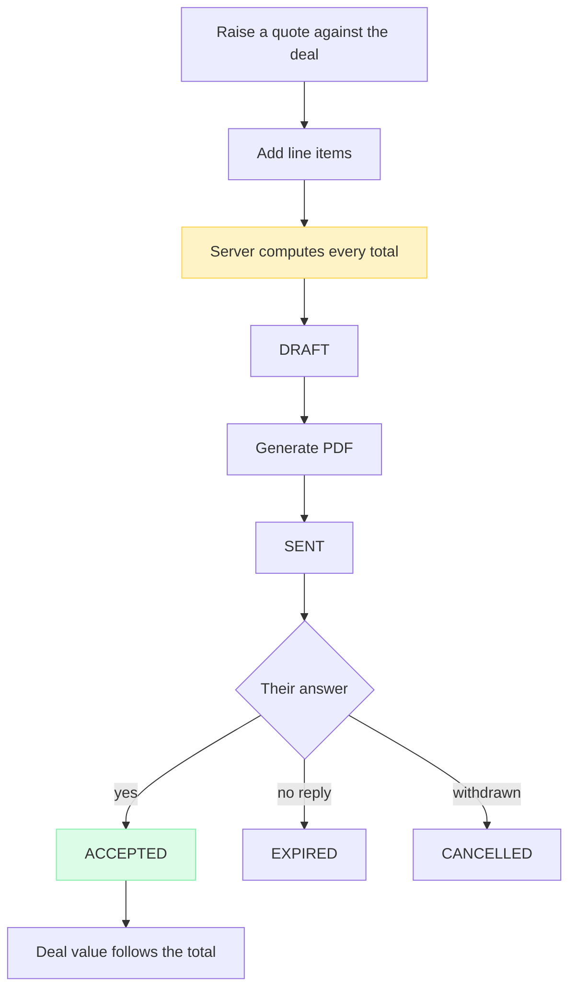

**Line items** carry description, unit, quantity, rate, discount and tax. Quantities and rates are
yours; **every total is calculated by the server**.

**Why the browser is never trusted with money.** A document must never bill an amount that arrived
from a form. The same principle runs through: when a quote becomes an invoice, the invoice inherits
the quote's figures rather than recalculating them.

**Numbering** is per organisation, per document type, per year — `EL/QT/2026/001` — allocated
atomically so two people clicking at once can never collide.

**The deal's value follows the quote total.** Typing the number twice is how the two end up
disagreeing.

---

# Step 5 · Won or lost

## Losing

Requires a **reason** — price, timing, competitor, no budget, went quiet. It's the only field in the
pipeline you can never reconstruct afterwards.

The deal closes. The company stays a prospect. Everything logged stays.

**A lost deal never reopens.** If they come back in six months, that's a **new deal** against the
same company, optionally referencing the old one.

**Why.** A deal that took three months, died, and revived six months later is not a nine-month deal.
Counting it as one makes cycle time and win rate meaningless.

## Winning

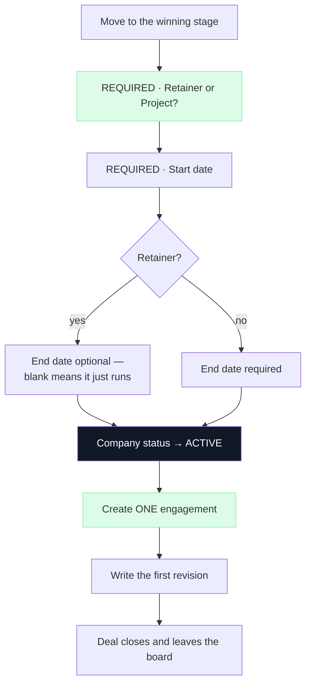

**Nothing is copied.** The company record has existed since they first appeared — it changes status.
Contacts stay put. Quotes stay put. There is nothing to carry across.

**Why the type is asked here.** A retainer bills monthly for as long as it runs; a project bills
once. The system cannot create the right commercial record without knowing which — and this is the
moment you certainly know, with the details in front of you.

**Why the deal leaves the board.** Its question has been answered. Keeping it clutters the view meant
to show what's still open.

---

# Step 6 · The engagement

The commercial agreement: what you'll do and what they'll pay.

| | |
|---|---|
| **Type** | Retainer or project |
| **Amount & currency** | |
| **Billing frequency** | Monthly, quarterly, yearly, or one-time |
| **Tax** | CGST/SGST or IGST, and whether the amount includes it |
| **Advance** | Amount and whether it's been received |
| **Start date** | |
| **End date** | Optional — **absent means it simply runs** |
| **Review cycle** | For rolling engagements, default every 6 months |
| **Status** | Active, paused, or ended |

**One idea, not two.** A recurring retainer and a one-off project differ in *how often they bill*.
That's a property, not a different kind of thing. Treating them as two separate objects is how a
business ends up with two different answers to "what is our monthly revenue?"

**One engagement per won deal**, enforced by the database rather than by application code — because
two people clicking at the same instant is exactly when application checks fail.

## Revisions — the quiet but important part

Every time the commercial terms change — a price rise at review, a pause, an ending — an
**append-only revision** is written.

**Why.** Without it, raising a client from ₹40,000 to ₹55,000 overwrites the old figure, and *"what
was our revenue last March?"* becomes permanently unanswerable. You don't discover that until the
day you ask. Revisions also double as the audit trail for every price change: who raised it, when,
and why.

---

# Step 7 · Projects

Delivery hangs off the **company**, not the deal.

**Why.** A customer you've won three times has one body of work, not three. Attaching delivery to the
relationship means the work outlives the deal record.

A project can **optionally** name which engagement pays for it — so you can see what a piece of
delivery is earning — but isn't forced to. Internal work has no engagement, and kickoffs sometimes
happen before paperwork.

## What a project holds

Name, description, type (retainer / one-time / event / internal), scope, dates, budget, priority,
status, platform, and a reporting cadence. Plus **members** — individuals or whole teams — and an
owner.

## Project health

Computed, not typed:

| | |
|---|---|
| 🟢 **On track** | Nothing overdue |
| 🟡 **At risk** | One or two overdue tasks |
| 🔴 **Off track** | Three or more overdue, or past its end date and not complete |

**Why computed.** A health flag someone sets by hand is a health flag that's green everywhere,
forever. Derived from tasks and dates, it tells the truth without anyone maintaining it.

---

# Step 8 · Tasks

The unit of work. On a project (delivery) or a deal (pre-sales).

| | |
|---|---|
| **Status** | Backlog · To Do · In Progress · Review · Approved · Blocked · On Hold · Completed |
| **Priority** | Low · Medium · High · Urgent |
| **Type** | Design, content, video, marketing, social, development, strategy, business |
| **People** | Assignee (or several), plus a separate reviewer |
| **Dates** | Assigned date, due date |
| **Recurring** | Daily, weekly, monthly, yearly — for retainer work that repeats |
| **Comments** | Discussion in place |
| **Subtasks** | Breakdown under a parent |

**Why a reviewer separate from an assignee.** Agency work is checked before it goes to a client. A
task in Review is waiting on a specific person, not on the room.

**Why recurring tasks matter for retainers.** A monthly report due on the 1st shouldn't be recreated
by hand twelve times a year.

## The calendar

Tasks with due dates on a month or week view, filterable by person or project. Meetings booked
against deals appear here too — so one screen answers "what's happening this week?"

---

# Step 9 · What Flowzen deliberately does not do

**There is no time tracking, and no internal cost rates.**

Nobody logs hours. Nobody has an hourly cost attached to them. The system never calculates what a
piece of work cost you to deliver.

**Why it was left out.** Timesheets are a daily chore that people quietly stop doing honestly, and a
system that records how long each person spent on what becomes a monitoring tool whatever its stated
purpose. The cost of collecting that data — in friction and in what it does to a team — was judged
higher than the value of the number it produces.

**What that means for the numbers.** Flowzen reports **gross margin**, not profit:

> revenue in  −  money paid out to vendors, tools and suppliers

The cost of your own team's effort is **not** in that figure. For most agencies salaries are the
largest expense, so gross margin will always look considerably better than true profit.

**This is a deliberate limit, not a gap.** Every report says gross margin and never says profit, so
the number is honest about what it does and doesn't include. A system that showed "profit" while
silently omitting its biggest cost would be wrong in the flattering direction — which is the
dangerous one to be wrong in.

**If it's ever wanted**, the lightest version is a monthly allocation — "roughly half of Ananya's
month went to Vyoma" — which gives most of the picture for about a minute per person per month.
It is not built, and nothing else depends on it.

---

# Step 10 · Invoices

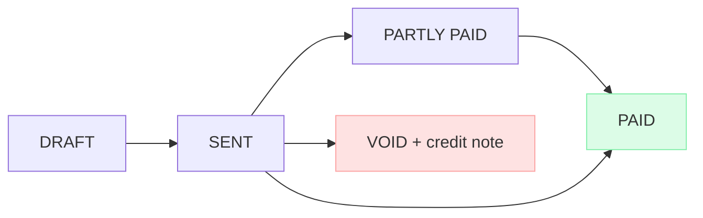

An invoice is raised from an accepted quote — inheriting its line items and totals exactly — or
directly against an engagement for a recurring charge.

**Line items freeze on issue.** Once it has gone to a customer it's a record of what you asked for.
If it's wrong you **void it and issue a credit note**, which is what your accountant expects and the
only version that survives an audit.

**"Overdue" is not a status.** It's sent, unpaid, and past its due date. Storing it would need a
nightly job to flip records — and the night that job fails, your receivables are silently wrong.

---

# Step 11 · Payments

Each payment records amount, date, method (bank transfer, UPI, cheque, card), and a reference — and
attaches to **the invoice it settles**.

**Why the invoice and not just the customer.** Otherwise "which invoice did this ₹50,000 settle?" has
no answer and part-payments can't be tracked at all.

**Receivables** are everything issued and unpaid, aged by how long overdue — the answer to "who owes
us money, and for how long?"

---

# Step 12 · Expenses

Logged against a company or project, categorised — vendor, travel, equipment, marketing, other — with
an amount, date and supplier.

Revenue minus expenses gives **gross margin** — what's left after money paid out, before the cost
of your own team's effort, which Flowzen does not track (*Step 9*).

---

# Step 13 · Keeping the customer

On the company's own page, each engagement shows as a card.

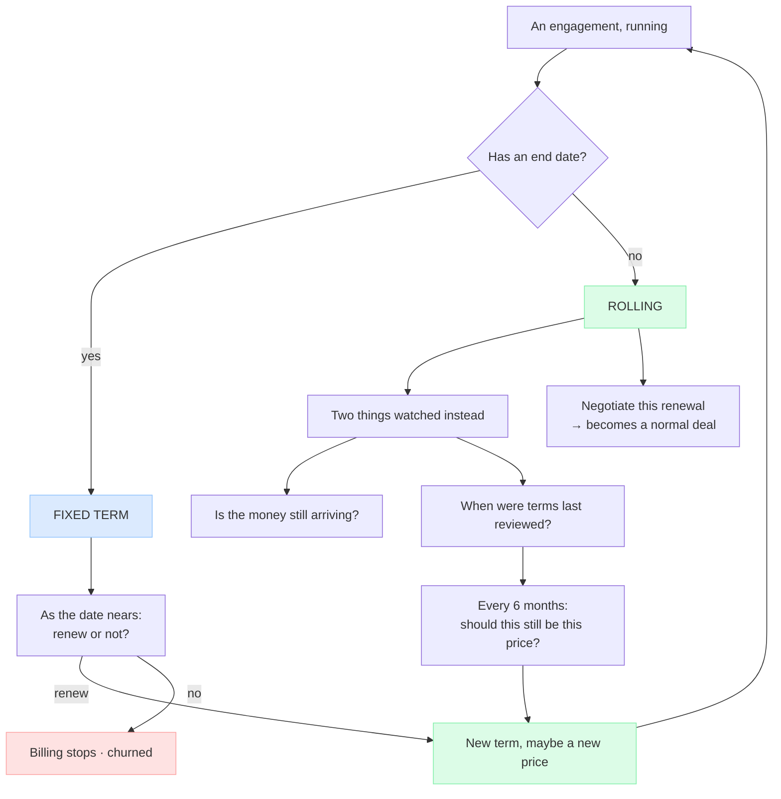

**Why an end date is optional.** Most agency retainers don't have one — they run monthly until
someone stops them. Forcing a date means inventing a deadline nobody agreed to and chasing a renewal
that isn't real. Its absence is information: *this one just runs*.

**Why rolling engagements are reviewed, not renewed.** Nothing expires — but the fee stays where it
started while the work quietly grows. A six-monthly review asks the question no calendar event
otherwise asks: *should this still be this price?* It's a health check disguised as a pricing
conversation.

**Why renewals live here and not on their own screen.** Renewing is a conversation about one
relationship, and everything you need — projects, payments, history, health — is already on this
page. Seeing everything due at once is a **filter on your customer list**, not a place of its own.

**When a renewal is really a negotiation** — they want double the scope at a new price — it becomes a
normal deal on the board, linked to the company you already have.

---

# Step 14 · Pausing and losing

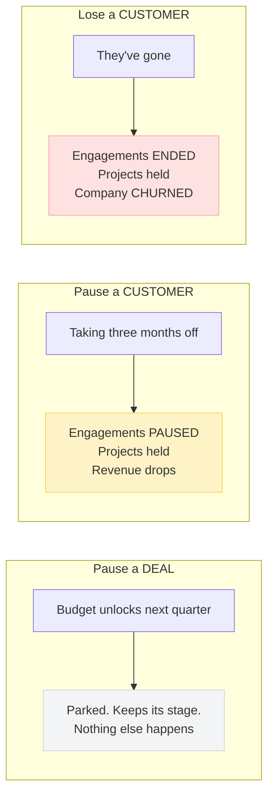

**Why parking a deal and pausing a customer are different actions.** Parking a deal you haven't won
costs nothing. Pausing a customer stops real money. One gesture doing both means billing stops as a
side effect of a drag, and nobody quite decided it should.

**Before freezing anything, the system checks for another live engagement** with that company. A
customer with two agreements who ends one should keep working on the other.

**Nothing is ever deleted.** History, invoices, payments and projects stay true and stay needed — for
accounts, for tax, and for the day they come back. Companies are retired, never erased.

---

# Step 15 · Who can do what

| | Companies | Deals | Quotes | Engagements | Projects | Tasks | Invoices | Settings |
|---|---|---|---|---|---|---|---|---|
| **Owner** | full | full | full | full | full | full | full | full |
| **Admin** | full | full | full | full | full | full | full | full |
| **Sales** | full | full | full | read | read | own | — | — |
| **Delivery** | read | read | — | amount only | full | full | — | — |
| **Finance** | read | value only | read | full | read | — | full | — |
| **Member** | read | — | — | — | assigned | own | — | — |

**Ownership is separate from permission.** A company has an account owner and a deal has a deal
owner. Those decide who gets **told** when something needs attention — not who is **allowed**.

**Deal visibility is a setting, not a role.** Everyone sees all deals, or people see only their own.
A five-person agency wants the first; a larger sales floor wants the second.

---

# Running throughout

## The timeline

Every meaningful event lands on one timeline, attached to whichever record it concerns — company,
deal, project, task or engagement. Created, moved, called, met, quoted, won, invoiced, paid, reviewed,
churned.

**One record per event.** Not a note here and an activity there that can disagree.

## Notifications

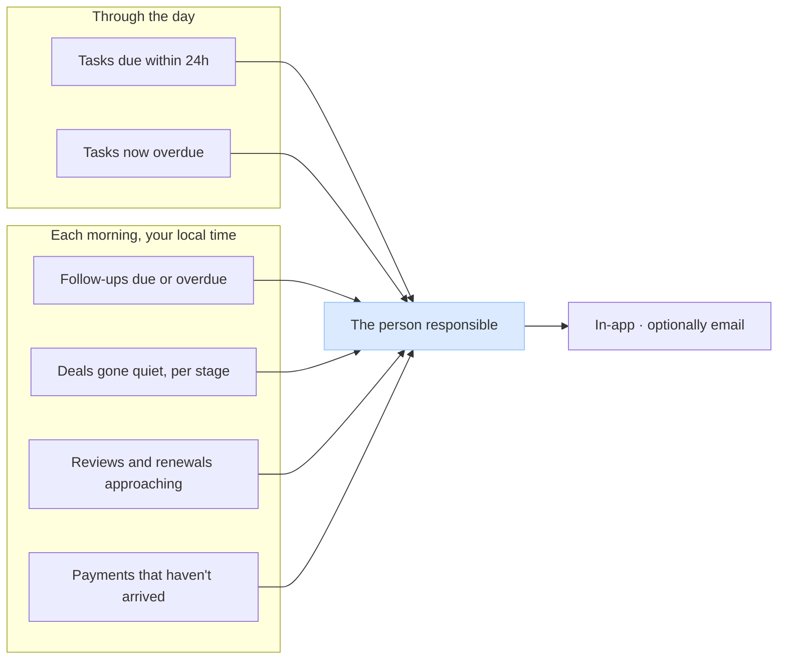

**Sent to one person, not everyone.** A notification to the whole team is one nobody acts on.
Oversight comes as a single daily summary rather than a stream of pings.

**"Quiet" is measured per stage.** A week at first contact is normal; a week in negotiation is not.

**"Each morning" means each organisation's own morning**, in their timezone.

## Live updates

When someone moves a deal, completes a task or records a payment, everyone else's screen updates
without a refresh — and only the affected row is refetched, not the whole board.

## Search

One search across companies, contacts, deals, projects, tasks and documents.

## Reports and dashboards

| | |
|---|---|
| **Pipeline** | Value by stage, weighted forecast, win rate, cycle time, win rate **by source** |
| **Revenue** | Monthly recurring revenue, one-off revenue, collected vs outstanding, and — because of revisions — **how all of it has moved over time** |
| **Delivery** | Projects by health, overdue tasks, workload per person, estimate vs actual |
| **Gross margin** | Per client, per project, per engagement: earned minus money paid out. Excludes your own team's effort — see *Step 9* |
| **Retention** | Reviews due, renewals approaching, churn, revenue lost |

## Audit

Four things are recorded permanently, because they involve money or access: **engagement terms
changing**, **payments created or removed**, **roles granted or revoked**, and **a company's status
changing**.

---

# The rules that hold everywhere

| The rule | Why |
|---|---|
| One company record, prospect or customer | Two records for one organisation always drift apart |
| A company becomes a customer only by winning a deal | So the customer list and the pipeline cannot disagree |
| One company, many deals | Customers come back, and buy more than one thing |
| The pipeline ends at won or lost | After that it's a relationship, not a pursuit |
| The kind of work is decided at the win | Retainers and projects bill differently from day one |
| One engagement per won deal, enforced by the database | Two clicks at the same instant must not bill twice |
| Commercial changes are never overwritten | Or last year's revenue becomes unknowable |
| An end date is optional, and its absence means something | Most retainers just run; inventing a date invents a deadline |
| Rolling engagements are reviewed, not renewed | The risk isn't expiry — it's a price that never moved |
| Parking a deal and pausing a customer are different | One stops nothing; the other stops money |
| An issued invoice never changes | Void it and credit-note it; that's what an audit needs |
| Facts that can be worked out are never stored | A stored "overdue" is wrong the night the job fails |
| A lost deal never reopens | Or your cycle time and win rate are lies |
| Nothing is deleted, only retired | History stays true, and customers come back |
| Money is never a rounding-prone number | An invoice off by a paisa is a dispute |
| Rules are enforced on the server, never only in the browser | A rule the API can skip isn't a rule |
| Every screen is scoped to your organisation | Nobody sees another agency's anything |
| The timeline is only ever added to | A history you can edit is not a history |
| Nothing assumes one country | Dates, days and money belong to whoever is using it |
| The system reports gross margin, never profit | It doesn't know what your team's effort cost, and won't pretend to |

---

**The plan to build this is in [FOUNDATION.md](./FOUNDATION.md).**
