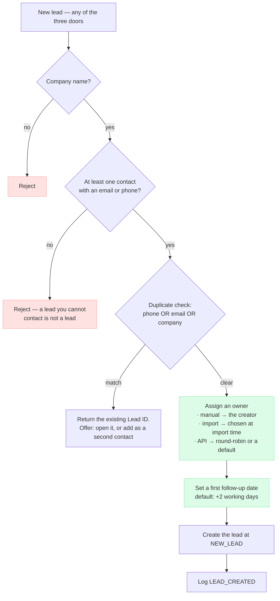
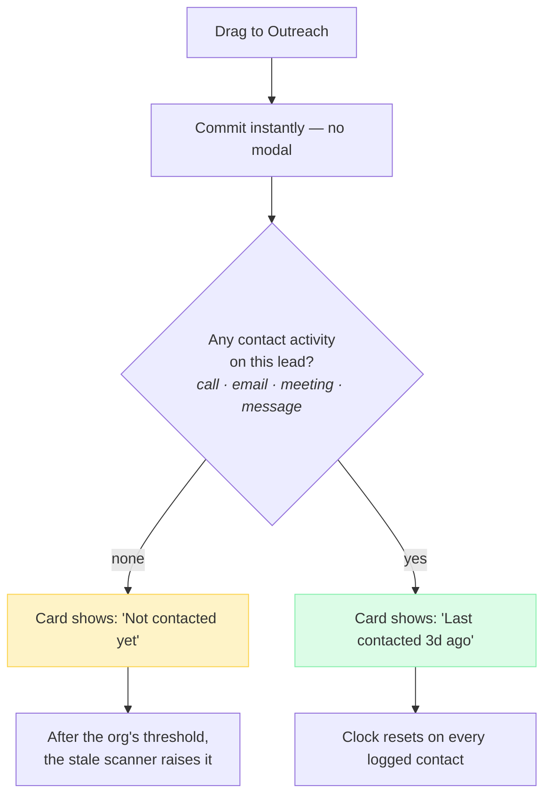
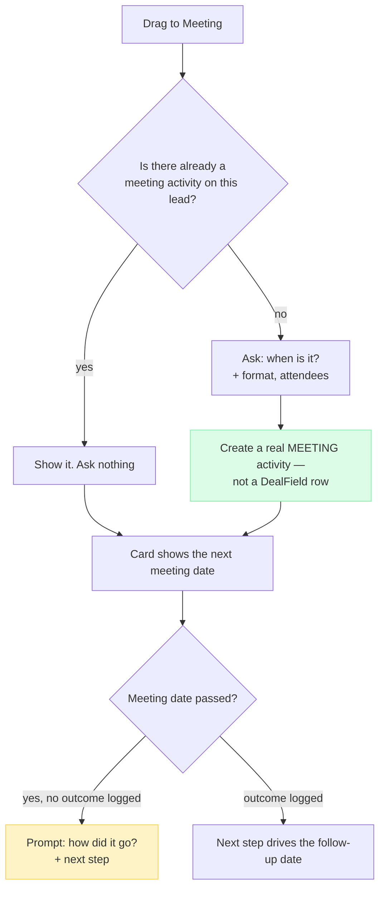
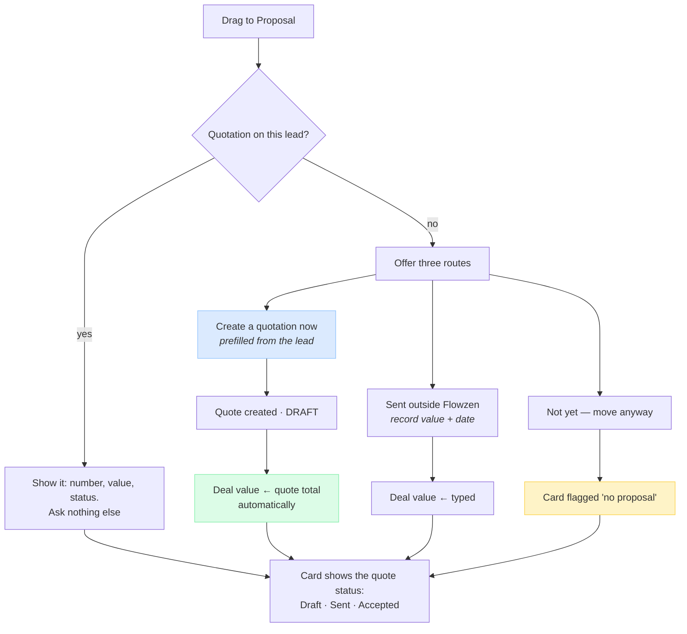
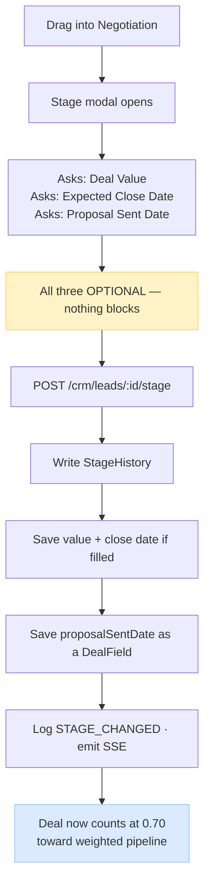
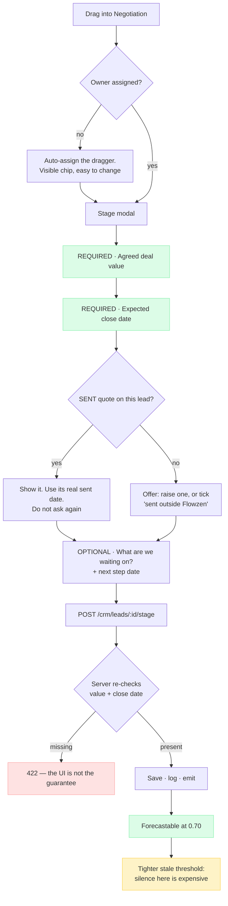
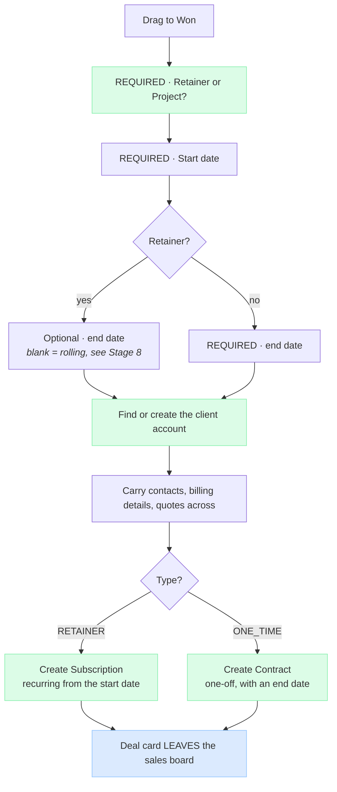
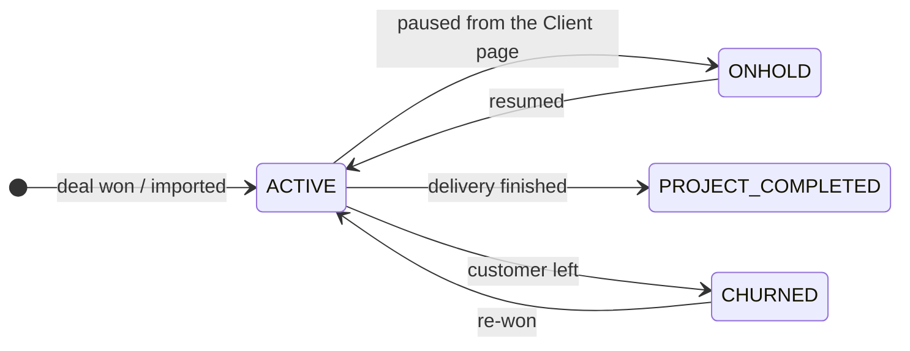
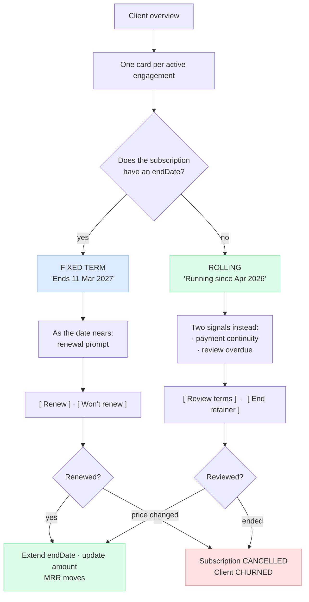

# Flowzen — System Improvement Plan

A living plan, designed **from scratch**, worked through **one stage at a time**, in journey order.

For each stage: what happens today, what's wrong (proved with your real data), the stronger version,
the decisions only you can make, and the work items.

Nothing here is built. This is the agreement about *what* to build, before any code changes.

> **Viewing:** diagrams are Mermaid. In VS Code press `Ctrl+Shift+V`. Also renders on GitHub.

**Companion documents**
- [FOUNDATION.md](./FOUNDATION.md) — the target schema, drawn once. Six moves that delete the
  duplications every bug below traces back to. Read it if you want the *destination*; read this
  document for the *route*.
- [FLOWZEN_FLOW.md](../FLOWZEN_FLOW.md) — how the application works today.

---

## The evidence this plan is built on

Everything below uses **only the 9 leads you created yourself** — my seeded test data is excluded,
because it would flatter every number (my script fills every field and moves stages in seconds).

```
company                   stage             source     owner  value  close  f/up  acts  quotes
Heaven's Elix             ACTIVE_RETAINER   EXCEL        ·      Y      ·      ·      0      0
Tamil Nadu Pickleball     ACTIVE_RETAINER   EXCEL        ·      Y      ·      ·      0      0
Da One High Performance   ACTIVE_RETAINER   MANUAL       Y      Y      ·      ·      0      0
Vyoma                     ACTIVE_RETAINER   EXCEL        ·      Y      ·      ·      0      0
Go Play Ventures          ACTIVE_PROJECT    EXCEL        ·      Y      ·      ·      0      0
Essa                      PROPOSAL          MANUAL       ·      ·      ·      Y      5      0
ICube                     PROPOSAL          MANUAL       ·      ·      ·      Y      6      0
Pink Beauty Parlour       MEETING           OTHER        ·      ·      ·      Y      3      0
Voso                      ACTIVE_RETAINER   REFERRAL     ·      Y      Y      ·      8      0
```

### The pattern that matters

Look at the two blocks:

- **The imported deals have money but no work.** Deal value and industry, then nothing — no owner,
  no activity, no follow-up. They were dropped in and never touched again.
- **The hand-worked deals have work but no money.** Essa, ICube and Pink Beauty Parlour have 5, 6
  and 3 logged activities — real selling — and **no deal value, no close date**.

> **The deals with numbers have no activity. The deals with activity have no numbers.**
> Only **Voso** has both — and Voso is the only deal that travelled the whole journey.

Totals: owner **1/9** · close date **1/9** · tasks **1/9** · notes **0/9** · **quotations 0/9**.

The Quotations module has never been used on a real deal.

---

## The design principle

This is the foundation the rest of the plan hangs off.

> **A stage is earned by an artefact, not by a drag.**

Today every stage is a position someone drags a card into. Nothing has to exist for it to be true.
That is exactly why the table above looks the way it does — the board records *intent*, not *fact*.

From scratch, each stage answers **one question** and is proved by **one artefact**:

```mermaid
flowchart LR
    A["NEW LEAD<br/><b>Who is this?</b><br/><i>a company + a contact</i>"] --> B["OUTREACH<br/><b>Did we reach them?</b><br/><i>a logged contact attempt</i>"]
    B --> C["MEETING<br/><b>Did they engage?</b><br/><i>a meeting that happened</i>"]
    C --> D["PROPOSAL<br/><b>What did we offer?</b><br/><i>a quotation</i>"]
    D --> E["NEGOTIATION<br/><b>Worth how much, by when?</b><br/><i>value + close date</i>"]
    E --> F["WON<br/><b>What did we win?</b><br/><i>contract type + start date</i>"]
    F --> G["ACTIVE<br/><b>Is it running?</b><br/><i>the revenue record</i>"]

    style A fill:#F3F4F6,stroke:#D1D5DB
    style D fill:#DBEAFE,stroke:#93C5FD
    style E fill:#DBEAFE,stroke:#93C5FD
    style F fill:#DCFCE7,stroke:#86EFAC
    style G fill:#DCFCE7,stroke:#86EFAC
```



**The artefact already exists in every case.** Activities, quotations, contract type, subscriptions —
all of it is already in the schema and already created by the app. Nothing new needs inventing. The
system simply never *asks* for any of it, so nobody supplies it.

That is the whole change: stop asking people to re-type facts, and start reading the facts the
system already has.

### Two guard-rails on this principle

1. **Soft by default, hard where money depends on it.** `stage-config.ts` states a deliberate "no
   hard gates" policy, and it's right for the early funnel — a toll gate between New Lead and
   Outreach would just make people lie. Gates appear only from **Negotiation** onward, where the
   forecast mathematically requires the data.
2. **Never block on something the system can derive.** If a quotation exists, the Proposal stage
   should *notice*, not interrogate.

---

## Order of work

| # | Stage | Status |
|---|---|---|
| **1** | **New Lead — capture** | **✅ drafted** |
| **2** | **Outreach** | **✅ drafted** |
| **3** | **Meeting** | **✅ drafted** |
| **4** | **Proposal** | **✅ drafted** |
| **5** | **Negotiation** | **✅ drafted** |
| **6** | **Won & Closed — the handover** | **✅ drafted · approved** |
| **7** | **The client lifecycle** (replaces the Active stages) | **✅ drafted · approved** |
| **8** | **Keeping the client — reviews & renewals** | **✅ drafted · approved** |
| 9 | Cross-cutting: roles, notifications, imports | not started |

---

# Stage 1 · New Lead — capture

**The question it answers:** who is this, and how do we reach them?

## Today

Three doors in: **manual form**, **CSV import**, **public API**. The only required field is
`companyName` (min 2 characters). Everything else — contact, owner, source, industry, value — is
optional. Duplicate detection covers **phone only**.

## What's wrong

| Problem | Evidence |
|---|---|
| **A lead can exist with no way to contact anyone** | Every one of your 9 has a contact — but nothing enforces it, and the CSV importer accepts rows without one |
| **8 of 9 leads have no owner** | Both daily scanners filter `assignedToId: { not: null }` — an unowned lead is **invisible to every reminder the system has** |
| **Imported leads are never touched again** | 4 of 5 EXCEL leads: zero activities, zero follow-ups, ever |
| **Duplicate detection is phone-only** | Same company with a different phone, or the same email, creates a second lead silently |
| **Source is captured but never used** | 11 different sources across 12 leads; no screen anywhere reports win rate by source |

## Proposed



**Two changes do almost all the work:** every lead gets an **owner** and a **first follow-up date**
at birth. Those two fields are what switch a lead from invisible to chased — and they're exactly
what your imported leads are missing.

## Decisions for you

1. **Reject a lead with no contact method?** Or accept and flag it "uncontactable"?
   — *recommend: reject on the form, flag on import, so a 500-row file isn't blocked by 3 bad rows*
2. **Import owner:** one owner for the whole file, a column in the CSV, or round-robin?
3. **Extend duplicate detection to email and company name?** Company-name matching will produce
   false positives ("Vyoma" vs "Vyoma Studios") — warn rather than block?

## Work items

| # | Item | Risk |
|---|---|---|
| C1 | Backfill an owner onto the 8 unowned leads | none — data only |
| C2 | Backfill a follow-up date onto leads that have none | none — data only |
| C3 | Require a contact method on the create form | low |
| C4 | Owner + first follow-up assigned at import time | low |
| C5 | Duplicate detection on email; company-name warning | medium — false positives |
| C6 | "Win rate by source" on the Analytics tab | low — data already there |

---

# Stage 2 · Outreach

**The question it answers:** have we actually reached them?

## Today

`STAGE_FIELDS.OUTREACH = []`. It asks for **nothing**, and `stageNeedsTransitionInput` returns
false — so the drag commits instantly with no modal. Moving a card here records only that someone
moved it.

## What's wrong

**Outreach is currently a claim, not a fact.** There is no difference in the data between "I emailed
them twice and heard nothing" and "I dragged this card." Which means the stage cannot answer the one
question a sales manager asks: *have we actually tried?*

Supporting evidence: `lastContactedDate` is set on **3 of 9** leads, and the stale-lead scanner is
built on activity timestamps — so a lead dragged to Outreach with no logged contact looks *active*
to the system while nothing has happened.

## Proposed

Keep the instant drag — no modal, no toll gate. Add **one derived flag**:



Nothing is required, nothing is blocked. The card simply tells the truth about itself. A column of
"Not contacted yet" badges is the most useful thing an Outreach column can show — and every input
it needs already exists.

## Decisions for you

1. **Is Outreach worth keeping as a distinct stage?** If a lead moves here the moment you *intend*
   to contact them, it's the same as New Lead. Merging them would give a shorter, more honest board.
   — *recommend: keep it, but only once the "not contacted yet" badge makes the distinction visible*
2. **Days before an Outreach lead is stale?** Default is org-configurable already.

## Work items

| # | Item | Risk |
|---|---|---|
| O1 | "Not contacted yet" / "Last contacted Nd ago" badge on the card | low |
| O2 | Set `lastContactedDate` automatically when a contact activity is logged | low |
| O3 | Review the per-stage stale thresholds with real numbers | none |

---

# Stage 3 · Meeting

**The question it answers:** did they engage with us?

## Today

Asks for one optional field — `meetingDate` ("Meeting Date Confirmed"). It's stored as a free-form
`DealField` key/value row. It is the **most-used** stage field in your database (5 uses), so people
do fill it in.

## What's wrong

| Problem | Evidence |
|---|---|
| **A "meeting date" isn't a meeting** | The field records that one was *booked*. Nothing records whether it *happened*, or what came out of it |
| **It duplicates the meeting activity** | Logging a meeting already captures date, format, attendees and next step. The stage asks for the date again, separately |
| **`DealField` is invisible to everything** | Free key/value rows — no report, no filter, no calendar reads them |
| **Nothing lands in the calendar** | The Calendar screen reads tasks and projects. A booked meeting appears nowhere |

## Proposed



**One record instead of two.** The meeting becomes a first-class activity — which the timeline,
the stale scanner and a future calendar view can all read — rather than an inert key/value row.

## Decisions for you

1. **Should a booked meeting appear on the Calendar screen?** It's the obvious home for it, and the
   screen already exists.
2. **Prompt for an outcome after the meeting date passes?** — *recommend: yes, it's the single
   highest-value nudge in the funnel*

## Work items

| # | Item | Risk |
|---|---|---|
| M1 | Meeting stage creates a MEETING activity, not a DealField | low |
| M2 | Migrate the 5 existing `meetingDate` DealFields to activities | low — small, reversible |
| M3 | "Next meeting" on the board card | low |
| M4 | Post-meeting outcome prompt | medium — new scanner rule |
| M5 | Meetings on the Calendar screen | medium |

---

# Stage 4 · Proposal

**The question it answers:** what exactly did we offer them?

## Today

Asks two optional fields: `auditRequired` (Yes/No) and `servicesInScope` (a checklist of 10
services). Both stored as `DealField` rows. 3 uses each.

## What's wrong

**This is the weakest stage in the whole pipeline, and the evidence is stark:**

> **0 of your 9 leads have a quotation.**

The Quotations module — document numbering, line items, tax, PDF generation, email sending, the
accept-to-contract flow — has never been used on a real deal. Meanwhile "Proposal" is recorded as a
tick-list of service names.

| Problem | Consequence |
|---|---|
| A lead can be at Proposal with no proposal | The stage name is not true |
| `servicesInScope` duplicates quote line items | Two descriptions of one offer, neither authoritative |
| Nothing carries into the quotation | The checklist is re-typed as line items later, by hand |
| No proposal → no value | This is *why* Essa and ICube have no deal value: nothing ever priced them |

That last row is the important one. It connects the two halves of the pattern at the top of this
document. **The deals with activity have no numbers because nothing ever asked them to be priced.**

## Proposed



**Deal value stops being a number someone types and becomes the quotation total.** That single link
is what would have given Essa and ICube a value, and it removes the double-entry entirely.

Keep `servicesInScope` — but as the **prefill for the quotation's line items**, not as a parallel
record of the offer.

## Decisions for you

1. **Why has the Quotations module never been used?** This is the most important question in the
   document. Is it missing something, too slow, or just not part of the habit yet? The answer
   changes whether this stage needs a *feature* or a *nudge*.
2. **Should the deal value auto-follow the quote total,** or stay independently editable? —
   *recommend: auto-follow, with a manual override that visibly says it's overridden*
3. **Allow Proposal with no proposal?** — *recommend: yes, but flag it on the card*

## Work items

| # | Item | Risk |
|---|---|---|
| P1 | Show any linked quotation in the stage modal and on the card | low |
| P2 | "Create quotation" from the Proposal transition, prefilled | medium |
| P3 | Deal value follows the quote total, with override | medium |
| P4 | `servicesInScope` prefills quote line items | low |
| P5 | "No proposal" flag on the card | low |

---

# Stage 5 · Negotiation

**The question it answers:** what will this be worth, and when will it close?

**Why this stage carries the most weight.** The board weights Negotiation at **0.70** — ₹10,00,000
here reports as ₹7,00,000 of expected revenue. Every number the business plans against starts here.

## Today



No conversion, no money, no client account. The lasting effects are the history row, the two saved
numbers, and the forecast weight.

## What's wrong

Across your 9 leads: **close date 1/9** · **owner 1/9** · **quotations 0/9**.

**① A forecast weight with no date.** A deal at 0.70 with no `expectedCloseDate` cannot be placed in
a month or a cash-flow projection. It inflates the pipeline total while contributing nothing
plannable. The field is asked for — and optional.

**② `proposalSentDate` is a manual duplicate.** A quotation already carries a real `SENT` timestamp.
The field has been filled exactly **once** in your entire database.

**③ Unowned deals at the sharp end.** Both scanners skip leads with no owner. A Negotiation deal
with no owner gets **no chasing at all** — the exact opposite of where attention belongs.

**④ Nowhere to record what the deal is waiting on.** A deal stuck three weeks looks identical to one
that moved yesterday.

## Proposed



This is the **first stage with a hard gate**, and only on the two fields the forecast requires.
Enforced **server-side** — any API caller can skip the modal today.

## Decisions for you

1. **Hard gate or soft warning on the close date?** — *recommend: gate, the forecast is the point*
2. **Owner: block, or auto-assign the dragger?** — *recommend: auto-assign*
3. **Retire `proposalSentDate`?** One use in the whole database
4. **Is 0.70 the right weight?** It's a hard-coded guess. With close dates we can measure your real
   Negotiation → Won rate and use that instead

## Work items

| # | Item | Risk |
|---|---|---|
| N1 | Backfill close dates on Negotiation+ leads missing them | none — data only |
| N2 | Assign owners to unowned Negotiation+ leads | none — data only |
| N3 | Server-side validation: value + close date required | low |
| N4 | Modal: both required, auto-assign owner | low |
| N5 | Show the linked quote; drop the manual date ask | low |
| N6 | `blockedOn` + `nextStepDate` on Lead, surfaced on the card | medium |
| N7 | Tune per-stage stale thresholds | none |

---

# Stage 6 · Won & Closed — the handover

**The question it answers:** what exactly did we win?

## Today

Winning creates the client account but **no money record**, because at that instant the system
doesn't know whether it's a retainer or a project. The type is asked one stage later, at Active.

That one-stage delay causes three problems, all proved on the live API:

- Dragging to the shared "Active" column always sends `ACTIVE_RETAINER` (`destGroup.stages[0]`), so
  **Active (Project) is unreachable from the UI**. A `ONE_TIME` deal was accepted and billed monthly.
- Stage and `contractType` store the same fact twice and can disagree — **26 dual-listings across
  11 files**.
- Nobody parks at Won anyway: **4 deals entered, 0 stayed, median dwell 44 seconds.**

## Proposed — ask the type at Won, create the engagement there



**The Active stages disappear.** There is no shared column to guess at, so the billing bug cannot
happen — it's fixed by construction, not by a patch. `contractType` becomes the single source of
truth and the 26 dual-listings collapse to nothing.

**Client creation is already automatic** and stays that way. `POST /clients` is a deliberate 403:
*"Clients cannot be created directly. Win a deal in the pipeline, or use bulk import."* Nothing to
change — confirmed in the code.

## Work items

| # | Item | Risk |
|---|---|---|
| W1 | Ask contract type + start date at Won | low |
| W2 | Move engagement creation from Active to Won | medium |
| W3 | Collapse `ACTIVE_RETAINER` / `ACTIVE_PROJECT` out of the enum; map `stage_history` too | **high — needs care** |
| W4 | Won deals leave the sales board | low |
| W5 | Backfill Subscription/Contract for the 5 imported won deals with none | medium — **₹4,20,000/mo currently invisible** |

---

# Stage 7 · The client lifecycle

Once a deal is won, the relationship lives on the **client**, not on a pipeline card.



Delivery is **Projects and Tasks**. Billing is **Invoice Drafts and Payments**. Neither needs a
pipeline card, and both already work.

## On Hold becomes a flag, not a stage

There are currently **two hold implementations that disagree**:

| | `POST /leads/:id/hold` | Drag to `ON_HOLD` |
|---|---|---|
| Client → ONHOLD | ✅ | ✅ |
| Subscriptions → PAUSED | ✅ | ✅ |
| Projects → ON_HOLD | ❌ | ✅ |
| Sibling-live-deal check | ❌ | ✅ |

So the Hold button freezes billing without freezing projects, and does it even when another deal on
the same account is still live — the exact case the stage path guards against.

The fix separates two things that were always different:

| | Park a **deal** | Pause an **account** |
|---|---|---|
| Means | "waiting on their budget" | "customer paused 3 months" |
| Lives on | `Lead.isOnHold` + `heldSince` + `holdReason` | A button on the Client page |
| Cascade | **none** — no client, no billing touched | status ONHOLD · subs PAUSED · projects held |
| Stage | **unchanged** — unparking is exact | n/a |

Unparking stops guessing. Today it digs through `stageHistory` and falls back to `NEW_LEAD` when it
can't tell — so a deal parked at Negotiation can return as a New Lead.

**Migration is free right now:** you have zero leads at `ON_HOLD`. That won't stay true.

## Work items

| # | Item | Risk |
|---|---|---|
| H1 | `isOnHold` / `heldSince` / `holdReason` on Lead; park keeps the stage | low |
| H2 | "Pause / Resume account" on the Client page — one implementation | medium |
| H3 | Remove `ON_HOLD` from the stage enum; migrate any existing rows | low — currently zero |
| H4 | Parking a won deal *asks* before pausing billing, never silently | low |

---

# Stage 8 · Keeping the client — reviews & renewals

**Decided: renewals live on the client page, not on a separate screen or board.**

## Why — the data settled it

Your five real retainers:

```
company                        value      start        END DATE
Da One High Performance        170000     2026-04-22   — none —
Vyoma                          140000     2026-03-01   — none —
Tamil Nadu Pickleball           70000     2026-02-16   — none —
Voso                           128000     —            — none —
Heaven's Elix                   40000     2026-04-25   — none —

  with an end date:    0/5        autoRenewal = true:  0/5
```

**You run rolling retainers** — monthly, continuing until someone stops. Nothing expires, so nothing
"renews".

Which means the Renewals screen currently cannot work: `due30` requires `contractEndDate` → always
**0**; `atRisk` requires a `renewalStatus` nobody sets → always **0**. It shows a total, two zeroes,
and an undated list. The code is correct; the concept doesn't match how you sell.

### The structural cause

```
model Subscription {
  startDate, nextBillingDate ...     ← no endDate. None.
}
model Lead {
  contractEndDate, nextRenewalDate,  ← the retainer's renewal data lives HERE,
  autoRenewal, renewalStatus ...        on the SALES record
}
```

That is the only reason `/crm/renewals` queries leads, and the only reason won leads can never leave
the board. **Move the renewal fields onto the Subscription** and both problems disappear together.

### Also found: two different MRR numbers

Renewals computes MRR by summing `lead.dealValue`. The Revenue module sums **active subscriptions**.
These disagree for any retainer with no subscription — **4 of your 5**. Two screens, two answers.

## Proposed — the engagement card on the client page



**`endDate` is optional, and its presence picks the behaviour.** You'd sign a fixed term
occasionally and it must work — but rolling is your default.

### What a rolling retainer needs instead of an expiry date

**① Payment continuity.** `Subscription.nextBillingDate` already exists. Did this month's payment
land, or has it been silent for six weeks? For a rolling retainer this is the real heartbeat.

**② A review date.** The rolling equivalent of a renewal. Not *"will they renew?"* but *"should this
still be ₹40,000?"* — Heaven's Elix started in April at ₹40,000/month and nothing in the system will
ever ask whether that is still right. **Default: every 6 months**, org-configurable.

**③ Health, computed not typed.** Activity recency, overdue tasks, unpaid invoices, project status —
every input is already stored.

```
  ┌──────────────────────────────────────────────────┐
  │  Heaven's Elix — Growth Retainer                 │
  │  ₹40,000 / month  ·  running since 25 Apr 2026   │
  │                                                  │
  │  ✓  Paid 8 days ago                              │
  │  ⚠  Terms not reviewed in 6 months               │
  │                                                  │
  │  [ Review terms ]      [ End retainer ]          │
  └──────────────────────────────────────────────────┘
```

### Seeing everything at once, without a separate page

The one job the Renewals board did was showing all expiries together. That doesn't need its own
screen:

- **A filter on the Clients list** — "Review or renewal due in 30 / 60 / 90 days", sortable
- **A dashboard tile** — "3 reviews due · ₹4.2L at stake"
- **A notification** — the daily 08:00 scanner already runs; point it at subscriptions

### Renewals that are really negotiations

If a client wants to double scope and renegotiate, that is a genuine sale. The card gets a
**"Negotiate this renewal"** option that creates a normal deal in the pipeline, linked to the
existing client. Routine renewals stay a button; real negotiations become deals. Costs almost
nothing — a lead can already point at an existing client.

## Work items

| # | Item | Risk |
|---|---|---|
| R1 | Move renewal fields from Lead → Subscription; backfill | medium |
| R2 | Add `endDate` + `reviewDate` + `lastReviewedAt` to Subscription | low |
| R3 | Engagement card on the Client page, both modes | medium |
| R4 | Review / Renew / End actions | medium |
| R5 | Payment-continuity signal from `nextBillingDate` + payments | low |
| R6 | Retire `/renewals`; replace with a Clients filter + dashboard tile | low |
| R7 | **Fix the two-MRR disagreement** — one definition, one source | medium |
| R8 | "Negotiate this renewal" → creates a pipeline deal | low |

---

# Where to start

If you want one thing that pays immediately and risks nothing:

> **C1 + C2 + N1 + N2 — the four pure data fixes.**
> Give every lead an owner and a follow-up date; backfill the missing close dates.

No schema change, no behaviour change, fully reversible. They switch your leads from *invisible to
every reminder the system has* to *actively chased* — which is the single biggest gap between what
Flowzen can do and what it's currently doing for you.

After that, **Stage 4 · Proposal** is where the most value is locked up, because it's the stage that
would give your worked deals their numbers.

---

# Backlog — found and evidenced, belongs to later stages

| Finding | Stage | Evidence |
|---|---|---|
| PROJECT_MANAGER and TEAM_MEMBER get **403** on the entire CRM | 9 | Role probe against the live API |
| Analytics tab never refreshes | 9 | No SSE subscription in `PipelineDashboard` |
| Phone uniqueness blocks a second deal with the same buyer | 9 | `POST /crm/leads` → 409; yet `Lead.clientId` is deliberately non-unique |
| Rotting/stale thresholds exist and are scanned daily, but are **never shown on the board** | 9 | Pipedrive-style red card would need UI only |
| Intelligence / LinkedIn dossier module cannot run | 9 | No `OPENAI_API_KEY` or `APIFY_TOKEN`; 0 dossiers ever generated |
| `GET /crm/forecast` has no caller anywhere | 9 | Dead endpoint |
| View Settings column toggles do nothing but toast "saved" | 9 | `visibleColumns` never passed to `LeadListView` |

*(Findings previously listed here for stages 6–8 have been folded into those sections.)*

---

# Decision log

Settled during design. Recorded so we don't relitigate them.

| Decision | Outcome |
|---|---|
| Client creation after a win | **Automatic** — already true; `POST /clients` is a deliberate 403. No change |
| Renewals as a separate page or board | **No.** Lives on the client page as an engagement card |
| Retainer end dates | **Optional.** Absent = rolling, which is your default (0/5 have one) |
| Rolling retainer prompt | **Review terms**, not renew. Default every **6 months**, configurable |
| Won deals on the sales board | **Leave at Won** |
| Retainer vs Project | Asked at **Won**; `contractType` is the single source of truth |
| Active as two stages | **Collapsed.** Fixes the billing bug by construction |
| On Hold | **A flag on the deal.** Pausing an account is a separate, explicit action |
| Delivery pipeline | **Not needed** — Projects already does this |
| Company / Deal object split | **Deferred.** Over-engineering for 13 clients |

---

## Next

Stage 9 (roles, notifications, imports, the board's rotting indicator) is the last one undrafted.
Say the word and I'll write it in the same shape.
